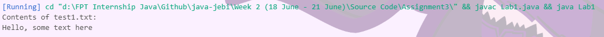
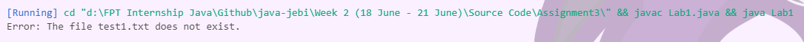
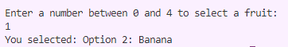
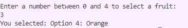
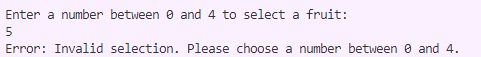
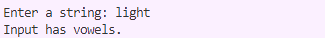

### 3.1 - Research and explain try-with-resources 
The try-with-resources feature, introduced in Java 7, is designed to simplify resource management by automatically closing resources once they are no longer needed. This is especially useful for handling resources like files, network connections, or streams, which require proper closure to prevent resource leaks.

#### Key Features
- **Automatic Resource Management:** Resources declared in the try-with-resources block are automatically closed after the block is executed, ensuring that no resources are left open unintentionally.
- **Implementation of AutoCloseable:** Any resource used in this construct must implement the AutoCloseable interface, which mandates a close() method to release the resource.
- **Support for Multiple Resources:** You can declare multiple resources within a single try statement, separated by semicolons, simplifying the code further.
#
#### Example Syntax
```java
try (ResourceType resource = new ResourceType()) {
    // Operations using the resource
} catch (ExceptionType e) {
    // Exception handling
}
```
In this structure, ResourceType must implement the AutoCloseable interface, and the resource is automatically closed after the try block, even if an exception occurs.
#
#### Example code, reading from a file
Consider a scenario where you want to read from a file and print its contents line by line
```java
import java.io.*;

public class TryWithResourcesExample {
    public static void main(String[] args) {
        // Using try-with-resources to handle BufferedReader
        try (BufferedReader reader = new BufferedReader(new FileReader("example.txt"))) {
            String line;
            while ((line = reader.readLine()) != null) {
                System.out.println(line);
            }
        } catch (IOException e) {
            e.printStackTrace();
        }
    }
}
```
#### Explanation
- **Resource Declaration:** BufferedReader reader = new BufferedReader(new FileReader("example.txt")) initializes the BufferedReader resource.
- **Automatic Closure:** The BufferedReader is closed automatically at the end of the try block, whether the block exits normally or due to an exception.
- **Exception Handling:** The catch block is used to handle any IOException that might be thrown during file reading operations.


#
#### Using Multiple resources
You can also manage multiple resources within a single try-with-resources statement
```java
import java.io.*;

public class MultipleResourcesExample {
    public static void main(String[] args) {
        // Using try-with-resources to manage both BufferedReader and BufferedWriter
        try (BufferedReader reader = new BufferedReader(new FileReader("input.txt"));
             BufferedWriter writer = new BufferedWriter(new FileWriter("output.txt"))) {

            String line;
            while ((line = reader.readLine()) != null) {
                writer.write(line);
                writer.newLine();
            }
        } catch (IOException e) {
            e.printStackTrace();
        }
    }
}
```
#### Explanation
- **Multiple Resource Declaration:** Both BufferedReader and BufferedWriter are declared and initialized within the try-with-resources block.
- **Automatic Closure:** Both resources are automatically closed in the reverse order of their declaration, ensuring no resource leaks occur.
- **Efficient Exception Handling:** Any IOException encountered while reading from or writing to the files is caught and handled in the catch block.

#
#### Benefits of Try-With-Resources
- **Simplified Code:** Eliminates the need for explicit resource closure, reducing boilerplate code.
- **Resource Safety:** Automatically ensures that resources are closed, even in the presence of exceptions.
- **Cleaner Exception Handling:** Provides a cleaner approach to handling exceptions related to resource management.


#
### 3.2 - Throw vs throws, give example

### Throw
The throw keyword is used to explicitly throw an exception in Java. This can be used within a method to signal that something has gone wrong. When you use throw, you create an instance of an Exception or a Throwable class and pass it to the throw statement.
#### Syntax
```java
throw new ExceptionType("Error message");
```
#### Example
Here’s an example where we use throw to explicitly throw a custom exception if a negative number is passed to a method:
```java
public class ThrowExample {
    public static void main(String[] args) {
        try {
            checkNumber(-5);
        } catch (IllegalArgumentException e) {
            System.out.println("Caught exception: " + e.getMessage());
        }
    }

    public static void checkNumber(int number) {
        if (number < 0) {
            throw new IllegalArgumentException("Number cannot be negative: " + number);
        }
        System.out.println("Number is: " + number);
    }
}
```
- **Purpose**: The throw keyword is used here to throw an IllegalArgumentException if the input number is negative.
- **Usage**: Use throw when you want to signal an error or an exceptional condition in your code and let the caller handle it.

#
#### When to Use throw
Use throw when you need to indicate an error condition in your method logic. This is typically used when:

- Validating input parameters and throwing an exception if they are invalid.
- Encountering a specific condition within a method that requires special handling or propagation as an exception.
#
### Throws
The throws keyword is used in a method signature to declare that the method might throw one or more exceptions. This informs the caller of the method that it needs to handle these potential exceptions, either with a try-catch block or by propagating the exceptions further.
#### Syntax
```java
returnType methodName(parameters) throws ExceptionType1, ExceptionType2 {
    // Method body
}
```
#### Example
```java
import java.io.*;

public class ThrowsExample {
    public static void main(String[] args) {
        try {
            readFile("example.txt");
        } catch (IOException e) {
            System.out.println("Caught exception: " + e.getMessage());
        }
    }

    public static void readFile(String fileName) throws IOException {
        BufferedReader reader = new BufferedReader(new FileReader(fileName));
        String line;
        while ((line = reader.readLine()) != null) {
            System.out.println(line);
        }
        reader.close();
    }
}
```
- **Purpose:** The throws keyword is used to declare that the readFile method might throw an IOException.
- **Usage:** Use throws to declare the exceptions that a method might throw, so that the caller is aware and can handle them appropriately.
  
#
#### When to Use throws
Use throws in the method signature to indicate that your method might throw certain exceptions, allowing the caller to handle them. This is common when:

- Working with I/O operations where exceptions like IOException might occur.
- Performing operations that can potentially fail due to conditions beyond your control, like network operations or file handling.
#
### Key Differences
`Usage Context:`

- **throw:** Used within the body of a method to throw an exception explicitly.
- **throws:** Used in the method signature to declare that a method might throw one or more exceptions.

`Purpose:`

- **throw:** To generate and throw an exception at a specific point in the code.
- **throws:** To inform the method caller about potential exceptions that might be thrown by the method.
- 
`Declaration:`
- **throw:** Directly follows an instance of Exception or Throwable.
- **throws:** Followed by one or more exception class names in the method signature.


#
### 3.3 File Operations with `try-with-resources`
1. Create test1.txt with text as “Hello, some text here”
2. Write application with feature read file test.txt 
3. Handle all exception and print text on file to console and write text to file test2.txt

```java
import java.io.BufferedReader;
import java.io.BufferedWriter;
import java.io.FileReader;
import java.io.FileWriter;
import java.io.IOException;
import java.nio.file.Files;
import java.nio.file.Paths;

public class FileProcessor {

    /**
     * Reads the entire content of a specified file.
     *
     * @param path The path to the file to read.
     * @return The file content as a string.
     * @throws IOException If an I/O error occurs.
     */
    private static String loadFile(String path) throws IOException {
        StringBuilder fileContent = new StringBuilder();

        // Using try-with-resources to ensure BufferedReader is closed after use
        try (BufferedReader reader = new BufferedReader(new FileReader(path))) {
            String line;
            while ((line = reader.readLine()) != null) {
                fileContent.append(line).append(System.lineSeparator());
            }
        }

        return fileContent.toString().trim(); // Trim to remove the last line separator
    }

    /**
     * Writes the given content to a specified file.
     *
     * @param path    The path to the file to write.
     * @param content The content to be written to the file.
     * @throws IOException If an I/O error occurs.
     */
    private static void saveToFile(String path, String content) throws IOException {
        // Using try-with-resources to ensure BufferedWriter is closed after use
        try (BufferedWriter writer = new BufferedWriter(new FileWriter(path))) {
            writer.write(content);
        }
    }

    public static void main(String[] args) {
        String inputFile = "data/test1.txt";
        String outputFile = "data/test2.txt";

        // Attempt to read from the input file and write to the output file
        try {
            String data = loadFile(inputFile);
            if (data.isEmpty()) {
                System.out.println("The file at " + inputFile + " is empty.");
            } else {
                System.out.println("Contents of " + inputFile + ":");
                System.out.println(data);
                saveToFile(outputFile, data);
            }
        } catch (IOException e) {
            if (!Files.exists(Paths.get(inputFile))) {
                System.out.println("Error: The file " + inputFile + " does not exist.");
            } else {
                System.out.println("Error: An I/O issue occurred while handling the files.");
            }
        }
    }
}
```
Output if test1.txt exist


The content also copied to test2.txt, and here is the output if the test1.txt is not exist.


#
### 3.4 Array Menu with Exception Handling
1. Create an array menu with 5 elements.
2. Prompt the user to enter a number and print the corresponding menu item.
3. Handle exceptions if the user enters an index out of bounds.

```java
import java.util.InputMismatchException;
import java.util.Scanner;

// Custom exception for menu selection
class InvalidMenuSelectionException extends RuntimeException {
    public InvalidMenuSelectionException(String message) {
        super(message);
    }
}

public class Lab2 {

    public static void main(String[] args) {
        // Define an array of fruit options
        String[] fruits = {"Option 1: Apple", "Option 2: Banana", "Option 3: Cherry", "Option 4: Orange", "Option 5: Elderberry"};
        
        // Use try-with-resources to ensure the Scanner is closed automatically
        try (Scanner input = new Scanner(System.in)) {
            System.out.println("Enter a number between 0 and 4 to select a fruit:");

            // Capture the user's selection
            int selection = input.nextInt();

            // Validate the selection
            if (selection < 0 || selection >= fruits.length) {
                throw new InvalidMenuSelectionException("Invalid selection. Please choose a number between 0 and 4.");
            }

            // Display the selected fruit
            System.out.println("You selected: " + fruits[selection]);

        } catch (InputMismatchException e) {
            // Handle non-integer input
            System.out.println("Error: Please enter a valid integer.");
        } catch (InvalidMenuSelectionException e) {
            // Handle out-of-bounds selection
            System.out.println("Error: " + e.getMessage());
        }
    }
}

```
#### Output if input is range 0-4



#
#### Output if input is out of range 


#
### 3.5 - Method to Check for Vowels with Custom Exception
1. Create a method that takes a string as input and throws an exception if the string does not contain vowels
2. Try to use user defined exception
```java
import java.util.Scanner;

// Custom exception class for when no vowels are found
class NoVowelsException extends Exception {
    public NoVowelsException(String message) {
        super(message);
    }
}

public class VowelChecker {

    // Method to check if a string contains vowels
    public static void checkForVowels(String input) throws NoVowelsException {
        boolean foundVowel = false;
        // Check each character in the string
        for (char c : input.toCharArray()) {
            if (isVowel(c)) {
                foundVowel = true;
                break;
            }
        }
        
        // If no vowel found, throw NoVowelsException
        if (!foundVowel) {
            throw new NoVowelsException("No vowels found in the input string.");
        }
    }

    // Helper method to check if a character is a vowel
    private static boolean isVowel(char c) {
        return "AEIOUaeiou".indexOf(c) != -1;
    }

    public static void main(String[] args) {
        Scanner scanner = new Scanner(System.in);

        try {
            System.out.print("Enter a string: ");
            String userInput = scanner.nextLine();

            checkForVowels(userInput);
            System.out.println("Input has vowels.");
        } catch (NoVowelsException e) {
            System.out.println(e.getMessage());
        } finally {
            scanner.close(); 
        }
    }
}
```
#### Explanation
-**NoVowelsException class:** This is a custom exception that extends the built-in Exception class. It has a constructor that accepts a message to be displayed when the exception is thrown.

- **checkForVowels method:** This method takes a string input as a parameter. It iterates through each character in the string to check if it is a vowel using the isVowel helper method. If it finds any vowel (foundVowel becomes true), it exits the loop early. If no vowels are found after checking all characters, it throws a NoVowelsException.

- **isVowel method:** This helper method checks if a given character c is a vowel. It compares c with a string containing all vowel characters.

#
#### Output if input has vowels

#
#### Output if input no vowels
