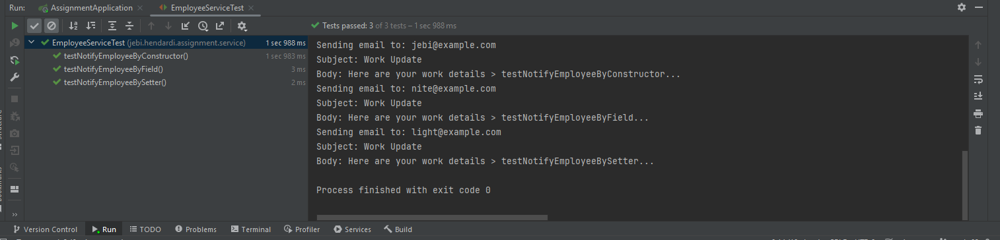

# Spring Java Assignment 2

## 1. Working with Annotations

Source Code : https://github.com/affandyfandy/java-jebi/tree/week_04/Week%2004/Assignment%202/Code/lab1


**App.java**
```java
package jebi.hendardi.assignment.config;

import org.springframework.context.annotation.ComponentScan;
import org.springframework.context.annotation.Configuration;

@Configuration
@ComponentScan(basePackages = "jebi.hendardi.assignment")
public class AppConfig {
}
```

#
**EmailService.java**
```java
public interface EmailService {
    void sendEmail(String to, String subject, String body);
}
```

#
**EmailServiceImpl.java**
```java
import org.springframework.stereotype.Service;

@Service
public class EmailServiceImpl implements EmailService {
    @Override
    public void sendEmail(String to, String subject, String body) {
        System.out.println("Sending email to: " + to);
        System.out.println("Subject: " + subject);
        System.out.println("Body: " + body);
    }
}
```
#
**EmployeeService.java**
```java

import org.springframework.beans.factory.annotation.Autowired;
import org.springframework.stereotype.Service;

@Service
public class EmployeeService {

    private EmailService emailService;

    // Constructor-based injections
    @Autowired
    public EmployeeService(EmailService emailService) {
        this.emailService = emailService;
    }

    // Field-based injection
    @Autowired
    private EmailService fieldEmailService;

    // Setter-based injection
    private EmailService setterEmailService;

    @Autowired
    public void setEmailService(EmailService emailService) {
        this.setterEmailService = emailService;
    }

    public void notifyEmployeeByConstructor(String to, String subject, String body) {
        emailService.sendEmail(to, subject, body);
    }

    public void notifyEmployeeByField(String to, String subject, String body) {
        fieldEmailService.sendEmail(to, subject, body);
    }

    public void notifyEmployeeBySetter(String to, String subject, String body) {
        setterEmailService.sendEmail(to, subject, body);
    }
}
```

##
**UnitTest : EmployeeServiceTest.java**
```java

import org.junit.jupiter.api.Test;
import org.springframework.beans.factory.annotation.Autowired;
import org.springframework.boot.test.context.SpringBootTest;

@SpringBootTest
public class EmployeeServiceTest {

    @Autowired
    private EmployeeService employeeService;

    @Test
    public void testNotifyEmployeeByConstructor() {
        employeeService.notifyEmployeeByConstructor("jebi@example.com", "Work Update : testNotifyEmployeeByConstructor", "Here are your work details > ByConstructor...");
    }

    @Test
    public void testNotifyEmployeeByField() {
        employeeService.notifyEmployeeByField("nite@example.com", "Work Update : testNotifyEmployeeByField", "Here are your work details > ByField...");
    }

    @Test
    public void testNotifyEmployeeBySetter() {
        employeeService.notifyEmployeeBySetter("light@example.com", "Work Update : testNotifyEmployeeBySetter", "Here are your work details > BySetter...");
    }
}
```

**Output Unit Test :**



#
## 2. Comparison of Dependency Injection Types

### Constructor-Based Injection
- **Advantages**:
  - Promotes immutability since dependencies are set at object creation and can't be changed.
  - Helps in identifying missing dependencies at compile-time.
- **Disadvantages**:
  - Can become cumbersome with a large number of dependencies.

### Field-Based Injection
- **Advantages**:
  - Simplifies injection by directly annotating fields.
  - Reduces boilerplate code.
- **Disadvantages**:
  - Makes testing and mocking difficult because fields can't be easily set from outside the class.
  - Less clear what dependencies a class needs from its constructor.

### Setter-Based Injection
- **Advantages**:
  - Allows changing dependencies after object creation.
  - Provides a middle ground by clearly defining dependencies through setters.
- **Disadvantages**:
  - Doesn't promote immutability as dependencies can be modified after object creation.

### Recommended Approach
- **Constructor-Based Injection** is generally recommended for its clarity and immutability. It makes dependencies explicit and easier to test and manage.
- **Field-Based Injection** is less preferred due to difficulties in testing and potential hidden dependencies.
- **Setter-Based Injection** is useful when there is a need to modify dependencies after object creation, though it is less common in favor of constructor-based injection.
#
## 3. Circular Dependency Injection

### What is Circular Dependency Injection?

Circular dependency occurs when two or more beans are dependent on each other, creating a cycle. This means that Bean A depends on Bean B, and Bean B, in turn, depends on Bean A. Such a situation makes it impossible for the dependency injection container to resolve the dependencies because neither bean can be created without the other being present.

### Example of Circular Dependency

Consider the following example where `ClassA` depends on `ClassB`, and `ClassB` depends on `ClassA`:

```java
@Service
public class ClassA {
    @Autowired
    private ClassB classB;

    public void doSomething() {
        classB.performAction();
    }
}

@Service
public class ClassB {
    @Autowired
    private ClassA classA;

    public void performAction() {
        classA.doSomething();
    }
}
```

In this example, `ClassA` has an `@Autowired` field `classB`, which means it depends on an instance of `ClassB`. Similarly, `ClassB` has an `@Autowired` field `classA`, indicating it depends on an instance of `ClassA`. This creates a circular dependency, where `ClassA` and `ClassB` are mutually dependent.

### Explanation

- **Cycle of Dependency**: The dependency graph between `ClassA` and `ClassB` forms a cycle, making it impossible to instantiate one without requiring the other to be already instantiated.
- **Problem in DI**: Circular dependencies cause problems in dependency injection frameworks like Spring, as they cannot resolve and instantiate the beans due to the cycle.
- **Resolution**: To resolve circular dependencies, consider redesigning your classes to break the dependency cycle, or use techniques such as lazy initialization, constructor injection with an `@Lazy` annotation, or a third bean to mediate the dependencies.

### How to Resolve Circular Dependencies

1. **Redesign Classes**: Refactor the code to eliminate the direct circular dependency. Often, introducing an interface or a third class to handle the shared functionality can help.
2. **Lazy Initialization**: Use the `@Lazy` annotation to delay the initialization of a bean until it is needed, helping to break the dependency cycle.

    ```java
    @Service
    public class ClassA {
        private final ClassB classB;

        @Autowired
        public ClassA(@Lazy ClassB classB) {
            this.classB = classB;
        }
    }
    ```

3. **Setter Injection**: Use setter injection instead of constructor injection, which can sometimes help manage dependencies in a way that avoids cycles.

    ```java
    @Service
    public class ClassA {
        private ClassB classB;

        @Autowired
        public void setClassB(ClassB classB) {
            this.classB = classB;
        }
    }
    ```

4. **Use a Mediator**: Introduce a mediator or a service that handles the interaction between the two dependent classes, breaking the direct dependency between them.

By addressing circular dependencies, you ensure that your application is more maintainable, easier to test, and free from complex initialization issues.


### Issues with Circular Dependency
- **Runtime Exceptions**: Spring will throw a `BeanCurrentlyInCreationException` because it can't create beans with circular dependencies by default.
- **Complexity**: Circular dependencies increase the complexity of the code and make it difficult to maintain and understand.

### Resolving Circular Dependencies
1. **Use `@Lazy` Annotation**: Delay the injection of one of the beans to break the cycle.
2. **Redesign Dependencies**: Refactor code to eliminate the need for circular dependencies by rethinking the design.
3. **Use Setter Injection**: In some cases, setter injection can help manage dependencies more flexibly to avoid cycles.

Example using `@Lazy`:

```java
@Service
public class ClassA {
    private final ClassB classB;

    @Autowired
    public ClassA(@Lazy ClassB classB) {
        this.classB = classB;
    }
}

@Service
public class ClassB {
    private final ClassA classA;

    @Autowired
    public ClassB(@Lazy ClassA classA) {
        this.classA = classA;
    }
}
```
#
## 4. Explain and give examples for some annotations

# Spring Annotations

## @Configuration
Marks a class as a source of bean definitions for the Spring IoC container. Typically used to define beans using the `@Bean` annotation.

**Example:**
```java
@Configuration
public class AppConfig {

    @Bean
    public EmailService emailService() {
        return new EmailServiceImpl();
    }
}
```

## @Bean
Indicates that a method produces a bean to be managed by the Spring container. Typically used in `@Configuration` classes.

**Example:**
```java
@Configuration
public class AppConfig {

    @Bean
    public EmailService emailService() {
        return new EmailServiceImpl();
    }
}
```

## @ComponentScan
Configures component scanning directives for use with `@Configuration` classes. It automatically discovers and registers beans in the Spring application context.

**Example:**
```java
@Configuration
@ComponentScan(basePackages = "com.example")
public class AppConfig {
}
```

## @Component
Indicates that an annotated class is a "component". Such classes are considered as candidates for auto-detection when using annotation-based configuration and classpath scanning.

**Example:**
```java
@Component
public class EmailServiceImpl implements EmailService {

    @Override
    public void sendEmail(String to, String subject, String body) {
        // Implementation here
    }
}
```

## @Service
Specialization of `@Component`. It indicates that an annotated class is a "service", originally defined by Domain-Driven Design (DDD) as an operation offered as an interface that stands alone in the model, with no encapsulated state.

**Example:**
```java
@Service
public class EmployeeService {

    @Autowired
    private EmailService emailService;

    public void notifyEmployee(String email, String subject, String body) {
        emailService.sendEmail(email, subject, body);
    }
}
```

## @Autowired
Marks a constructor, field, setter method, or config method to be autowired by Spring's dependency injection facilities. It is an alternative to the XML `<property>` or `<constructor-arg>` elements.

**Example:**
```java
@Service
public class EmployeeService {

    @Autowired
    private EmailService emailService;

    public void notifyEmployee(String email, String subject, String body) {
        emailService.sendEmail(email, subject, body);
    }
}
```

## @Scope
Configures the scope of a bean. It can be used at the class level or on a `@Bean` method in a `@Configuration` class. Common scopes are singleton (default) and prototype.

**Example:**
```java
@Service
@Scope("prototype")
public class PrototypeService {

    public void execute() {
        // Implementation here
    }
}
```

