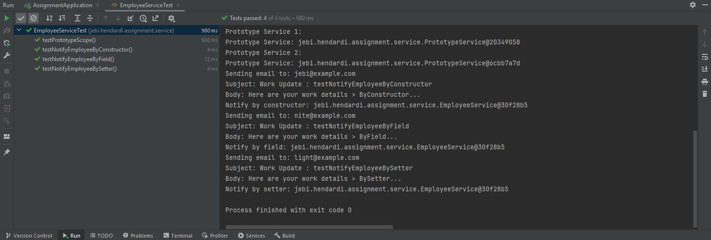
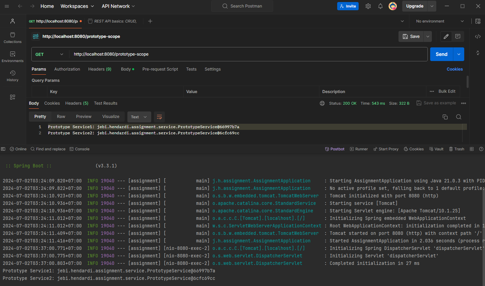

# Spring Java Assignment 3

## 1. Adding Bean Scopes to Assignment 2

### Update EmployeeService.java

**Explanation:**

- Annotated with @Scope("singleton") to indicate that this bean should be a singleton.
- Added System.out.println() statements in the methods to print the instance of EmployeeService for verification.


    ```java
    package jebi.hendardi.assignment.service;

    import jebi.hendardi.assignment.service.EmailService;
    import org.springframework.beans.factory.annotation.Autowired;
    import org.springframework.context.annotation.Scope;
    import org.springframework.stereotype.Service;

    @Service
    @Scope("singleton") // Singleton scope annotation
    public class EmployeeService {

        private final EmailService emailService;

        @Autowired
        public EmployeeService(EmailService emailService) {
            this.emailService = emailService;
        }

        @Autowired
        private EmailService fieldEmailService;

        private EmailService setterEmailService;

        @Autowired
        public void setEmailService(EmailService emailService) {
            this.setterEmailService = emailService;
        }

        public void notifyEmployeeByConstructor(String to, String subject, String body) {
            emailService.sendEmail(to, subject, body);
            System.out.println("Notify by constructor: " + this);
        }

        public void notifyEmployeeByField(String to, String subject, String body) {
            fieldEmailService.sendEmail(to, subject, body);
            System.out.println("Notify by field: " + this);
        }

        public void notifyEmployeeBySetter(String to, String subject, String body) {
            setterEmailService.sendEmail(to, subject, body);
            System.out.println("Notify by setter: " + this);
        }
    }
    ```
#
### Create PrototypeService.java

**Explanation:**

- New class to demonstrate prototype scope.
- Annotated with @Scope("prototype") to indicate that this bean should be a prototype.
- Contains a method that prints the instance of PrototypeService for verification.

    ```java
    package jebi.hendardi.assignment.service;

    import org.springframework.context.annotation.Scope;
    import org.springframework.stereotype.Service;

    @Service
    @Scope("prototype") // Prototype scope annotation
    public class PrototypeService {

        public void printPrototypeScope() {
            System.out.println("Prototype Service: " + this);
        }
    }
    ```

#
### Update Unit Test : EmployeeServiceTest.java

**Explanation:**

- Updated to include PrototypeService beans to verify the prototype scope.
- Added a new test method testPrototypeScope to print and verify the instances of PrototypeService.

    ```java
    @Test
    public void testPrototypeScope() {
        System.out.println("Prototype Service 1:");
        prototypeService1.printPrototypeScope();

        System.out.println("Prototype Service 2:");
        prototypeService2.printPrototypeScope();
    }
    ```

    **Output Unit Test : EmployeeServiceTest.java**

    

## 2. Creating a Controller for Request Scope

```java
package jebi.hendardi.assignment.controller;

import jebi.hendardi.assignment.service.EmployeeService;
import jebi.hendardi.assignment.service.PrototypeService;
import org.springframework.beans.factory.annotation.Autowired;
import org.springframework.web.bind.annotation.GetMapping;
import org.springframework.web.bind.annotation.RestController;

@RestController
public class EmployeeController {

    private final EmployeeService employeeService;

    @Autowired
    private PrototypeService prototypeService1;

    @Autowired
    private PrototypeService prototypeService2;

    @Autowired
    public EmployeeController(EmployeeService employeeService) {
        this.employeeService = employeeService;
    }

    @GetMapping("/notify-constructor")
    public String notifyEmployeeByConstructor() {
        employeeService.notifyEmployeeByConstructor("employee@example.com", "Work Update", "Here are your work details...");
        return "Notification sent via constructor injection!";
    }

    @GetMapping("/notify-field")
    public String notifyEmployeeByField() {
        employeeService.notifyEmployeeByField("employee@example.com", "Work Update", "Here are your work details...");
        return "Notification sent via field injection!";
    }

    @GetMapping("/notify-setter")
    public String notifyEmployeeBySetter() {
        employeeService.notifyEmployeeBySetter("employee@example.com", "Work Update", "Here are your work details...");
        return "Notification sent via setter injection!";
    }

    @GetMapping("/prototype-scope")
    public String testPrototypeScope() {
        String prototype1Details = "Prototype Service1: " + prototypeService1;
        String prototype2Details = "Prototype Service2: " + prototypeService2;

        System.out.println(prototype1Details);
        System.out.println(prototype2Details);

        return prototype1Details + "\n" + prototype2Details;
    }
}
```
**Output Test `/prototype-scope` with Postman**



## 3. Injecting Prototype Bean into Singleton Bean

### How to Inject Prototype Bean into Singleton Bean?

Injecting a prototype-scoped bean into a singleton-scoped bean directly may lead to only one instance being created and reused, which defeats the purpose of prototype scope. To ensure that a new instance is created each time, you can use the `ObjectFactory` or `Provider` from JSR-330.

#### Using ObjectFactory

```java
import org.springframework.beans.factory.ObjectFactory;
import org.springframework.beans.factory.annotation.Autowired;
import org.springframework.stereotype.Service;

@Service
public class SingletonBean {

    private final ObjectFactory<PrototypeBean> prototypeBeanFactory;

    @Autowired
    public SingletonBean(ObjectFactory<PrototypeBean> prototypeBeanFactory) {
        this.prototypeBeanFactory = prototypeBeanFactory;
    }

    public void usePrototypeBean() {
        PrototypeBean prototypeBean = prototypeBeanFactory.getObject();
        prototypeBean.doSomething();
    }
}

@Component
@Scope("prototype")
class PrototypeBean {
    public void doSomething() {
        System.out.println("PrototypeBean: " + this);
    }
}
```

#### Explanation

- **ObjectFactory**: Ensures that each call to `getObject()` returns a new instance of `PrototypeBean`, thus adhering to prototype scope even when injected into a singleton.

## 4. Difference between BeanFactory and ApplicationContext

### BeanFactory

- **Overview**: `BeanFactory` is the root interface for accessing Spring's dependency injection container.
- **Initialization**: Beans are created on demand when requested for the first time.
- **Features**: Basic dependency injection and configuration support.
- **Use Case**: Suitable for lightweight applications with simple dependency injection needs.

### ApplicationContext

- **Overview**: `ApplicationContext` is a sub-interface of `BeanFactory` and provides more advanced features.
- **Initialization**: Beans are pre-loaded and initialized during context startup.
- **Features**: Supports internationalization, event propagation, declarative mechanisms to create a bean, and a variety of post-processing capabilities.
- **Use Case**: Preferred for most applications as it provides all the functionality of `BeanFactory` and adds more enterprise-specific functionalities.

### Key Differences

1. **Initialization**: 
   - `BeanFactory` initializes beans lazily on demand.
   - `ApplicationContext` pre-instantiates singleton beans on startup.

2. **Functionality**: 
   - `BeanFactory` provides basic DI capabilities.
   - `ApplicationContext` provides additional enterprise features such as event handling, AOP, etc.

3. **Usage Scenario**: 
   - Use `BeanFactory` for lightweight, low-resource applications.
   - Use `ApplicationContext` for complex, full-featured applications needing additional capabilities.

### Summary

In most cases, `ApplicationContext` is recommended over `BeanFactory` due to its richer features and functionalities suitable for enterprise applications.

