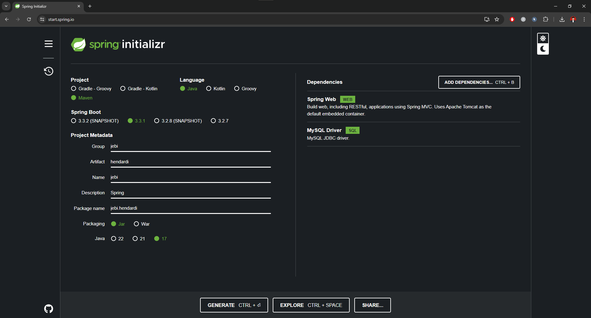
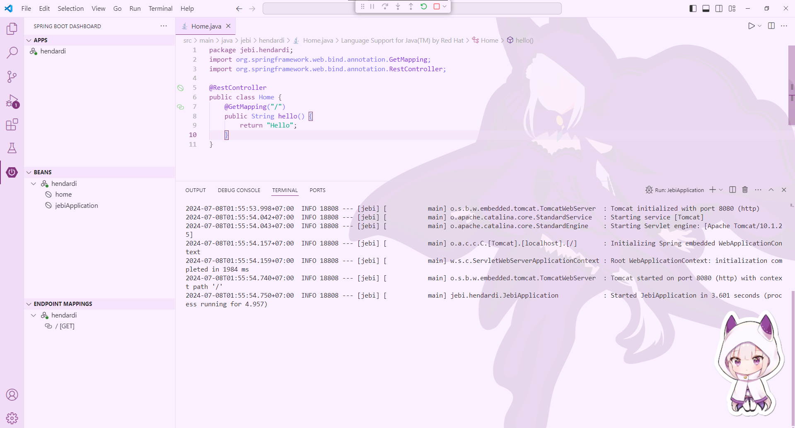
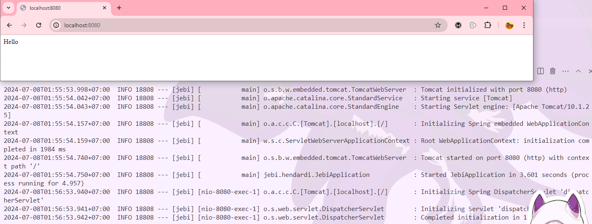

# Assignment 01 - Create Spring Boot Project


### Step 1: Visit Spring Initializr

Go to [Spring Initializr](https://start.spring.io).


### Step 2: Configure the Project

- **Project**: Select **Maven Project**.
- **Language**: Choose **Java**.
- **Spring Boot**: Select the latest stable version (for this case, version **3.3.1**).
- **Project Metadata**:
  - **Group**: jebi
  - **Artifact**: hendardi
  - **Name**: jebi
  - **Description**: Spring
  - **Package name**: jebi.hendardi
- **Packaging**: Select **Jar**.
- **Java Version**: 17





### Step 3: Add Dependencies

Include the necessary dependencies for the project:

- **Spring Web** for building web applications.
- **Spring Data JPA** for database access.

### Step 4: Generate the Project

Click on **Generate** to download the project as a ZIP file.

### Step 5: Extract the ZIP

Unzip the downloaded file to your preferred directory.


### Step 6: Add Demo Controller for verify


```java
import org.springframework.web.bind.annotation.GetMapping;
import org.springframework.web.bind.annotation.RestController;

@RestController
public class Home {

    @GetMapping("/")
    public String hello() {
        return "Hello";
    }
}
```

**Explanation:**

- **`@RestController`**: This annotation marks the class as a web controller. It combines `@Controller` and `@ResponseBody`, meaning that the methods in this class return the response body directly.
- **`@GetMapping("/")`**: This annotation maps the HTTP GET request for the root URL (`/`) to the `hello()` method.
- **`public String hello()`**: This method handles the GET request and returns the string "Hello", which will be displayed.


### Project Structure

Your project structure should resemble the following:

```
assignment_1
├── .mvn/wrapper/
│   └── maven-wrapper.properties
├── src/main/
│   ├── java/com/jebi/assignment_1/
│   │   ├── Home.java
│   │   └── Assignment1Application.java
│   └── resources/
│       └── application.properties
├── .gitignore
├── mvnw
├── mvnw.cmd
└── pom.xml
```

## Running the Spring Boot Application 



After the application starts, we can access it by navigating to [http://localhost:8080](http://localhost:8080).

