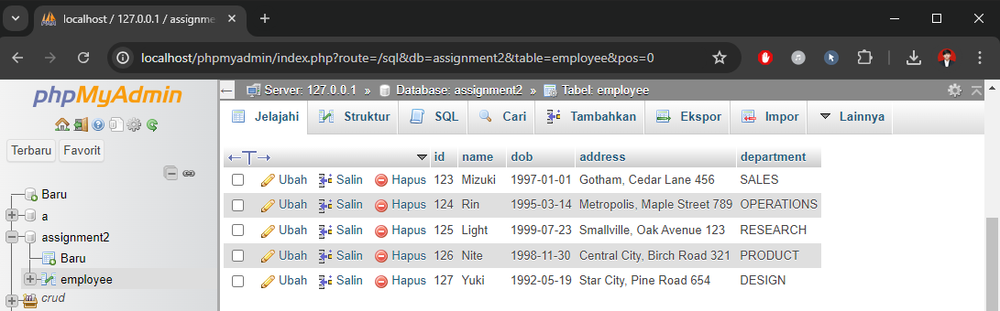
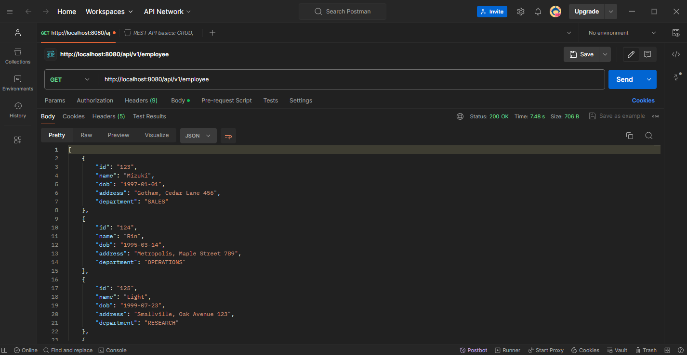
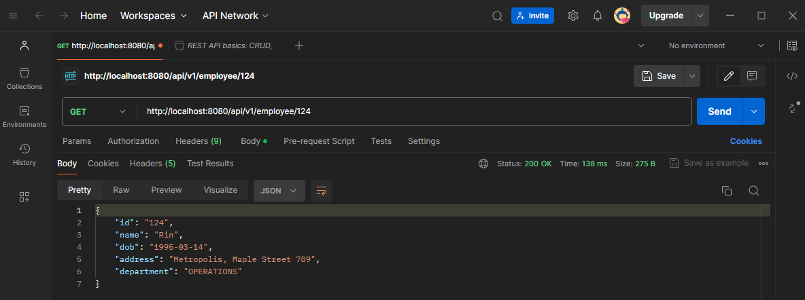
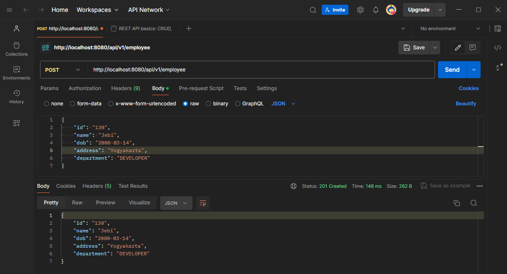
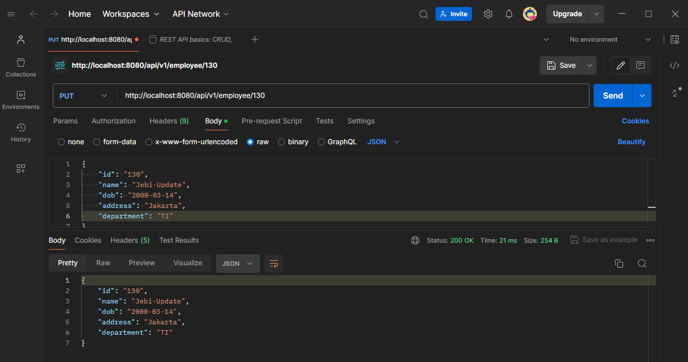
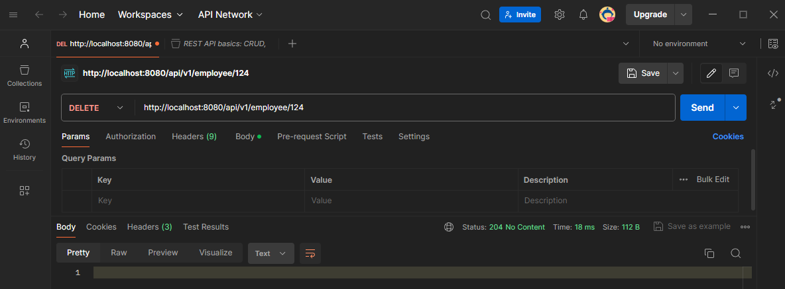
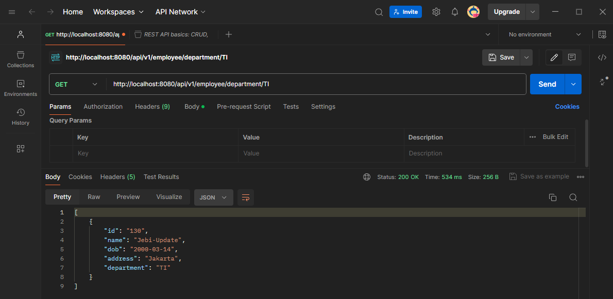
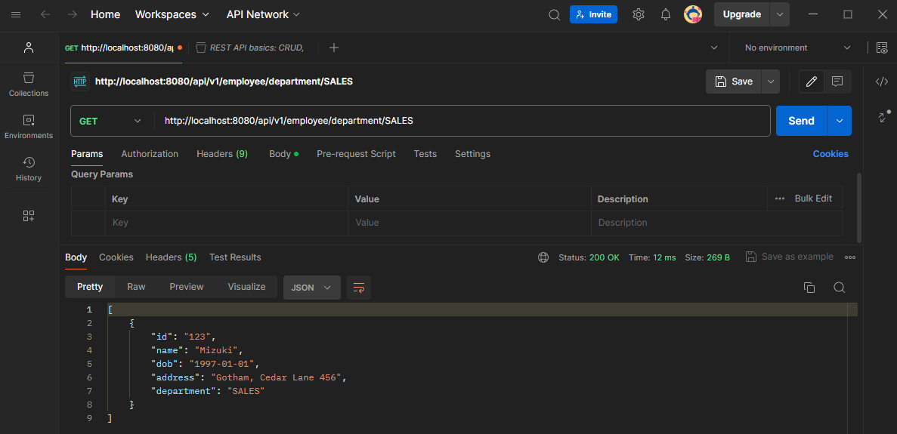

## Assignment 02 - CRUD Project for Employee Management with JDBC Template

### 1. Create Employee Table in MySQL


```sql
CREATE TABLE employee (
    id VARCHAR(50) NOT NULL,
    name VARCHAR(100) COLLATE utf8mb4_unicode_ci NOT NULL,
    dob DATE NOT NULL,
    address VARCHAR(255) NOT NULL,
    department VARCHAR(100) NOT NULL,
    PRIMARY KEY (id)
);

-- Insert dummy data into the employee table
INSERT INTO employee (id, name, dob, address, department) VALUES
('123', 'Mizuki', '1997-01-01', 'Gotham, Cedar Lane 456', 'SALES'),
('124', 'Rin', '1995-03-14', 'Metropolis, Maple Street 789', 'OPERATIONS'),
('125', 'Light', '1999-07-23', 'Smallville, Oak Avenue 123', 'RESEARCH'),
('126', 'Nite', '1998-11-30', 'Central City, Birch Road 321', 'PRODUCT'),
('127', 'Yuki', '1992-05-19', 'Star City, Pine Road 654', 'DESIGN');
```


#
### 2. Configure Data Source in application.properties

```properties
spring.application.name=week4_assignment

spring.datasource.url=jdbc:mysql://localhost:3306/week4_assignment?allowPublicKeyRetrieval=true&useSSL=false
spring.datasource.username=root
spring.datasource.password=password123
spring.datasource.driver-class-name=com.mysql.cj.jdbc.Driver

spring.jpa.hibernate.ddl-auto=update
spring.jpa.show-sql=true
```

**Explanation:**
- `spring.datasource.url` specifies the JDBC URL for the MySQL database.
- `spring.datasource.username` and `spring.datasource.password` set the database credentials.
- `spring.datasource.driver-class-name` defines the JDBC driver class.
- `spring.jpa.hibernate.ddl-auto` specifies the DDL mode (update to create/update schema automatically).
- `spring.jpa.show-sql` enables logging of SQL statements.
#
### 3. Create Employee Model


```java
package jebi.hendardi.model;

import java.io.Serializable;
import java.time.LocalDate;

import jakarta.persistence.Entity;
import jakarta.persistence.Id;
import lombok.Getter;
import lombok.NoArgsConstructor;
import lombok.Setter;

@Getter
@Setter
@Entity
@NoArgsConstructor
public class Employee implements Serializable {

    private static final long serialVersionUID = 1L;

    @Id
    private String id;
    private String name;
    private LocalDate dob;
    private String address;
    private String department;

    public Employee(String id, String name, LocalDate dob, String address, String department) {
        this.id = id;
        this.name = name;
        this.dob = dob;
        this.address = address;
        this.department = department;
    }
}
```

**Explanation:**
- The `@Entity` annotation specifies that this class is an entity and is mapped to a database table.
- The `@Id` annotation specifies the primary key of the entity.
- `@Getter`, `@Setter`, and `@NoArgsConstructor` are Lombok annotations to generate boilerplate code.
- The `Employee` class includes fields for ID, name, date of birth, address, and department.

### 5. Create Employee Repository

```java
package jebi.hendardi.repository;

import java.sql.ResultSet;
import java.sql.SQLException;
import java.util.List;
import java.util.Optional;

import org.springframework.jdbc.core.JdbcTemplate;
import org.springframework.jdbc.core.RowMapper;
import org.springframework.stereotype.Repository;

import jebi.hendardi.model.Employee;

@Repository
public class EmployeeRepository {

    private final JdbcTemplate jdbcTemplate;

    public EmployeeRepository(JdbcTemplate jdbcTemplate) {
        this.jdbcTemplate = jdbcTemplate;
    }

    private final RowMapper<Employee> EMPLOYEE_ROW_MAPPER = new RowMapper<>() {
        @Override
        public Employee mapRow(ResultSet rs, int rowNum) throws SQLException {
            return new Employee(
                    rs.getString("id"),
                    rs.getString("name"),
                    rs.getDate("dob").toLocalDate(),
                    rs.getString("address"),
                    rs.getString("department")
            );
        }
    };

    public List<Employee> findAll() {
        String sql = "SELECT * FROM employee";
        return jdbcTemplate.query(sql, EMPLOYEE_ROW_MAPPER);
    }

    public Optional<Employee> findById(String id) {
        String sql = "SELECT * FROM employee WHERE id = ?";
        return jdbcTemplate.query(sql, EMPLOYEE_ROW_MAPPER, id).stream().findFirst();
    }

    public int save(Employee employee) {
        String sql = "INSERT INTO employee (id, name, dob, address, department) VALUES (?, ?, ?, ?, ?)";
        return jdbcTemplate.update(sql, employee.getId(), employee.getName(), employee.getDob(), employee.getAddress(), employee.getDepartment());
    }

    public int update(Employee employee) {
        String sql = "UPDATE employee SET name = ?, dob = ?, address = ?, department = ? WHERE id = ?";
        return jdbcTemplate.update(sql, employee.getName(), employee.getDob(), employee.getAddress(), employee.getDepartment(), employee.getId());
    }

    public int deleteById(String id) {
        String sql = "DELETE FROM employee WHERE id = ?";
        return jdbcTemplate.update(sql, id);
    }

    public List<Employee> findByDepartment(String department) {
        String sql = "SELECT * FROM employee WHERE department = ?";
        return jdbcTemplate.query(sql, EMPLOYEE_ROW_MAPPER, department);
    }
}
```

**Explanation:**
1. **RowMapper Definition (EMPLOYEE_ROW_MAPPER):**
    - Maps a row from the `ResultSet` to an `Employee` object.

2. **Find All Employees (findAll):**
    - Retrieves all employees from the employee table.

3. **Find Employee by ID (findById):**
    - Retrieves an employee based on the provided ID.
    - Uses `Optional` to handle the possibility of no result found.

4. **Save New Employee (save):**
    - Inserts a new employee into the employee table.

5. **Update Existing Employee (update):**
    - Updates an existing employee's details based on their ID.

6. **Delete Employee by ID (deleteById):**
    - Deletes an employee from the employee table based on their ID.

7. **Find Employees by Department (findByDepartment):**
    - Retrieves employees that belong to a specific department.
#
### 6. Create Employee Controller


The `EmployeeController` class serves as a REST controller in a Spring Boot application, handling CRUD operations for `Employee` resources via HTTP requests.

```java
package jebi.hendardi.controller;

import java.util.List;
import java.util.Optional;

import org.springframework.http.HttpStatus;
import org.springframework.http.ResponseEntity;
import org.springframework.web.bind.annotation.*;

import jebi.hendardi.model.Employee;
import jebi.hendardi.repository.EmployeeRepository;

@RestController
@RequestMapping("/api/v1/employee")
public class EmployeeController {

    private final EmployeeRepository employeeRepository;

    public EmployeeController(EmployeeRepository employeeRepository) {
        this.employeeRepository = employeeRepository;
    }

    // Retrieve all employees
    @GetMapping("/all")
    public List<Employee> getAllEmployees() {
        return employeeRepository.findAll();
    }

    // Retrieve an employee by ID
    @GetMapping("/{id}")
    public ResponseEntity<Employee> getEmployeeById(@PathVariable String id) {
        Optional<Employee> employee = employeeRepository.findById(id);
        return employee.map(ResponseEntity::ok).orElseGet(() -> ResponseEntity.status(HttpStatus.NOT_FOUND).build());
    }

    // Create a new employee
    @PostMapping("/add")
    public ResponseEntity<Employee> createEmployee(@RequestBody Employee employee) {
        employeeRepository.save(employee);
        return ResponseEntity.status(HttpStatus.CREATED).body(employee);
    }

    // Update an existing employee by ID
    @PutMapping("/update/{id}")
    public ResponseEntity<Employee> updateEmployee(@PathVariable String id, @RequestBody Employee employeeDetails) {
        Optional<Employee> optionalEmployee = employeeRepository.findById(id);

        if (optionalEmployee.isPresent()) {
            Employee employee = optionalEmployee.get();
            employee.setName(employeeDetails.getName());
            employee.setDob(employeeDetails.getDob());
            employee.setAddress(employeeDetails.getAddress());
            employee.setDepartment(employeeDetails.getDepartment());
            employeeRepository.save(employee);
            return ResponseEntity.ok(employee);
        } else {
            return ResponseEntity.status(HttpStatus.NOT_FOUND).build();
        }
    }

    // Delete an employee by ID
    @DeleteMapping("/delete/{id}")
    public ResponseEntity<Void> deleteEmployee(@PathVariable String id) {
        employeeRepository.deleteById(id);
        return ResponseEntity.noContent().build();
    }

    // Retrieve employees by department
    @GetMapping("/{department}")
    public List<Employee> getEmployeesByDepartment(@PathVariable String department) {
        return employeeRepository.findByDepartment(department);
    }
}
```

**REST Endpoints**

| HTTP Method | Endpoint                   | Description                                                                                          |
|-------------|----------------------------|------------------------------------------------------------------------------------------------------|
| GET         | `/api/v1/employee`     | Retrieves all employees from the database.                                                            |
| GET         | `/api/v1/employee/{id}`    | Retrieves an employee by ID.                                                                          |
| POST        | `/api/v1/employee/add`     | Adds a new employee to the database.                                                                  |
| PUT         | `/api/v1/employee/update/{id}` | Updates an existing employee by ID.                                                                  |
| DELETE      | `/api/v1/employee/delete/{id}` | Deletes an employee by ID.                                                                          |
| GET         | `/api/v1/employee/department/{department}` | Retrieves employees by department.                                                                   |

**Explanation:**
- The `@RestController` annotation indicates that this class handles RESTful requests.
- `@RequestMapping("/api/v1/employee")` specifies the base URL for all endpoints in this controller.
- Each method corresponds to a CRUD operation:
  - `getAllEmployees()`: Retrieves all employees.
  - `getEmployeeById(String id)`: Retrieves an employee by ID.
  - `createEmployee(Employee employee)`: Adds a new employee.
  - `updateEmployee(String id, Employee employeeDetails)`: Updates an existing employee.
  - `deleteEmployee(String id)`: Deletes an employee.
  - `getEmployeesByDepartment(String department)`: Retrieves employees by department.

This controller interacts with `EmployeeRepository` to perform database operations and uses ResponseEntity to handle HTTP responses with appropriate status codes and payloads.

#
### 7. Verify the Application


### Retrieve All Employees
Retrieve all employees from the database using a HTTP `GET` request to `/api/v1/employee`.


#
### Retrieve Employee by EmployeeID
Retrieve a specific employee by their employeeID using a HTTP `GET` request to `/api/v1/employee/{employeeID}`.



#
### Add New Employee
Add a new employee to the database using a HTTP `POST` request to `/api/v1/employee/add`.

- Prepare a JSON payload containing details of a new employee.
- Send a `POST` request to `/api/v1/employee` with the JSON payload in the request body.



#
### Update Employee by EmployeeID
Update an existing employee's information identified by their employeeID using a HTTP `PUT` request to `/api/v1/employee/update/{employeeID}`.

- Replace `{employeeID}` with the ID of an existing employee.
- Prepare a JSON payload containing updated information for the employee.
- Send a `PUT` request to `/api/v1/employee/update/{employeeID}` with the JSON payload.



### Delete Employee by EmployeeID
Delete an employee from the database by their employeeID using a HTTP `DELETE` request to `/api/v1/employee/delete/{employeeID}`.



### Filter Employees by Department
Filter employees by their department using HTTP `GET` requests to `/api/v1/employee/department/{department}` for different departments.

#### Filter department TI



#### Filter department Sales

