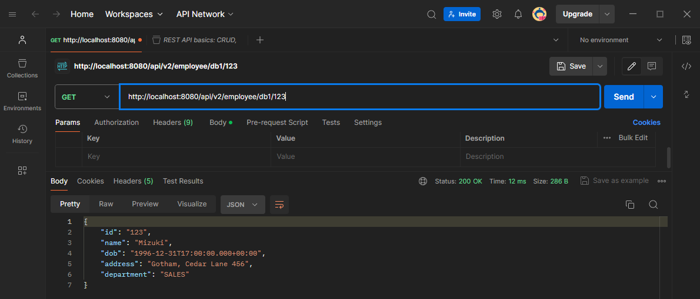

# Assignment 03 

For this assignment, I configured two datasources: employeeDataSource and secondaryDataSource. 

**Summary of Changes from Assignment 2**
- Moved datasource configuration from application properties to Java configuration using @Bean.
- Added multiple datasources.
- Added transaction management for save, update, and deleteById methods in the EmployeeRepository class.
#
### 1. Secondary Database Configuration

```sql
CREATE TABLE employee (
    id VARCHAR(50) NOT NULL,
    name VARCHAR(100) COLLATE utf8mb4_unicode_ci NOT NULL,
    dob DATE NOT NULL,
    address VARCHAR(255) NOT NULL,
    department VARCHAR(100) NOT NULL,
    PRIMARY KEY (id)
);

-- Insert dummy data into the employee table
INSERT INTO employee (id, name, dob, address, department) VALUES
('301', 'Sakura', '1997-02-14', 'Gotham, Cedar Lane 456', 'SALES'),
('302', 'Ryu', '1995-04-01', 'Metropolis, Maple Street 789', 'OPERATIONS'),
('303', 'Hikari', '1999-08-30', 'Smallville, Oak Avenue 123', 'RESEARCH'),
('304', 'Akira', '1998-12-15', 'Central City, Birch Road 321', 'PRODUCT'),
('305', 'Haru', '1992-06-25', 'Star City, Pine Road 654', 'DESIGN');

```


#
### 2. Datasource Configuration
In Assignment 3, we moved the datasource configuration from application properties to bean definitions in the Java code. Additionally, we using multiple datasources. 


```java

@Configuration
public class AppConfig {

    
    @Bean
    @Qualifier("dataSource1")
    public DataSource dataSource1() {
        DataSourceBuilder dataSourceBuilder = DataSourceBuilder.create();
        dataSourceBuilder.driverClassName("com.mysql.jdbc.Driver");
        dataSourceBuilder.url("jdbc:mysql://localhost:3306/assignment2");
        dataSourceBuilder.username("root");
        dataSourceBuilder.password("");
        return dataSourceBuilder.build();
    }

    @Bean
    @Qualifier("dataSource2")
    public DataSource getDataSourcePart2() {
        DataSourceBuilder dataSourceBuilder = DataSourceBuilder.create();
        dataSourceBuilder.driverClassName("com.mysql.jdbc.Driver");
        dataSourceBuilder.url("jdbc:mysql://localhost:3306/assignment3");
        dataSourceBuilder.username("root");
        dataSourceBuilder.password("");
        return dataSourceBuilder.build();
    }
    
}
```
**Explanation:**
- `@Configuration`: Marks this class as a source of bean definitions for the application context.
- `@Bean`: Registers a method as a bean definition. `dataSource1` and `dataSource2` are beans that provide two different data sources.
- `@Qualifier`: Specifies which bean to inject. `dataSource1` and `dataSource2` are differentiated to select the correct datasource.


#
### 3. Repository
```java
package com.lecture8.assignment3.repository;

import java.util.List;

import javax.sql.DataSource;

import org.springframework.beans.factory.annotation.Autowired;
import org.springframework.beans.factory.annotation.Qualifier;
import org.springframework.dao.IncorrectResultSizeDataAccessException;
import org.springframework.jdbc.core.BeanPropertyRowMapper;
import org.springframework.jdbc.core.JdbcTemplate;
import org.springframework.stereotype.Repository;

import com.lecture8.assignment3.entity.Employee;

@Repository
public class EmployeeRepository {

    private final JdbcTemplate jdbc1;
    private final JdbcTemplate jdbc2;

    @Autowired
    public EmployeeRepository(@Qualifier("dataSource1") DataSource dataSource1,
                        @Qualifier("dataSource2") DataSource dataSource2) {
        this.jdbc1 = new JdbcTemplate(dataSource1);
        this.jdbc2 = new JdbcTemplate(dataSource2);
    }

    private JdbcTemplate getJdbcTemplate(String db) {
        return "db1".equals(db) ? jdbc1 : jdbc2;
    }

    public int save(String db, Employee employee){
        return getJdbcTemplate(db).update("INSERT INTO employee (id, name, dob, address, department) VALUES (?,?,?,?,?)",
            new Object[] { employee.getId(), employee.getName(), employee.getDob(), employee.getAddress(), employee.getDepartment() });
    }

    public int update(String db, Employee employee){
        return getJdbcTemplate(db).update("UPDATE employee SET name=?, dob=?, address=?, department=? WHERE id=?",
            new Object[] { employee.getName(), employee.getDob(), employee.getAddress(), employee.getDepartment(), employee.getId()});
    }

    public Employee findById(String db, String id){
        try {
            Employee employee = getJdbcTemplate(db).queryForObject("SELECT * FROM employee WHERE id=? LIMIT 1",
                    BeanPropertyRowMapper.newInstance(Employee.class), id);
            return employee;
        } catch (IncorrectResultSizeDataAccessException e) {
            return null;
        }
    }

    public int deleteById(String db, String id) {
        return getJdbcTemplate(db).update("DELETE FROM employee WHERE id=?", id);
    }

    public List<Employee> findAll(String db){
        return getJdbcTemplate(db).query("SELECT * from employee", BeanPropertyRowMapper.newInstance(Employee.class));
    }

}
```

**Explanation:**
- `@Repository`: Indicates that this class is a Data Access Object (DAO) that interacts with the database.
- Two `JdbcTemplate` instances are used to interact with two different datasources.
- `getJdbcTemplate(String db)`: Chooses the appropriate `JdbcTemplate` based on the database specified by the `db` parameter.
- `save(String db, Employee employee)`: Inserts a new `Employee` record into the specified database.
- `update(String db, Employee employee)`: Updates an existing `Employee` record in the specified database.
- `findById(String db, String id)`: Retrieves an `Employee` record by its ID from the specified database.
- `deleteById(String db, String id)`: Deletes an `Employee` record by its ID from the specified database.
- `findAll(String db)`: Retrieves all `Employee` records from the specified database.


#
### 4. Service

```java
package com.lecture8.assignment3.service;

import java.util.List;
import com.lecture8.assignment3.entity.Employee;

public interface EmployeeService {

    Employee save(String db, Employee employee);
    List<Employee> findAll(String db);
    Employee findEmployeeById(String db, String id);
    Employee update(String db, Employee employee);
    String delete(String db, String id);
}
```
**Explanation:**
- `EmployeeService`: Defines the interface for employee-related business operations.
- Methods specify the contract for CRUD operations, including saving, finding, updating, and deleting `Employee` entities.


#
### 5. [Transaction Management] `Service Impl`
The @Transactional annotation is a key feature of Spring Framework, enabling declarative transaction management. When applied to a method or a class, it ensures that a set of database operations are executed within a single transaction context. If any operation within this transaction fails, all operations are rolled back to maintain data consistency. Conversely, if all operations succeed, the transaction is committed, and the changes are persisted in the database.

```java
package com.lecture8.assignment3.service;

import java.util.List;
import org.springframework.stereotype.Service;
import org.springframework.transaction.annotation.Transactional;

import com.lecture8.assignment3.entity.Employee;
import com.lecture8.assignment3.repository.EmployeeRepository;

@Service
@Transactional
public class EmployeeServiceImpl implements EmployeeService {
    
    private final EmployeeRepository employeeRepository;

    public EmployeeServiceImpl(EmployeeRepository employeeRepository){
        this.employeeRepository = employeeRepository;
    }

    @Override
    public Employee save(String db, Employee employee) {
        int res = employeeRepository.save(db, employee);
        if (res > 0){
            return employee;
        }
        return null;
    }

    @Override
    public List<Employee> findAll(String db) {
        var listEmployee = employeeRepository.findAll(db);
        return listEmployee;
    }

    @Override
    public Employee findEmployeeById(String db, String id) {
        var employee = employeeRepository.findById(db, id);
        if (employee != null){
            return employee;
        }
        return null;
    }

    @Override
    public Employee update(String db, Employee employee) {
        int res = employeeRepository.update(db, employee);
        if (res > 0){
            return employee;
        }
        return null;
    }

    @Override
    public String delete(String db, String id) {
        int res = employeeRepository.deleteById(db, id);
        if (res > 0){
            return "success";
        }
        return "failed";
    }
}
```
**Explanation:**
- `@Service`: Marks this class as a Spring service component.
- `@Transactional`: Ensures that the methods run within a transaction context.
- Implements `EmployeeService` interface methods:
  - `save(String db, Employee employee)`: Saves a new `Employee` record to the specified database.
  - `findAll(String db)`: Retrieves a list of all `Employee` records from the specified database.
  - `findEmployeeById(String db, String id)`: Finds a specific `Employee` by ID from the specified database.
  - `update(String db, Employee employee)`: Updates an existing `Employee` record in the specified database.
  - `delete(String db, String id)`: Deletes an `Employee` record by ID from the specified database.
  
**How It Works**
- `Save Operation`: The save method is annotated with @Transactional, meaning it runs within a transactional context. When an Employee object is saved, the method attempts to insert the employee record into the database. If the insertion is successful (indicated by a return value greater than 0), the method returns the Employee object. If the insertion fails, a RuntimeException is thrown, causing the transaction to roll back, and no changes are made to the database.

- `Update Operation`: Similarly, the update method is transactional. It attempts to update an existing employee record. If the update operation succeeds, the updated Employee object is returned. If it fails, a RuntimeException is thrown, triggering a rollback of the transaction.

- `Delete Operation`: The delete method is also transactional. It deletes an employee record based on the provided ID. If the deletion is successful, it returns a success message. If it fails, a RuntimeException is thrown, and the transaction is rolled back.


**Benefits of Transactional Management**
- `Data Integrity`: Ensures that all operations within a transaction are completed successfully before committing, maintaining the integrity of the data.
- `Consistency`: Prevents partial updates to the database, which could lead to inconsistent data states.
- `Error Handling`: By throwing exceptions in case of failures, we ensure that transactions are rolled back, and appropriate actions can be taken to handle the errors.
#
### REST Endpoints

| HTTP Method | Endpoint                         | Description                                                                                         |
|-------------|----------------------------------|-----------------------------------------------------------------------------------------------------|
| GET         | `/api/v2/employee/{db}`           | Retrieves all employees from the specified database (`db` can be `dataSource1` or `dataSource2`). |
| GET         | `/api/v2/employee/{db}/{id}`      | Retrieves a specific employee by their ID from the specified database.                            |
| POST        | `/api/v2/employee/{db}/add`       | Adds a new employee to the specified database.                                                     |
| PUT         | `/api/v2/employee/{db}/{id}/update` | Updates an existing employee's information in the specified database.                             |
| DELETE      | `/api/v2/employee/{db}/{id}/delete` | Deletes an employee from the specified database.                                                  |

#
### Verify the Application


### Retrieve All Employees
Retrieve all employees from the database using a HTTP `GET` request to `/api/v2/employee/{db}`.
- **Data From db1 : `http://localhost:8080/api/v2/employee/db1`**
    

- **Data from db2 : `http://localhost:8080/api/v2/employee/db2`**
    

#
### Retrieve Employee by EmployeeID
Retrieve a specific employee by their employeeID using a HTTP `GET` request to `/api/v2/employee/{db}/{employeeID}`.

- **Data From db1 : `api/v2/employee/db1/124`**
    

- **Data from db2 : `api/v2/employee/db2/302`**
    

#
### Add New Employee
Add a new employee to the database using a HTTP `POST` request to `/api/v1/employee/add`.

- Prepare a JSON payload containing details of a new employee.
- Send a `POST` request to `/api/v1/employee` with the JSON payload in the request body.


- **Add to db1 : `api/v2/employee/db1/add`**
    

- **Add to db2 : `api/v2/employee/db2/add`**
    
#
### Update Employee by EmployeeID
Update an existing employee's information identified by their employeeID using a HTTP `PUT` request to `/api/v1/employee/update/{employeeID}`.

- Replace `{employeeID}` with the ID of an existing employee.
- Prepare a JSON payload containing updated information for the employee.
- Send a `PUT` request to `/api/v2/employee/{db}/{employeeID}/update` with the JSON payload.

- **Update data db1 : `api/v2/employee/db1/123/update`**
    

- **Update data db2 : `api/v2/employee/db2/303/update`**
    


### Delete Employee by EmployeeID
Delete an employee from the database by their employeeID using a HTTP `DELETE` request to `/api/v1/employee/delete/{employeeID}`.

- **Delete data db1 : `api/v2/employee/db1/123/update`**

    

- **Delete data db2 : `api/v2/employee/db2/303/update`**

    


#
## [Optional] Research Lombok 

[Lombok](https://projectlombok.org/) is a Java library that helps reduce boilerplate code and streamline Java application development. It offers a set of annotations that automatically generate common code, such as getters, setters, and constructors, which reduces the need for manually writing repetitive code.

### Key Features of Lombok

Lombok provides a variety of annotations to handle different types of boilerplate code. Below are some of the most commonly used features and annotations:

### 1. **`@Getter` and `@Setter`**

- **`@Getter`**: Generates getter methods for all fields in the class.
- **`@Setter`**: Generates setter methods for all fields in the class.

**Example:**

```java
@Getter
@Setter
public class Person {
    private String name;
    private int age;
}
```

**Generated Code:**

```java
public class Person {
    private String name;
    private int age;

    public String getName() {
        return name;
    }

    public void setName(String name) {
        this.name = name;
    }

    public int getAge() {
        return age;
    }

    public void setAge(int age) {
        this.age = age;
    }
}
```

### 2. **`@ToString`**

- **`@ToString`**: Generates a `toString()` method that includes all fields of the class.

**Example:**

```java
@ToString
public class Person {
    private String name;
    private int age;
}
```

**Generated Code:**

```java
@Override
public String toString() {
    return "Person(name=" + this.name + ", age=" + this.age + ")";
}
```

### 3. **`@EqualsAndHashCode`**

- **`@EqualsAndHashCode`**: Generates `equals()` and `hashCode()` methods based on the fields of the class.

**Example:**

```java
@EqualsAndHashCode
public class Person {
    private String name;
    private int age;
}
```

**Generated Code:**

```java
@Override
public boolean equals(Object o) {
    if (this == o) return true;
    if (o == null || getClass() != o.getClass()) return false;
    Person person = (Person) o;
    return age == person.age && Objects.equals(name, person.name);
}

@Override
public int hashCode() {
    return Objects.hash(name, age);
}
```

### 4. **`@NoArgsConstructor`, `@AllArgsConstructor`, and `@RequiredArgsConstructor`**

- **`@NoArgsConstructor`**: Generates a no-argument constructor.
- **`@AllArgsConstructor`**: Generates a constructor with parameters for all fields.
- **`@RequiredArgsConstructor`**: Generates a constructor with parameters for all `final` fields and fields marked with `@NonNull`.

**Example:**

```java
@NoArgsConstructor
@AllArgsConstructor
@RequiredArgsConstructor
public class Person {
    private final String name;
    private int age;
}
```

**Generated Code:**

```java
public Person() {
    // No-argument constructor
}

public Person(String name, int age) {
    this.name = name;
    this.age = age;
}

public Person(String name) {
    this.name = name;
}
```

### 5. **`@Data`**

- **`@Data`**: A convenience annotation that combines `@Getter`, `@Setter`, `@ToString`, `@EqualsAndHashCode`, and `@RequiredArgsConstructor`.

**Example:**

```java
@Data
public class Person {
    private final String name;
    private int age;
}
```

**Generated Code:**

```java
public class Person {
    private final String name;
    private int age;

    public String getName() {
        return name;
    }

    public void setAge(int age) {
        this.age = age;
    }

    public int getAge() {
        return age;
    }

    @Override
    public String toString() {
        return "Person(name=" + this.name + ", age=" + this.age + ")";
    }

    @Override
    public boolean equals(Object o) {
        if (this == o) return true;
        if (o == null || getClass() != o.getClass()) return false;
        Person person = (Person) o;
        return age == person.age && Objects.equals(name, person.name);
    }

    @Override
    public int hashCode() {
        return Objects.hash(name, age);
    }

    public Person(String name) {
        this.name = name;
    }
}
```

### 6. **`@Builder`**

- **`@Builder`**: Generates a builder pattern implementation for the class.

**Example:**

```java
@Builder
public class Person {
    private String name;
    private int age;
}
```

**Generated Code:**

```java
public class Person {
    private String name;
    private int age;

    public static class PersonBuilder {
        private String name;
        private int age;

        PersonBuilder() {}

        public PersonBuilder name(String name) {
            this.name = name;
            return this;
        }

        public PersonBuilder age(int age) {
            this.age = age;
            return this;
        }

        public Person build() {
            return new Person(name, age);
        }
    }
}
```

### 7. **`@Synchronized`**

- **`@Synchronized`**: Ensures thread safety by applying the `synchronized` keyword to a method or block.

**Example:**

```java
public class Counter {
    private int count = 0;

    @Synchronized
    public void increment() {
        count++;
    }
}
```

**Generated Code:**

```java
public class Counter {
    private int count = 0;

    public synchronized void increment() {
        count++;
    }
}
```

### 8. **`@Log`**

- **`@Log`**: Generates a logger field in the class. `@Log` can be replaced by more specific logging annotations like `@Slf4j`, `@Log4j2`, etc.

**Example:**

```java
@Slf4j
public class MyService {
    public void doSomething() {
        log.info("Doing something!");
    }
}
```

**Generated Code:**

```java
public class MyService {
    private static final Logger log = LoggerFactory.getLogger(MyService.class);

    public void doSomething() {
        log.info("Doing something!");
    }
}
```

### 9. **`@Value`**

- **`@Value`**: Creates immutable objects. It combines `@Getter`, `@ToString`, `@EqualsAndHashCode`, and `@AllArgsConstructor` with `final` fields.

**Example:**

```java
@Value
public class Person {
    String name;
    int age;
}
```

**Generated Code:**

```java
public class Person {
    private final String name;
    private final int age;

    public String getName() {
        return name;
    }

    public int getAge() {
        return age;
    }

    @Override
    public String toString() {
        return "Person(name=" + this.name + ", age=" + this.age + ")";
    }

    @Override
    public boolean equals(Object o) {
        if (this == o) return true;
        if (o == null || getClass() != o.getClass()) return false;
        Person person = (Person) o;
        return age == person.age && Objects.equals(name, person.name);
    }

    @Override
    public int hashCode() {
        return Objects.hash(name, age);
    }
}
```
#
### Add Lombok Dependency

For Maven, add the following dependency to `pom.xml`:

```xml
<dependency>
    <groupId>org.projectlombok</groupId>
    <artifactId>lombok</artifactId>
    <scope>provided</scope>
</dependency>
```

## Conclusion

Lombok is a powerful tool for Java developers, helping to reduce boilerplate code and improve productivity. By using annotations like `@Getter`, `@Setter`, `@Data`, and `@Builder`, Lombok can automate the generation of common methods and patterns, leading to cleaner and more maintainable code.
