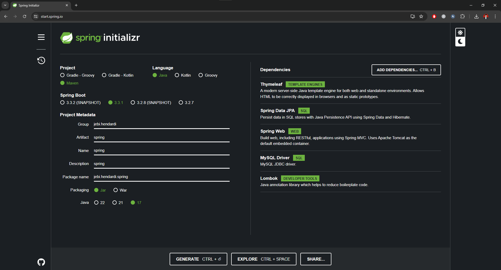
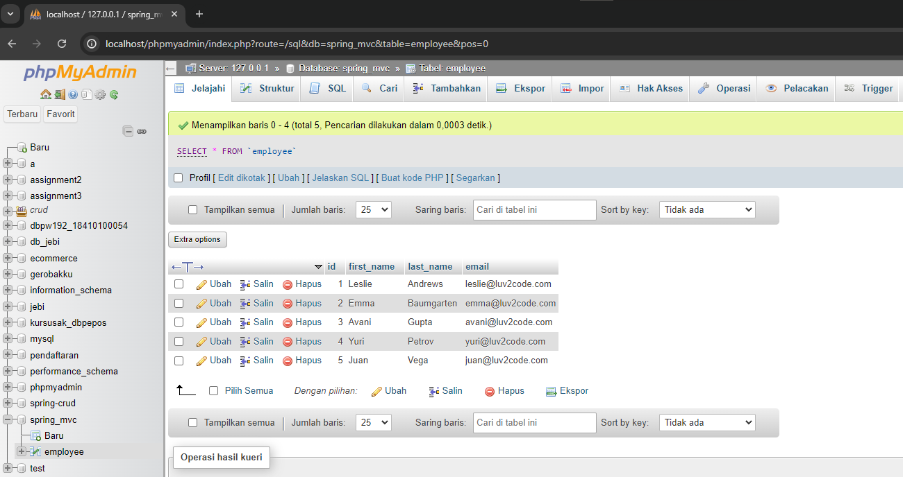
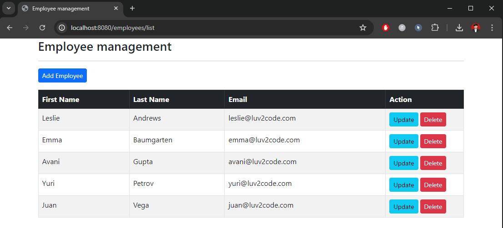

## Assignment 1

### Init Project



Init Project with dependencies :

- `Thymeleaf` : A server-side Java template engine for web applications, used to process and generate HTML, XML, JavaScript, CSS, and text.

- `Spring Data JPA` : Simplifies the implementation of JPA-based repositories by providing a repository abstraction over JPA, reducing boilerplate code.
  
- `Spring Web` : Facilitates the development of web applications by providing Spring MVC and RESTful web services support for handling HTTP requests and responses.

- `MySQL Driver` : Connects Java applications to MySQL databases by implementing the JDBC API for MySQL, enabling database interactions in Spring Boot applications.

- `Lombok` - Reduces boilerplate code by providing annotations to generate getters, setters, constructors, and other methods, simplifying code maintenance and readability.

#
### Init Database

```sql
CREATE TABLE `employee` (
    `id` int NOT NULL AUTO_INCREMENT,
    `first_name` varchar(45) DEFAULT NULL,
    `last_name` varchar(45) DEFAULT NULL,
    `email` varchar(45) DEFAULT NULL,
    PRIMARY KEY (`id`)
) ENGINE=InnoDB AUTO_INCREMENT=1 DEFAULT CHARSET=latin1;

--
-- Data for table `employee`
--

INSERT INTO `employee` VALUES
    (1,'Leslie','Andrews','leslie@luv2File.com'),
    (2,'Emma','Baumgarten','emma@luv2File.com'),
    (3,'Avani','Gupta','avani@luv2File.com'),
    (4,'Yuri','Petrov','yuri@luv2File.com'),
    (5,'Juan','Vega','juan@luv2File.com');
```





#
### Configure Properties
```properties
spring.datasource.driver-class-name=com.mysql.jdbc.Driver
spring.datasource.url=jdbc:mysql://localhost:3306/<your_database>
spring.datasource.username=<your_user_name>
spring.datasource.password=<your_password>
```


#
### Create Model

File : `Employee.java`

The Employee class represents the model that maps to the employee table in the database.

**Explanation:**
- `@Entity`: Specifies that the class is an entity and is mapped to a database table.
- `@Table(name = "employee")`: Specifies the table name in the database.
- `@Id`: Specifies the primary key of the entity.
- `@GeneratedValue(strategy = GenerationType.IDENTITY)`: Indicates that the ID should be generated automatically.
- `@Column(name = "id")`: Maps the field to the corresponding database column.
- `Lombok Annotations (@Getter, @Setter)`: Automatically generates getters and setters for all fields.

#
### Create JPA Repository

File : `EmployeeRepository.java`

The repository provides CRUD operations for the entity.

**Explanation:**
- `JpaRepository<Employee, Integer>`: Extends the JpaRepository to provide CRUD operations and pagination.
- `findAllByOrderByLastNameAsc()`: Custom method to retrieve all employees ordered by their last name in ascending order.

#
### Create Service

File : `EmployeeService`

The EmployeeService interface defines the business logic methods for managing employees.

**Explanation:**
- `findAll()`: Retrieves all employees.
- `findById(int theId)`: Retrieves an employee by their ID.
- `save(Employee theEmployee)`: Saves or updates an employee.
- `deleteById(int theId)`: Deletes an employee by their ID.


#
### Create Service Impl
File : `EmployeeService`

The EmployeeServiceImpl class implements the EmployeeService interface and provides the actual business logic.

**Explanation:**
- `@Service`: Marks the class as a service provider in the Spring context.
- `@AllArgsConstructor`: Lombok annotation to generate a constructor with arguments for all fields.
- Business Logic: Implements methods to interact with the EmployeeRepository for CRUD operations.


#
### Create Controller

File : `EmployeeController`

The EmployeeController class handles HTTP requests for employee management.

**Explanation:**
- `@Controller`: Indicates that the class is a Spring MVC controller.
- `@RequestMapping("/employees")`: Maps HTTP requests to handler methods of MVC and REST controllers.
- `@GetMapping("/list")`: Handles GET requests for listing employees.
- `@GetMapping("/showFormForAdd")`: Handles GET requests to show the form for adding a new employee.
- `@PostMapping("/showFormForUpdate")`: Handles POST requests to show the form for updating an existing employee.
- `@PostMapping("/save")`: Handles POST requests to save an employee.
- `@PostMapping("/delete")`: Handles POST requests to delete an employee.


#
### Implement HTML

File : `employee-form.html`, `list-employees.html`


This Thymeleaf templates provide the frontend interface for adding, updating, and listing employees.


#
### Run App

Open in browser : http://localhost:8080

