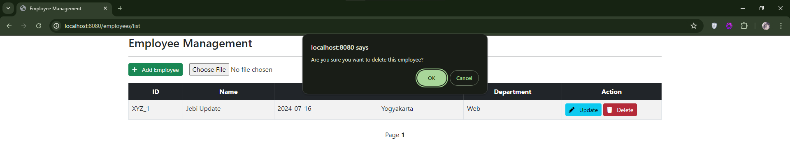
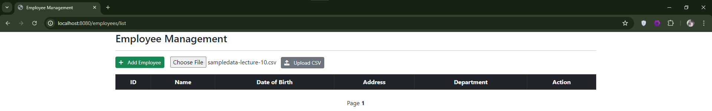

## Assignment 1

### Init Project


#
### Init Database

```sql
CREATE TABLE employee (
    id VARCHAR(255) PRIMARY KEY,
    name VARCHAR(255),
    dob DATE,
    address VARCHAR(255),
    department VARCHAR(255)
);
```


#
### Configure Properties
```properties
spring.datasource.driver-class-name=com.mysql.cj.jdbc.Driver
spring.datasource.url=jdbc:mysql://localhost:3306/spring_mvc
spring.datasource.username=root
spring.datasource.password=
```


#
### Create Model

File : `Employee.java`

The Employee class defines the employee entity with fields for ID, name, date of birth, address, and department. The class is annotated with JPA annotations to map it to the employee table in the database.

**Annotations:**
- @Entity marks the class as a JPA entity.
- @Table(name = "employee") specifies the table name.
- @Id and @Column annotations are used to map fields to the corresponding columns in the table.

**Lombok Annotations:**
- @Getter and @Setter generate getter and setter methods.
- @NoArgsConstructor and @AllArgsConstructor generate constructors.

#
### Create JPA Repository

File : `EmployeeRepository.java`

An interface extending JpaRepository for performing CRUD operations on the Employee entity. It includes custom methods to find all employees ordered by name.

**Methods:**
- List<Employee> findAllByOrderByNameAsc(): Retrieves all employees ordered by name in ascending order.
- Page<Employee> findAllByOrderByNameAsc(Pageable pageable): Retrieves a paginated list of employees ordered by name in ascending order.


#
### Create Service

File : `EmployeeService`

An interface defining methods for employee-related operations such as finding all employees, finding by ID, saving, deleting, and uploading CSV files.

**Methods:**
- List<Employee> findAll()
- Page<Employee> findAll(Pageable pageable)
- Employee findById(String id)
- void save(Employee employee)
- void deleteById(String id)
- void uploadCsv(MultipartFile file)

#
### Create Service Impl
File : `EmployeeService`

Implements the EmployeeService interface, providing the logic for the methods defined in the service interface. It interacts with the EmployeeRepository to perform database operations and includes a method for uploading CSV files.

**Dependencies:**
- EmployeeRepository: Injected via constructor injection.

**Methods:**
- findAll(): Retrieves all employees ordered by name in ascending order.
- findAll(Pageable pageable): Retrieves a paginated list of employees ordered by name in ascending order.
- findById(String id): Retrieves an employee by ID, throwing an exception if not found.
- save(Employee employee): Saves an employee to the database.
- deleteById(String id): Deletes an employee by ID.
- uploadCsv(MultipartFile file): Reads employees from a CSV file and saves them to the database.


#
### Create Controller

File : `EmployeeController`

MVC controller that handles HTTP requests for managing employees. It includes endpoints for listing employees, showing forms for adding and updating employees, saving employees, deleting employees, and uploading CSV files.

**Endpoints:**
- @GetMapping("/list"): Displays a paginated list of employees.
- @GetMapping("/showFormForAdd"): Displays a form to add a new employee.
- @PostMapping("/showFormForUpdate"): Displays a form to update an existing employee.
- @PostMapping("/save"): Saves a new or updated employee.
- @PostMapping("/delete"): Deletes an employee.
- @PostMapping("/upload"): Uploads a CSV file and saves employees to the database.

#
### Implement HTML

File : `employee-form.html`, `list-employees.html`


**employee-form.html:**

A Thymeleaf template for displaying a form to add or update an employee.
Includes fields for ID, name, date of birth, address, and department.
Uses Thymeleaf attributes to bind form fields to the Employee model.
The form submits data to the /employees/save endpoint to save the employee.

**list-employees.html:**

A Thymeleaf template for listing employees with pagination.
Displays employee details in a table format, including ID, name, date of birth, address, and department.
Includes buttons to add, update, and delete employees.
Incorporates a form to upload a CSV file for bulk employee data uploads.
Implements pagination controls to navigate through the list of employees.


#
### Run App

Open in browser : http://localhost:8080

The application provides a web interface for managing employees, including adding, updating, deleting, listing employees, and uploading employee data via a CSV file. The user can interact with the application through the provided endpoints and HTML templates, which are rendered by Thymeleaf.

Flow of the application:

1. `Listing Employees`: When the user accesses /employees/list, the listEmployees method in the controller fetches a paginated list of employees from the service and adds it to the model. The list-employees.html template then displays this list.

    
   
2. `Adding an Employee`: Clicking "Add Employee" directs the user to /employees/showFormForAdd, which shows the employee-form.html template. The user can fill in employee details and submit the form to /employees/save.

    
    
   
3. `Updating an Employee`: Clicking "Update" on an employee's row directs the user to /employees/showFormForUpdate, pre-filling the form with the employee's current details. The user can then update the information and submit it to /employees/save.

    
    
   
4. `Deleting an Employee`: Clicking "Delete" on an employee's row sends a request to /employees/delete, removing the employee from the database.

    
    
   
5. `Uploading CSV`: The user can upload a CSV file containing employee data to /employees/upload. The uploadCsv method in the service reads the file, parses employee data, and saves it to the database.

    
    
    

    