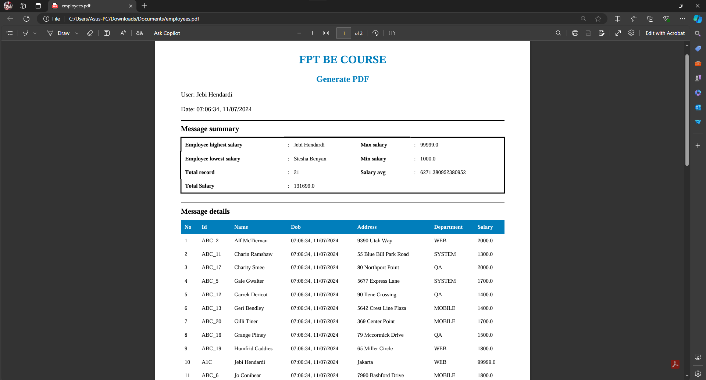

## Assignment 3

This is a continuation of the project from Assignment 2, with updates

#
### Add Dependencies
```xml
<dependency>
    <groupId>org.xhtmlrenderer</groupId>
    <artifactId>flying-saucer-pdf-openpdf</artifactId>
    <version>9.1.22</version>
</dependency>
<dependency>
    <groupId>org.apache.pdfbox</groupId>
    <artifactId>pdfbox</artifactId>
    <version>2.0.24</version>
</dependency>
```

- `Flying Saucer` is a Java library that converts XHTML/XML content to PDF documents. The OpenPDF variant uses the OpenPDF library as the PDF rendering engine. It allows for rendering HTML content into PDF format.
- `Apache PDFBox` is an open-source Java library for working with PDF documents. It provides functionalities for creating, manipulating, and extracting data from PDF files. 
#
### PdfService.java

```java
package jebi.hendardi.spring.service;

import java.io.ByteArrayOutputStream;
import java.time.LocalDateTime;
import java.time.format.DateTimeFormatter;
import java.util.List;
import java.util.Optional;
import java.util.OptionalDouble;

import org.springframework.stereotype.Service;
import org.thymeleaf.TemplateEngine;
import org.thymeleaf.context.Context;
import org.xhtmlrenderer.pdf.ITextRenderer;

import jebi.hendardi.spring.model.Employee;

@Service
public class PdfService {

    private final TemplateEngine templateEngine;
    private final EmployeeService employeeService;

    public PdfService(TemplateEngine templateEngine, EmployeeService employeeService) {
        this.templateEngine = templateEngine;
        this.employeeService = employeeService;
    }

    public byte[] generatePdf(List<Employee> employees) throws Exception {
        Context context = new Context();
        context.setVariable("employees", employees);

        double totalSalary = employees.stream()
                                     .mapToDouble(Employee::getSalary)
                                     .sum();
        context.setVariable("totalSalary", totalSalary);

        DateTimeFormatter formatter = DateTimeFormatter.ofPattern("HH:mm:ss, dd/MM/yyyy");
        String formattedDateTime = LocalDateTime.now().format(formatter);
        context.setVariable("currentDate", formattedDateTime);

        Optional<Employee> highestSalaryEmployee = employeeService.getHighestSalaryEmployee();
        Optional<Employee> lowestSalaryEmployee = employeeService.getLowestSalaryEmployee();
        long recordCount = employeeService.getRecordCount();
        OptionalDouble averageSalary = employeeService.getAverageSalary();

        context.setVariable("highestSalaryEmployee", highestSalaryEmployee.orElse(null));
        context.setVariable("lowestSalaryEmployee", lowestSalaryEmployee.orElse(null));
        context.setVariable("recordCount", recordCount);
        context.setVariable("averageSalary", averageSalary.isPresent() ? averageSalary.getAsDouble() : 0);

        String html = templateEngine.process("pdf-template", context);

        try (ByteArrayOutputStream os = new ByteArrayOutputStream()) {
            ITextRenderer renderer = new ITextRenderer();
            renderer.setDocumentFromString(html);
            renderer.layout();
            renderer.createPDF(os);
            return os.toByteArray();
        }
    }
}
```
This class is a Spring @Service responsible for generating a PDF report based on employee data. It uses TemplateEngine from Thymeleaf to process an HTML template (pdf-template.html). Key functionalities include calculating total salary, formatting the current date and time, retrieving additional employee statistics (highest salary, lowest salary, record count, average salary), and then using Flying Saucer (ITextRenderer) to convert the processed HTML into a PDF byte array.

#
### Controller EndPoint GeneratePdf
```java
@GetMapping("/generatePdf")
public ResponseEntity<InputStreamResource> generatePdf() throws Exception {
    List<Employee> employees = employeeService.findAll();
    byte[] pdfBytes = pdfService.generatePdf(employees);

    ByteArrayResource resource = new ByteArrayResource(pdfBytes);

    return ResponseEntity.ok()
        .header(HttpHeaders.CONTENT_DISPOSITION, "attachment;filename=employees.pdf")
        .contentType(MediaType.APPLICATION_PDF)
        .contentLength(pdfBytes.length)
        .body(new InputStreamResource(resource.getInputStream()));
}
```

This method is an HTTP GET endpoint (/generatePdf) that triggers the generation of a PDF report. It retrieves a list of all employees using EmployeeService, then calls PdfService to generate a PDF byte array based on the retrieved employee data. The generated PDF is returned as a downloadable file (employees.pdf) in the HTTP response.

#
### pdf-template.html
```html
<!DOCTYPE html>
<html xmlns:th="http://www.thymeleaf.org">
<head>
    <meta charset="UTF-8"/>
    <meta name="viewport" content="width=device-width, initial-scale=1.0"/>
    <style>
        table {
            width: 100%;
            border-collapse: collapse;
        }
        th, td {
            border: 1px solid black;
            padding: 8px;
            text-align: left;
        }
        th {
            background-color: #f2f2f2;
        }
    </style>
</head>
<body>
    <div>
        <h2>Employee Report</h2>
        <div>
            <strong>CEO : </strong> Jebi Hendardi
        </div>
        <div>
            <strong>Generated on : </strong> <span th:text="${currentDate}"></span>
        </div>
        <div>
            <strong>Total Records : </strong> <span th:text="${recordCount}"></span>
        </div>
        <div>
            <strong>Total Salary : </strong> <span th:text="${totalSalary}"></span>
        </div>
        <div>
            <strong>Average Salary : </strong> <span th:text="${averageSalary}"></span>
        </div>
        <div>
            <strong>Highest Salary Employee : </strong> <span th:text="${highestSalaryEmployee != null ? highestSalaryEmployee.name : ''}"></span>
            with salary <span th:text="${highestSalaryEmployee != null ? highestSalaryEmployee.salary : ''}"></span>
        </div>
        <div>
            <strong>Lowest Salary Employee : </strong> <span th:text="${lowestSalaryEmployee != null ? lowestSalaryEmployee.name : ''}"></span>
            with salary <span th:text="${lowestSalaryEmployee != null ? lowestSalaryEmployee.salary : ''}"></span>
        </div>

        <h3>Employee List</h3>
        <table>
            <thead>
                <tr>
                    <th>ID</th>
                    <th>Name</th>
                    <th>DOB</th>
                    <th>Address</th>
                    <th>Department</th>
                    <th>Salary</th>
                </tr>
            </thead>
            <tbody>
                <tr th:each="employee : ${employees}">
                    <td th:text="${employee.id}"></td>
                    <td th:text="${employee.name}"></td>
                    <td th:text="${employee.dob}"></td>
                    <td th:text="${employee.address}"></td>
                    <td th:text="${employee.department}"></td>
                    <td th:text="${employee.salary}"></td>
                </tr>
            </tbody>
        </table>
    </div>

</body>
</html>
```

This HTML template is processed by Thymeleaf to generate the content of the PDF report. It includes various sections such as CEO information, generated date, total records, total salary, average salary, details of the highest and lowest salary employees, and a table listing all employees with their ID, name, date of birth (dob), address, department, and salary. Thymeleaf expressions (th:text) are used to dynamically populate data from the context (Context) set in PdfService.

# 
### Run App
Open in browser : http://localhost:8080


#
### Upload CSV File


#
### Add Data


#
### Download Data to PDF
Click `Download Employee Report` Button


