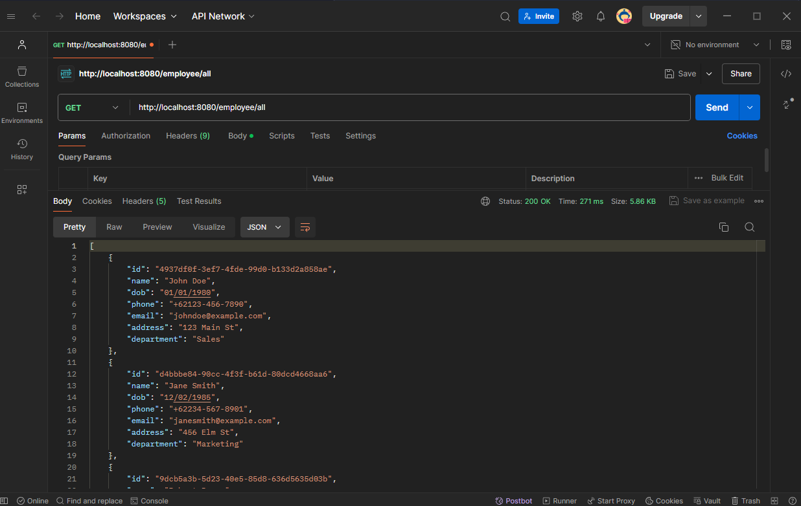

#
### Assignment 1 - Spring CRUD with CSV Import to database

#### Project Structure
```
menu
├── src\main\java\jebi\hendardi\lecture5
│   ├── Lecture5Application.java
│   ├── config
│   │   ├── BatchConfig.java
│   │   └── EmployeeProcessor.java
│   ├── controller
│   │   └── EmployeeController.java
│   ├── dto
│   │   └── EmployeeDTO.java
│   ├── exception
│   │   └── GlobalExceptionHandler.java
│   ├── mapper
│   │   └── EmployeeMapper.java
│   ├── model
│   │   └── Employee.java
│   ├── repository
│   │   └── EmployeeRepository.java
│   └── service
│       └── EmployeeService.java
└── pom.xml

```
#
## 1. Add Dependencies
```xml
<dependency>
    <groupId>jakarta.validation</groupId>
    <artifactId>jakarta.validation-api</artifactId>
    <version>3.0.2</version>
</dependency>
<dependency>
    <groupId>org.hibernate.validator</groupId>
    <artifactId>hibernate-validator</artifactId>
    <version>8.0.1.Final</version>
</dependency>
<dependency>
    <groupId>org.mapstruct</groupId>
    <artifactId>mapstruct</artifactId>
    <version>1.5.3.Final</version>
</dependency>
<dependency>
    <groupId>org.mapstruct</groupId>
    <artifactId>mapstruct-processor</artifactId>
    <version>1.5.3.Final</version>
    <scope>provided</scope>
</dependency>
```

| Dependency                                          | Purpose                                                                       | Use in Project                                           |
|-----------------------------------------------------|-------------------------------------------------------------------------------|----------------------------------------------------------|
| `jakarta.validation:jakarta.validation-api:3.0.2`   | Provides the Jakarta Bean Validation API for validating Java Beans.           | Utilized for validating the fields of the Employee entity. |
| `org.hibernate.validator:hibernate-validator:8.0.1.Final` | Implements the Jakarta Bean Validation API, providing the validation logic.   | Validates Employee entity fields according to the constraints specified. |
| `org.mapstruct:mapstruct:1.5.3.Final`               | A code generator for simplifying the implementation of mappings between Java bean types. | Converts EmployeeDTO to Employee and vice versa.         |
| `org.mapstruct:mapstruct-processor:1.5.3.Final`     | Includes the annotation processor for MapStruct, generating mapper implementations. | Automatically generates the implementation of mapper interfaces. |


#
## 2. Add Data Transfer Objects (DTOs)

**File: `EmployeeDTO.java`**

DTOs are used to encapsulate data and send it across different layers of the application. They help in reducing the number of calls and providing a consistent data format.

```java
package jebi.hendardi.lecture5.dto;

import jakarta.validation.constraints.Email;
import jakarta.validation.constraints.NotBlank;
import jakarta.validation.constraints.Pattern;
import lombok.Getter;
import lombok.Setter;

import java.util.UUID;

@Getter
@Setter
public class EmployeeDTO {
    private UUID id;

    @Pattern(regexp = "^[a-zA-Z\\s]+$", message = "Name must contain only letters and spaces")
    @NotBlank(message = "Name is mandatory")
    private String name;

    @NotBlank(message = "Date of birth is mandatory")
    private String dob;

    @Pattern(regexp = "^\\+62[0-9]+$", message = "Phone must start with +62")
    @NotBlank(message = "Phone is mandatory")
    private String phone;

    @Email(message = "Email should be valid")
    @NotBlank(message = "Email is mandatory")
    private String email;

    private String address;

    private String department;
}
```
**Annotations:**
- `@Getter and @Setter`: Automatically generate getter and setter methods.
- `@Pattern`: Ensures that the name contains only letters and spaces, and phone starts with "+62".
- `@NotBlank`: Ensures that the field is not empty.
- `@Email`: Ensures that the email format is valid.


#
## 2. MapStruct for Object Mapping

File: `EmployeeMapper.java`

MapStruct is used to automatically map between DTOs and entities, reducing boilerplate code.

```java
package jebi.hendardi.lecture5.mapper;

import org.mapstruct.Mapper;
import org.mapstruct.Mapping;
import org.mapstruct.Mappings;
import org.mapstruct.factory.Mappers;

import jebi.hendardi.lecture5.dto.EmployeeDTO;
import jebi.hendardi.lecture5.model.Employee;

import java.util.List;

@Mapper
public interface EmployeeMapper {
    EmployeeMapper INSTANCE = Mappers.getMapper(EmployeeMapper.class);

    @Mappings({
        @Mapping(source = "id", target = "id"),
        @Mapping(source = "name", target = "name"),
        @Mapping(source = "dob", target = "dob"),
        @Mapping(source = "phone", target = "phone"),
        @Mapping(source = "email", target = "email"),
        @Mapping(source = "address", target = "address"),
        @Mapping(source = "department", target = "department")
    })
    EmployeeDTO toDTO(Employee employee);

    @Mappings({
        @Mapping(source = "id", target = "id"),
        @Mapping(source = "name", target = "name"),
        @Mapping(source = "dob", target = "dob"),
        @Mapping(source = "phone", target = "phone"),
        @Mapping(source = "email", target = "email"),
        @Mapping(source = "address", target = "address"),
        @Mapping(source = "department", target = "department")
    })
    Employee toEntity(EmployeeDTO employeeDTO);

    List<EmployeeDTO> toDTOs(List<Employee> employees);

    List<Employee> toEntities(List<EmployeeDTO> employeeDTOs);
}
```

**Annotations:**
- `@Mapper`: Defines this interface as a MapStruct mapper.
- `@Mappings` and `@Mapping`: Specify the mapping between fields of the source and target objects.

**Methods:**
- `toDTO`: Converts an Employee entity to an EmployeeDTO.
- `toEntity`: Converts an EmployeeDTO to an Employee entity.
- `toDTOs` and `toEntities`: Convert lists of entities and DTOs, respectively.


#
### 2. Global Exception Handling

File : `GlobalExceptionHandler.java`

Provides a centralized exception handling mechanism, improving code maintainability and user experience.

**Annotations:**
- `@RestControllerAdvice`: Indicates that this class provides global exception handling for all controllers.
- `@ExceptionHandler`: Specifies the type of exception to handle.
  
**Method:**
- `handleValidationExceptions`: Captures *MethodArgumentNotValidException* and returns a map of validation errors with a BAD_REQUEST status.


#
## 4. Implement DTO and validation in service

File: `EmployeeService.java`

This file serves as the service layer in the application, responsible for managing operations related to Employee entities. It encapsulates business logic and interacts with the repository layer (EmployeeRepository) and mapping layer (EmployeeMapper).


**Annotations :**
- `@Service`: Indicates that the class is a service component in Spring, handling business logic. It is automatically detected during component scanning and registered in the application context.
  
- `@Validated`: Enables method-level validation for validating method parameters. It supports validation annotations like `@Valid`, ensuring that inputs conform to specified constraints.

- `@Transactional`: Defines transactional behavior for methods in the service. It ensures that each method operates within a transaction, providing atomicity, consistency, isolation, and durability (ACID properties).

**DTO Validation and Its Function:**
- **DTO (Data Transfer Object)**: In this context, `EmployeeDTO` represents a data structure used for transferring data between layers, typically between the controller and service layers.

- `@Valid` Annotation: Applied to methods like `addEmployee()` and `updateEmployee()`, it triggers validation of the `EmployeeDTO` input. Validation rules defined in `EmployeeDTO` (such as field constraints from annotations like `@NotBlank`, `@Size`, etc.) are enforced before processing.

**Function:**
- **Validation**: Ensures that incoming data (in `EmployeeDTO`) meets specified criteria, maintaining data integrity and consistency.
  
- **Error Handling**: Detects and handles validation errors, preventing invalid data from being processed further.
  
- **Data Integrity**: Guarantees that only valid data is persisted or returned from operations, enhancing the reliability and correctness of the application.


#
### REST Endpoints
| HTTP Method | Endpoint                          | Description                                                                                           |
|-------------|-----------------------------------|-------------------------------------------------------------------------------------------------------|
| GET         | `/employee/all`                   | Retrieves all employees from the database using `employeeService.findAllEmployees()`.                  |
| GET         | `/employee/find/{employeeID}`     | Retrieves an employee by their `employeeID` using `employeeService.findEmployeeByEmployeeID(employeeID)`. |
| POST        | `/employee/add`                   | Adds a new employee to the database using `employeeService.addEmployee(employee)`.                     |
| GET         | `/employee/{department}`           | Retrieves employees by their `department` using `employeeService.findEmployeesByDepartment(department)`. |
| PUT         | `/employee/update/{employeeID}`   | Updates an employee identified by `employeeID` with new details using `employeeService.updateEmployee(updatedEmployee)`. |
| DELETE      | `/employee/delete/{employeeID}`   | Deletes an employee from the database by `employeeID` using `employeeService.deleteEmployee(employeeID)`. |
| POST        | `/employee/import`                | Initiates a batch job (`importEmployee`) to import data from a CSV file (`ImportData.csv`) into the database using `jobLauncher.run(job, jobParameters)`. |
| POST      | `/employee/upload`   | Uploads a CSV file and processes it to store the data into the database using `employeeService.addEmployee(employee)`. The file must be a valid CSV with the expected format. |

#
## Demo Run Project
### Start Project
When the project is successfully started, the employee table is automatically created in the database.

#
### Import data to DB
Since the database is initially empty, data needs to be imported from the ImportData.csv file using a HTTP `POST` request to `/employee/import`

**Note**: Ensure that the CSV file is located in `src\main\resources\ImportData.csv`, as specified in `BatchConfig.java`.


After the HTTP `POST` request to `/employee/import` is successful, the data from the CSV file is imported into the employee table in the database.


#
### Upload and store CSV File to database

- **HTTP Method**: POST
- **Endpoint**: /employee/upload
- **Description**: This endpoint allows users to upload a CSV file containing employee data. The file is processed to extract employee information, which is then stored in the database.
- **Request Parameter**: form-data "file" (MultipartFile) - The CSV file to be uploaded.

**Note** : Ensure that the form data key for the file upload is `file` to match the request parameter `@RequestParam("file")`. If there's a mismatch in key name, the file won't be processed correctly.


#
### Retrieve All Employees
Retrieve all employees from the database using a HTTP `GET` request to `/employee/all`.




#
### Retrieve Employee by EmployeeID
Retrieve a specific employee by their employeeID using a HTTP `GET` request to `/employee/find/{employeeID}`.


#
### Add New Employee
Add a new employee to the database using a HTTP `POST` request to `/employee/add`.

- Prepare a JSON payload containing details of a new employee.
- Send a `POST` request to `/employee/add` with the JSON payload in the request body.


#
### Validation

1. **Name Validation**
   - **Purpose**: Ensures that the `name` field contains only letters and spaces and cant be null/blank.
   - **Regex**: `^[a-zA-Z\\s]+$`
   - **Message**: "Name must contain only letters and spaces"
   - **Usage**: Validates that the `name` provided is composed solely of alphabetical characters and spaces.
    
    

    **Blank Name Validation**
    

1. **Email Validation**
   - **Purpose**: Validates that the `email` field adheres to a valid email format.
   - **Annotation**: `@Email`
   - **Message**: "Email should be valid"
   - **Usage**: Checks if the `email` provided matches the standard email format.

   

2. **Phone Validation**
   - **Purpose**: Ensures that the `phone` field starts with the country code "+62" and consists of digits.
   - **Regex**: `^\\+62[0-9]+$`
   - **Message**: "Phone must start with +62"
   - **Usage**: Verifies that the `phone` number starts with "+62" and contains only digits afterward.

   

3. **All Validation**
   - **Purpose**: Represents the combination of all validations (`name`, `email`, and `phone`) applied to the `EmployeeDTO` class.
   - **Usage**: When used collectively, these validations ensure that all mandatory fields (`name`, `email`, `phone`) adhere to their respective constraints. This comprehensive validation approach guarantees that data integrity is maintained and only valid data is processed or persisted.

   

#
### Update Employee by EmployeeID
Update an existing employee's information identified by their employeeID using a HTTP `PUT` request to `/employee/update/{employeeID}`

- Replace {employeeID} with the ID of an existing employee.
- Prepare a JSON payload containing updated information for the employee.
- Send a `PUT` request to `/employee/update/{employeeID}` with the JSON payload.
  

#
### Delete Employee by EmployeeID
Delete an employee from the database by their employeeID using a HTTP `DELETE` request to `/employee/delete/{employeeID}`


#
### Filter Employees by Department
Filter employees by their department using HTTP `GET` requests to `/employee/{department}` for different departments.


Send a `GET` request to `/employee/{department}` where {department} is replaced with specific department names like **Sales** or **HR**.


