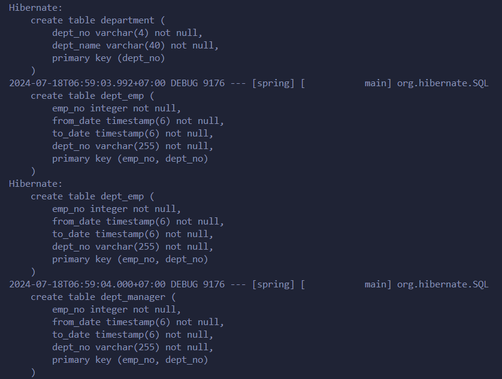
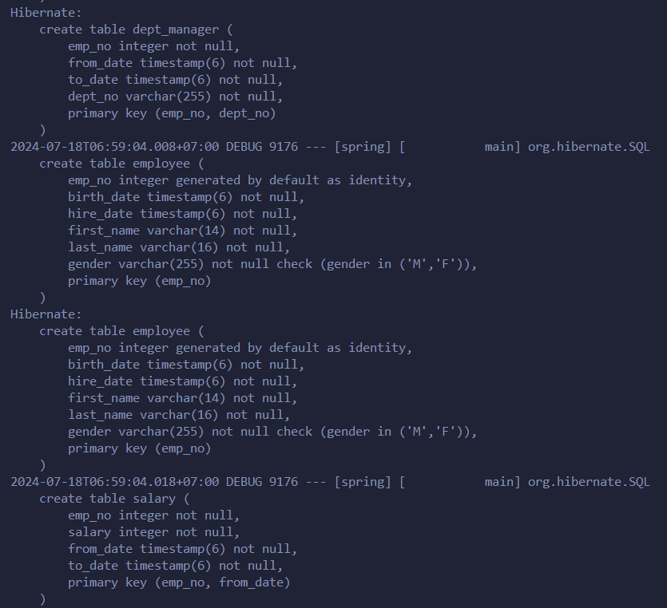
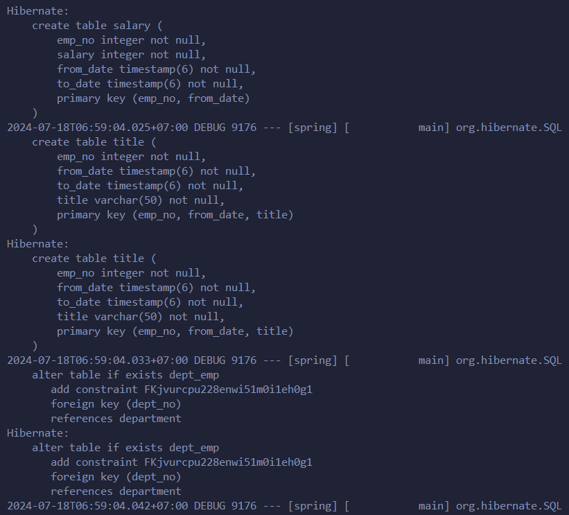
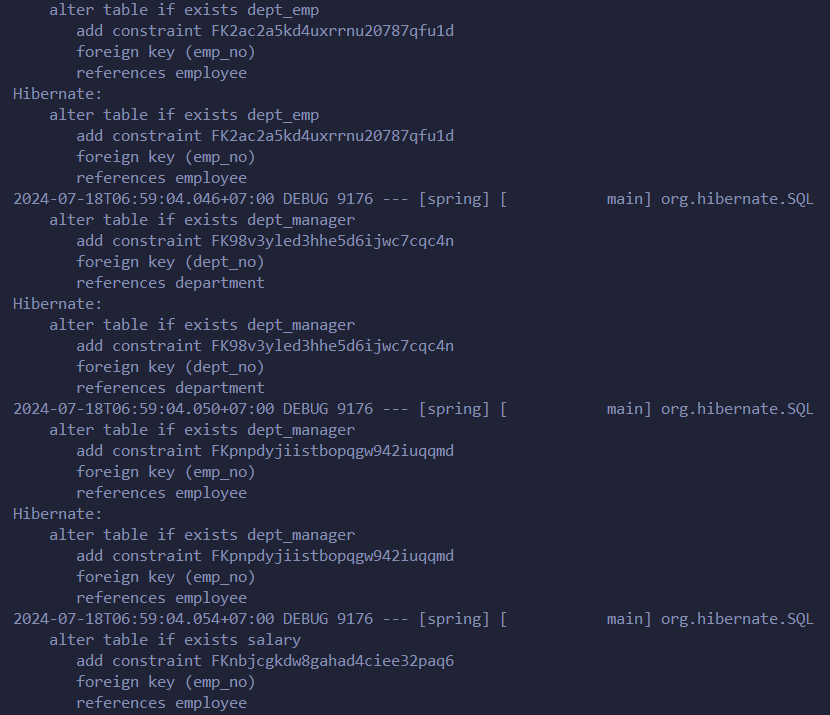
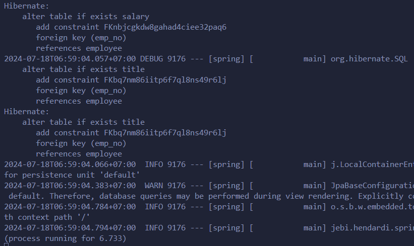
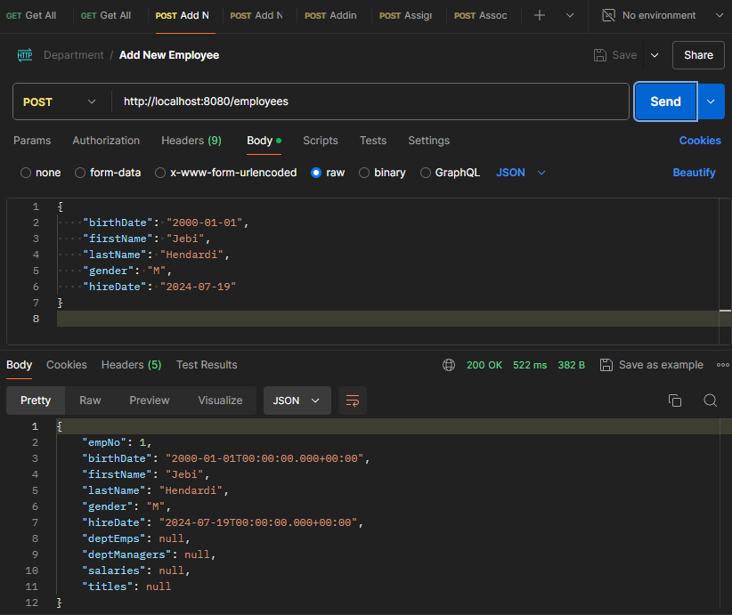
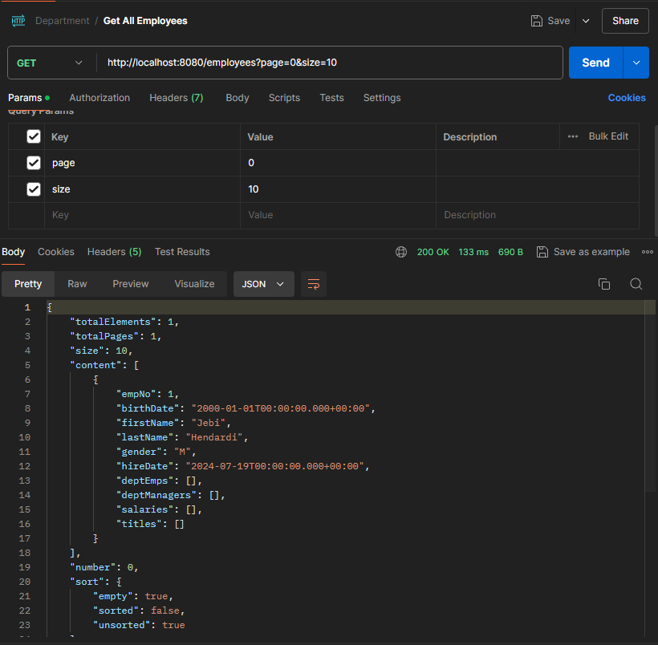
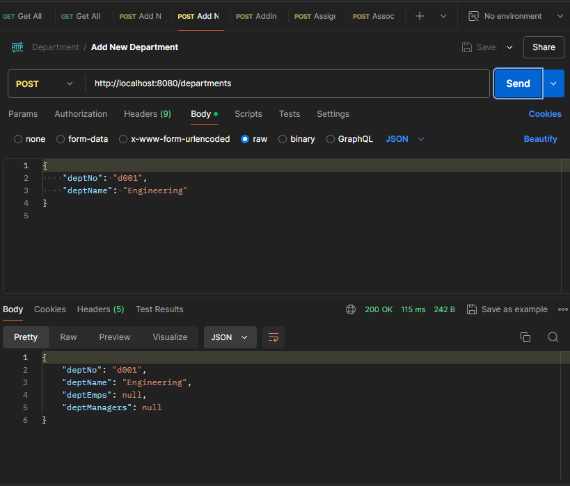
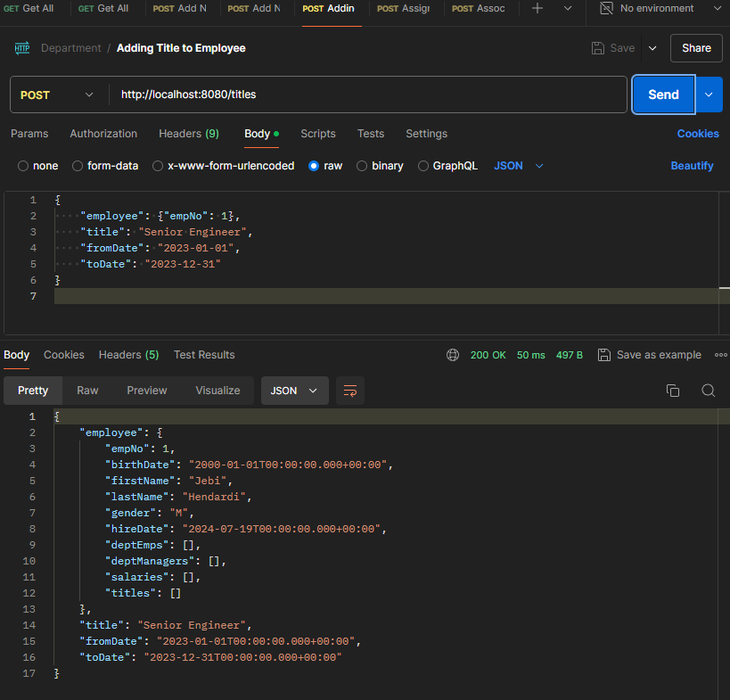

### API Endpoints

### DepartmentController

- **GET /departments**
  - Retrieves a list of all departments.
  
- **POST /departments**
  - Creates a new department.
  
- **PUT /departments/{deptNo}**
  - Updates an existing department by its department number (`deptNo`).
  
- **DELETE /departments/{deptNo}**
  - Deletes a department by its department number (`deptNo`).
#
### EmployeeController

- **GET /employees**
  - Retrieves a paginated list of all employees.
  
- **POST /employees**
  - Creates a new employee.
  
- **PUT /employees/{empNo}**
  - Updates an existing employee by their employee number (`empNo`).
  
- **DELETE /employees/{empNo}**
  - Deletes an employee by their employee number (`empNo`).
#
### SalaryController

- **POST /salaries**
  - Adds a new salary record for an employee.
  
- **PUT /salaries/{empNo}**
  - Updates the salary of an employee by their employee number (`empNo`).
#
### TitleController

- **POST /titles**
  - Adds a new title for an employee.
  
- **PUT /titles/{empNo}**
  - Updates the title of an employee by their employee number (`empNo`).

#

#
### Run App :

**Add Employee**

#
**Get Employee with paging**

`GET http://localhost:8080/employees?page=0&size=10`

can change value page and size from parameter (in this case use page=0 and size = 10)

#
**Add Department**

#
**Add Salary to employee**

#
**Add title to employee**
