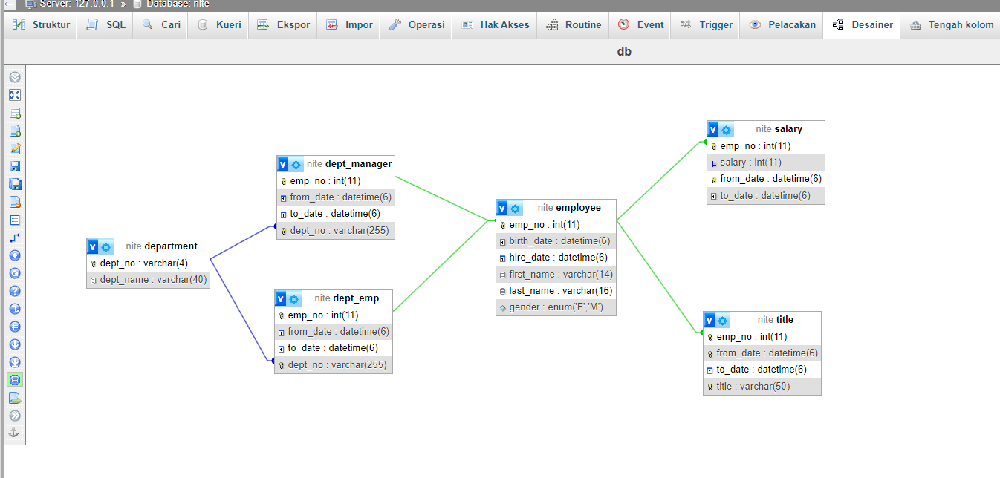

### Project Structure
```


src
├── main
│   ├── java
│   │   └── jebi
│   │       └── hendardi
│   │           └── spring
│   │               ├── controller
│   │               │   ├── DepartmentController.java
│   │               │   ├── EmployeeController.java
│   │               │   ├── SalaryController.java
│   │               │   └── TitleController.java
│   │               │
│   │               ├── dto
│   │               │   └── EmployeeDTO.java
│   │               │
│   │               ├── entity
│   │               │   ├── Department.java
│   │               │   ├── DeptEmp.java
│   │               │   ├── DeptEmpId.java
│   │               │   ├── DeptManager.java
│   │               │   ├── DeptManagerId.java
│   │               │   ├── Employee.java
│   │               │   ├── Gender.java
│   │               │   ├── Salary.java
│   │               │   ├── SalaryId.java
│   │               │   ├── Title.java
│   │               │   └── TitleId.java
│   │               │
│   │               ├── repository
│   │               │   ├── DepartmentRepository.java
│   │               │   ├── DeptEmpRepository.java
│   │               │   ├── DeptManagerRepository.java
│   │               │   ├── EmployeeRepository.java
│   │               │   ├── SalaryRepository.java
│   │               │   └── TitleRepository.java
│   │               │
│   │               └── service
│   │                   ├── DepartmentService.java
│   │                   ├── EmployeeService.java
│   │                   ├── SalaryService.java
│   │                   └── TitleService.java
```
#
### Database


#### This database design automatically created when program started

#
### Run App :

**Add Employee**


#
**Add Department**


#
**Add Salary to employee**


#
**Add title to employee**


#

**Get Employee with paging**

`GET http://localhost:8080/employees?page=0&size=10`

can change value page and size from parameter (in this case use page=0 and size = 10)


#
**Search by first Name**


#
**Search by last Name**
