### 📚 Project Documentation: Assignment 3 - Simple Interceptor
#
### 🎯 Project Objective

The goal of this project is to enhance the existing system by implementing an interceptor that performs the following tasks:

1. **Store Username for Each API Key:** Extract the username associated with each API key, add it to the request header, and print it in a controller function.
2. **Add Timestamp to Responses:** Include a "timestamp" header with the current time in all responses returned to the client.
3. **Track API Key Usage:** Record the last time each API key was used.
#
### 🔄 Interceptor Flow Explanation

The interceptor, `ApiKeyInterceptor`, is designed to intercept incoming HTTP requests and perform the following operations before and after request processing:

1. **Pre-Handle Phase:**
   - The interceptor extracts the `api-key` from the request header.
   - Validates the `api-key` using `ApiKeyService`.
   - If the `api-key` is invalid, it sends an HTTP 401 Unauthorized response.
   - If valid, it retrieves the associated username and adds it to the request attributes.
   - Adds the username and current timestamp to the response headers.

2. **After Completion Phase:**
   - Updates the `last_used` timestamp for the `api-key` in the database.
   - Adds a current timestamp to the response headers again to ensure consistency.
#
## 🛠️ Interceptor Configuration

The interceptor is configured in the `InterceptorConfig` class, which registers the `ApiKeyInterceptor` to intercept all requests to `/products/**`.

### 📝 Code Snippets

#### 🛠️ Interceptor Configuration (`InterceptorConfig.java`)
```java
package jebi.hendardi.spring.config;

import org.springframework.beans.factory.annotation.Autowired;
import org.springframework.context.annotation.Configuration;
import org.springframework.web.servlet.config.annotation.InterceptorRegistry;
import org.springframework.web.servlet.config.annotation.WebMvcConfigurer;
import jebi.hendardi.spring.interceptor.ApiKeyInterceptor;

@Configuration
public class InterceptorConfig implements WebMvcConfigurer {

    @Autowired
    private ApiKeyInterceptor apiKeyInterceptor;

    @Override
    public void addInterceptors(InterceptorRegistry registry) {
        registry.addInterceptor(apiKeyInterceptor).addPathPatterns("/products/**");
    }
}
```

#### 🔄 Interceptor Implementation (`ApiKeyInterceptor.java`)
```java
package jebi.hendardi.spring.interceptor;

import java.io.IOException;
import java.time.Instant;
import org.springframework.beans.factory.annotation.Autowired;
import org.springframework.stereotype.Component;
import org.springframework.web.servlet.HandlerInterceptor;
import jakarta.servlet.http.HttpServletRequest;
import jakarta.servlet.http.HttpServletResponse;
import jebi.hendardi.spring.service.ApiKeyService;

@Component
public class ApiKeyInterceptor implements HandlerInterceptor {

    @Autowired
    private ApiKeyService apiKeyService;

    @Override
    public boolean preHandle(HttpServletRequest request, HttpServletResponse response, Object handler) throws IOException {
        String apiKey = request.getHeader("api-key");

        if (apiKey == null || !apiKeyService.isValidApiKey(apiKey)) {
            response.sendError(HttpServletResponse.SC_UNAUTHORIZED, "Invalid API Key");
            return false;
        }

        String username = apiKeyService.getUsernameForKey(apiKey);
        request.setAttribute("username", username);
        request.setAttribute("apiKey", apiKey);
        response.addHeader("username", username);
        response.addHeader("timestamp", Instant.now().toString());

        return true;
    }

    @Override
    public void afterCompletion(HttpServletRequest request, HttpServletResponse response, Object handler, Exception ex) {
        String apiKey = (String) request.getAttribute("apiKey");
        if (apiKey != null) {
            apiKeyService.updateLastUsed(apiKey);
        }
        response.addHeader("timestamp", Instant.now().toString());
    }
}
```
#### 🌐 Controller Modification (`ProductController.java`)
```java
package jebi.hendardi.spring.controller;

import java.util.List;
import org.springframework.beans.factory.annotation.Autowired;
import org.springframework.http.HttpStatus;
import org.springframework.http.ResponseEntity;
import org.springframework.web.bind.annotation.*;
import jakarta.servlet.http.HttpServletRequest;
import jebi.hendardi.spring.entity.Product;
import jebi.hendardi.spring.service.ProductService;

@RestController
@RequestMapping("/products")
public class ProductController {

    @Autowired
    private ProductService productService;

    @GetMapping
    public ResponseEntity<List<Product>> getAllProducts(HttpServletRequest request) {
        String username = (String) request.getAttribute("username");
        System.out.println("Request made by user: " + username);
        return ResponseEntity.ok(productService.getAllProducts());
    }

    @GetMapping("/{id}")
    public ResponseEntity<Product> getProductById(@PathVariable Long id, HttpServletRequest request) {
        String username = (String) request.getAttribute("username");
        System.out.println("Request made by user: " + username);
        Product product = productService.getProductById(id);
        if (product != null) {
            return ResponseEntity.ok(product);
        } else {
            return ResponseEntity.status(HttpStatus.NOT_FOUND).build();
        }
    }

    @PostMapping
    public ResponseEntity<Product> createProduct(@RequestBody Product product, HttpServletRequest request) {
        String username = (String) request.getAttribute("username");
        System.out.println("Request made by user: " + username);
        return ResponseEntity.status(HttpStatus.CREATED).body(productService.createProduct(product));
    }

    @PutMapping("/{id}")
    public ResponseEntity<Product> updateProduct(@PathVariable Long id, @RequestBody Product product, HttpServletRequest request) {
        String username = (String) request.getAttribute("username");
        System.out.println("Request made by user: " + username);
        Product updatedProduct = productService.updateProduct(id, product);
        if (updatedProduct != null) {
            return ResponseEntity.ok(updatedProduct);
        } else {
            return ResponseEntity.status(HttpStatus.NOT_FOUND).build();
        }
    }

    @DeleteMapping("/{id}")
    public ResponseEntity<Void> deleteProduct(@PathVariable Long id, HttpServletRequest request) {
        String username = (String) request.getAttribute("username");
        System.out.println("Request made by user: " + username);
        productService.deleteProduct(id);
        return ResponseEntity.status(HttpStatus.NO_CONTENT).build();
    }
}
```

#
### 🌐 Endpoint Table

| Method | Endpoint           | Description                   | Headers                  | Body (JSON)                           |
|--------|--------------------|-------------------------------|--------------------------|---------------------------------------|
| GET    | /products          | Get all products              | api-key                  |                                       |
| GET    | /products/{id}     | Get product by ID             | api-key                  |                                       |
| POST   | /products          | Create a new product          | api-key                  | {"name": "Product D", "price": 40.0}  |
| PUT    | /products/{id}     | Update an existing product    | api-key                  | {"name": "Product A Updated", "price": 15.0} |
| DELETE | /products/{id}     | Delete a product              | api-key                  |                                       |


#

### 📊 Initial Data for Testing

To test the endpoints, you can insert the following initial data into the database:

#### Insert API Keys and products

```sql
INSERT INTO apikey (id, xkey, username, last_used) VALUES
('1', 'apikeyjebi', 'jebihendardi', NULL),
('2', 'apikeynite', 'nitewalter', NULL);
```
```sql
INSERT INTO product (id, name, price) VALUES
(1, 'Product A', 10.0),
(2, 'Product B', 20.0),
(3, 'Product C', 30.0);
```

#
### 🧪 Postman Test Table

| Test Description                | Method | Endpoint           | Headers           | Body (JSON)                           | Expected Response               |
|---------------------------------|--------|--------------------|-------------------|---------------------------------------|---------------------------------|
| Get all products                | GET    | /products          | api-key           |                                       | 200 OK, List of products        |
| Get product by ID               | GET    | /products/1        | api-key           |                                       | 200 OK, Product details         |
| Create a new product            | POST   | /products          | api-key           | {"name": "Product D", "price": 40.0}  | 201 Created, New product details |
| Update an existing product      | PUT    | /products/1        | api-key           | {"name": "Product A Updated", "price": 15.0} | 200 OK, Updated product details |
| Delete a product                | DELETE | /products/1        | api-key           |                                       | 204 No Content                  |
| Get product with invalid API key| GET    | /products          | invalid-api-key   |                                       | 401 Unauthorized                |

#
### ✅ Test Cases

### 1. Add Product

- **Body**
  
  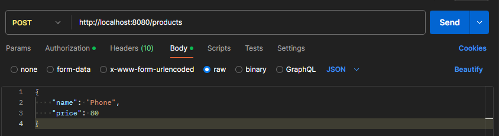

---

- **Authorization With Unregistered API Key**
    
  

---

- **Authorization With Correct API Key**
  
  **Response : Body** 
      
  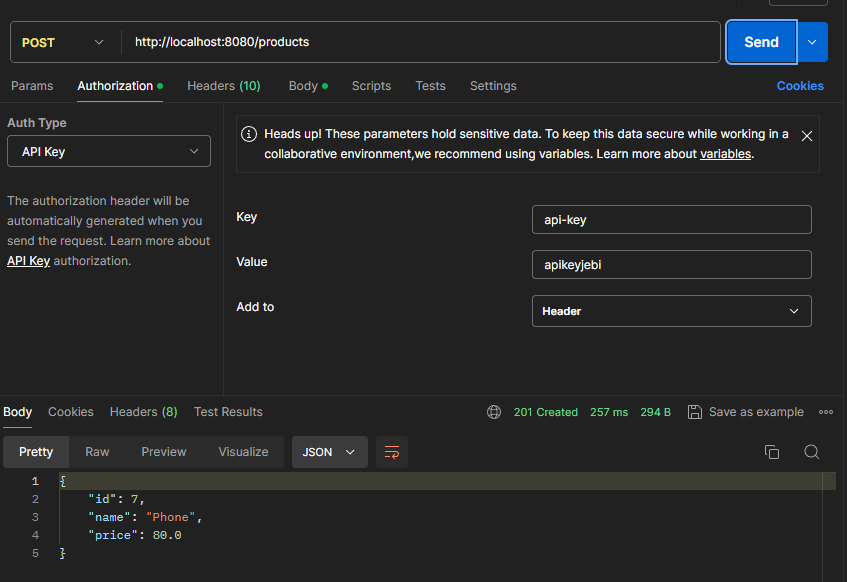

  **Response : Header**
      
  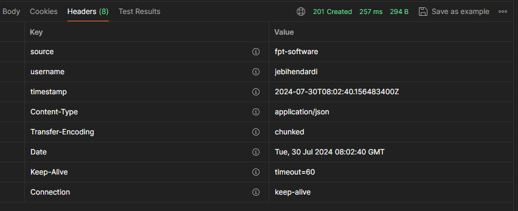
  
  **Hibernate Log**

  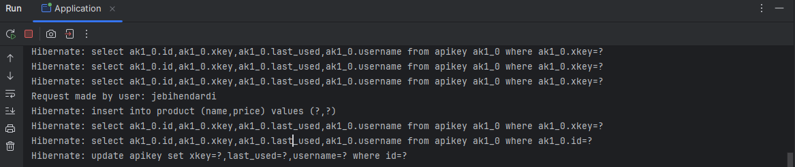

---

### 2. Update Product

- **Body**
  
  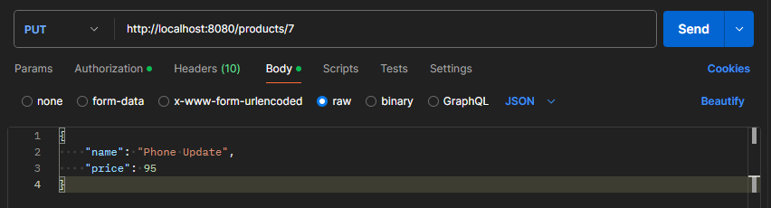

---

- **Authorization With Unregistered API Key**
    
  

---

- **Authorization With Correct API Key**
  
  **Response : Body** 
      
  

  **Response : Header**
      
  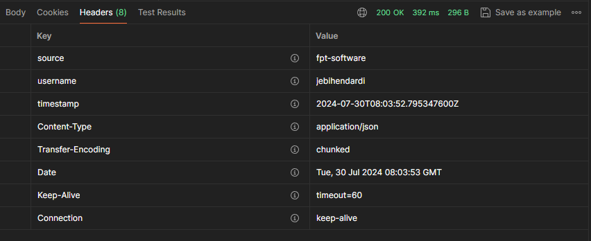

  **Hibernate Log**

  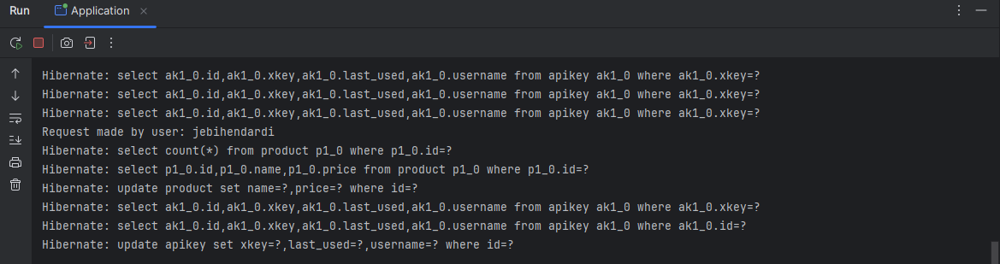

---

### 3. Get Product

- **Authorization With Unregistered API Key**
    
  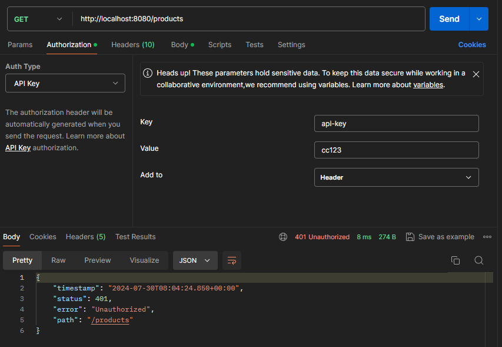

---

- **Authorization With Correct API Key**
  
  **Response : Body** 
      
  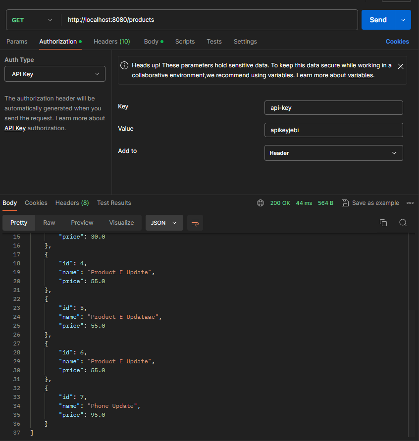

  **Response : Header**
      
  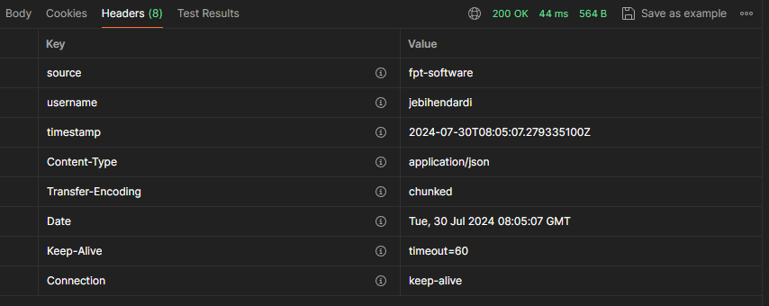

  **Hibernate Log**

  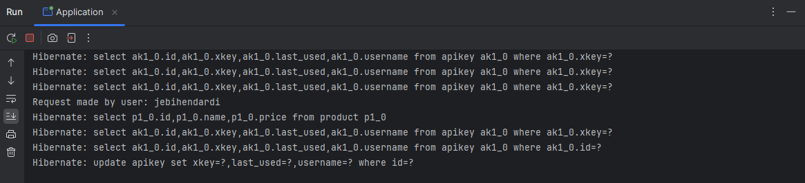

---

### 4. Delete Product

- **Authorization With Unregistered API Key**
    
  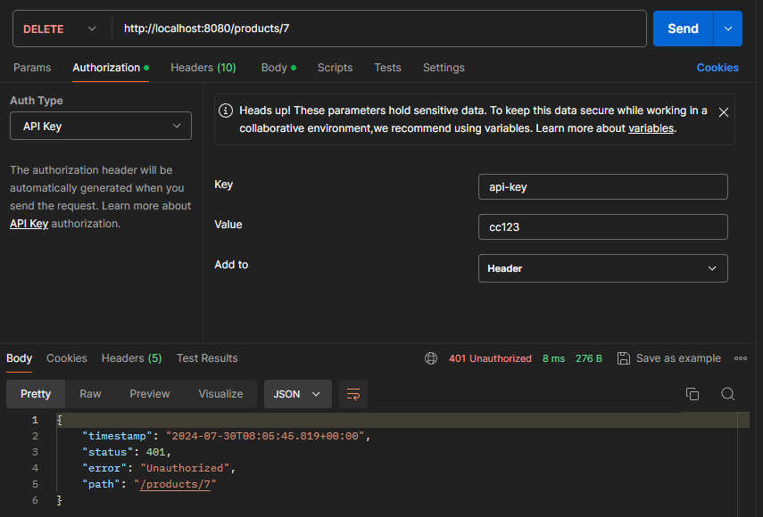

---

- **Authorization With Correct API Key**
  
  **Response : Body** 
      
  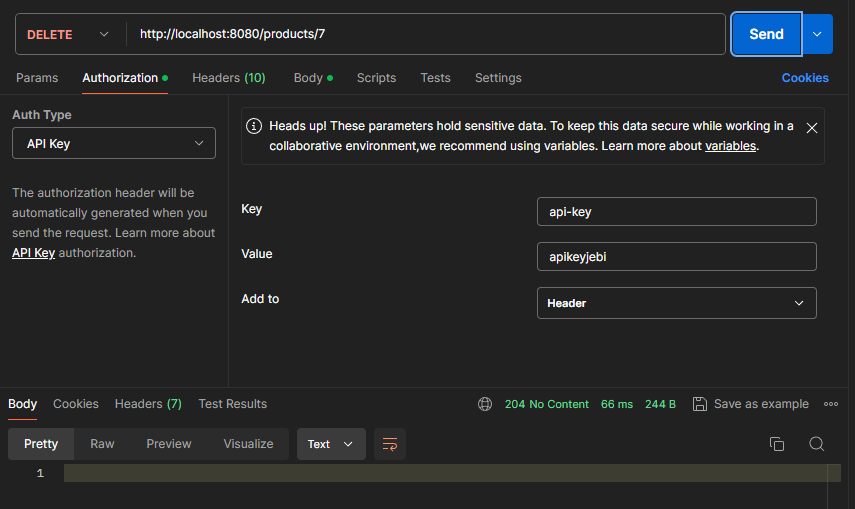

  **Response : Header**
      
  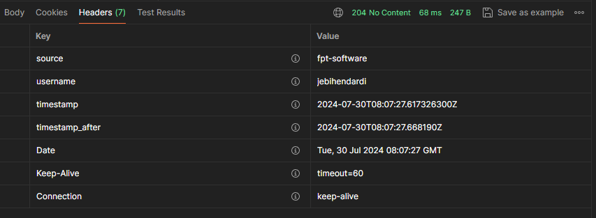

  **Hibernate Log**
  
  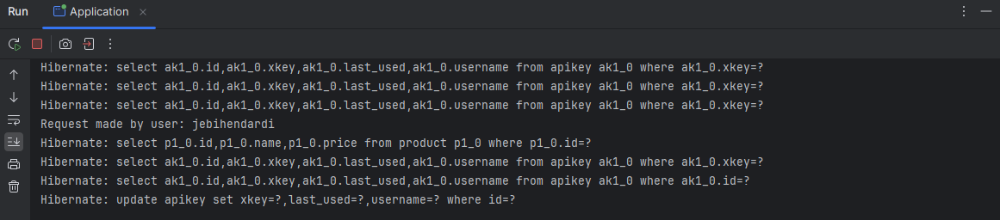

#
### Test Using Another Api Key
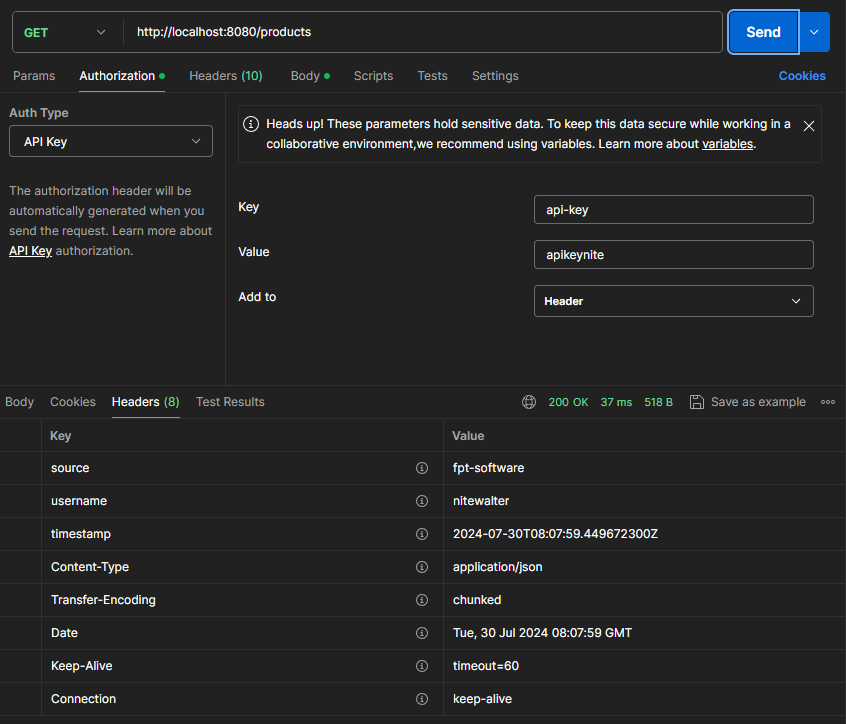

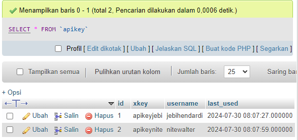