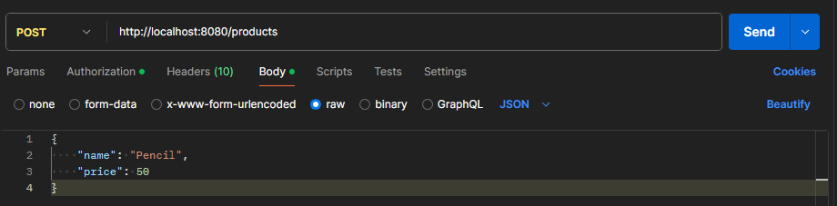
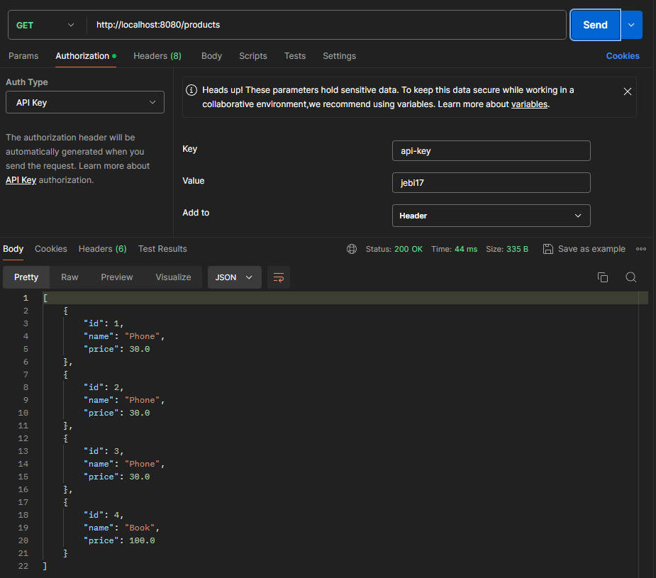

## Spring Boot CRUD Project with API Key Verification

### 🎯 Project Objectives


**Implement Secure Access**:
- Protect API endpoints by implementing an API key authentication mechanism.
- Ensure that only authorized users can access and modify data.

**CRUD Operations**:
- Develop a comprehensive CRUD (Create, Read, Update, Delete) system for managing products.
- Ensure smooth integration with the database for efficient data handling.

#
### 📂 Project Structure

The project is structured as follows:

- **Entities**
  - `ApiKey.java`
  - `Product.java`
- **Repositories**
  - `ApiKeyRepository.java`
  - `ProductRepository.java`
- **Services**
  - `ApiKeyService.java`
  - `ProductService.java`
- **Controllers**
  - `ProductController.java`
- **Filters**
  - `ApiKeyFilter.java`
- **Configuration**
  - `FilterConfig.java`
#
### 🗂️ Entities

**Source Code :** [ApiKey.java](https://github.com/affandyfandy/java-jebi/blob/week_08/Week%2008/Assignment%202/src/main/java/jebi/hendardi/spring/entity/ApiKey.java)

Represents the API key entity used for request verification.

**Explanation**:
- **Annotation**: `@Entity` denotes that this class is a JPA entity.
- **Fields**:
  - `id`: Primary key of type String, representing the ID of the API key.
  - `key`: The actual API key value.
- **Purpose**: To store API key values for authentication purposes.

---

**Source Code :** [Product.java](https://github.com/affandyfandy/java-jebi/blob/week_08/Week%2008/Assignment%202/src/main/java/jebi/hendardi/spring/entity/Product.java)

Represents the product entity with details such as name and price.

**Explanation**:
- **Annotation**: `@Entity` denotes that this class is a JPA entity.
- **Fields**:
  - `id`: Primary key of type Long, auto-generated.
  - `name`: Name of the product.
  - `price`: Price of the product.
- **Purpose**: To manage product information in the database.
#
### 🗄️ Repositories

**Source Code :** [ApiKeyRepository.java](https://github.com/affandyfandy/java-jebi/blob/week_08/Week%2008/Assignment%202/src/main/java/jebi/hendardi/spring/repository/ApiKeyRepository.java)

Interface for accessing `ApiKey` data in the database.

**Explanation**:
- **Extends**: `JpaRepository<ApiKey, String>`.
- **Methods**:
  - `findByKey(String key)`: Retrieves an `ApiKey` entity by its key value.
- **Purpose**: Provides CRUD operations and custom queries for the `ApiKey` entity.

---

**Source Code :** [ProductRepository.java](https://github.com/affandyfandy/java-jebi/blob/week_08/Week%2008/Assignment%202/src/main/java/jebi/hendardi/spring/repository/ProductRepository.java)

Interface for accessing `Product` data in the database.

**Explanation**:
- **Extends**: `JpaRepository<Product, Long>`.
- **Methods**:
  - Standard CRUD operations inherited from `JpaRepository`.
- **Purpose**: Provides CRUD operations for the `Product` entity.
#
### 🛠️ Services

**Source Code :** [ApiKeyService.java](https://github.com/affandyfandy/java-jebi/blob/week_08/Week%2008/Assignment%202/src/main/java/jebi/hendardi/spring/service/ApiKeyService.java)

Service for managing API key validation.

**Explanation**:
- **Dependencies**: Uses `ApiKeyRepository`.
- **Methods**:
  - `isValidApiKey(String key)`: Checks if the API key is present in the database.
- **Purpose**: Handles business logic related to API key verification.

---

**Source Code :** [ProductService.java](https://github.com/affandyfandy/java-jebi/blob/week_08/Week%2008/Assignment%202/src/main/java/jebi/hendardi/spring/service/ProductService.java)

Service for managing CRUD operations for products.

**Explanation**:
- **Dependencies**: Uses `ProductRepository`.
- **Methods**:
  - `getAllProducts()`: Retrieves all products.
  - `getProductById(Long id)`: Retrieves a product by ID.
  - `createProduct(Product product)`: Creates a new product.
  - `updateProduct(Long id, Product product)`: Updates an existing product. The method first checks if the product exists by its ID, and if so, sets the product's ID and updates it in the database.
  - `deleteProduct(Long id)`: Deletes a product by ID.
- **Purpose**: Contains business logic for handling product data.
#
### 🌐 Controllers

**Source Code :** [ProductController.java](https://github.com/affandyfandy/java-jebi/blob/week_08/Week%2008/Assignment%202/src/main/java/jebi/hendardi/spring/controller/ProductController.java)

Handles HTTP requests related to products.

**Explanation**:
- **Annotations**: `@RestController` and `@RequestMapping("/products")`.
- **Endpoints**:
  - `GET /products`: Retrieves all products.
  - `GET /products/{id}`: Retrieves a product by ID.
  - `POST /products`: Creates a new product.
  - `PUT /products/{id}`: Updates an existing product. The method responds with 200 OK if the product is updated and 404 Not Found if the product ID does not exist.
  - `DELETE /products/{id}`: Deletes a product by ID.
- **Purpose**: Manages the HTTP layer for product-related operations.
#
### 🔍 Filters

**Source Code :** [ApiKeyFilter.java](https://github.com/affandyfandy/java-jebi/blob/week_08/Week%2008/Assignment%202/src/main/java/jebi/hendardi/spring/filter/ApiKeyFilter.java)

Filters incoming HTTP requests to verify the presence and validity of the `api-key` header.

**Explanation**:
- **Annotation**: `@Component` registers this class as a Spring component.
- **Methods**:
  - `doFilterInternal(HttpServletRequest request, HttpServletResponse response, FilterChain chain)`: Checks the `api-key` header and validates it using `ApiKeyService`. Adds a `source` header to the response.
- **Purpose**: Ensures that requests are authenticated and adds a custom header to responses.
#
### ⚙️ Configuration

**Source Code :** [FilterConfig.java](https://github.com/affandyfandy/java-jebi/blob/week_08/Week%2008/Assignment%202/src/main/java/jebi/hendardi/spring/config/FilterConfig.java)

Configures the `ApiKeyFilter` for the application.

**Explanation**:
- **Annotation**: `@Configuration`.
- **Methods**:
  - `apiKeyFilterRegistration()`: Registers `ApiKeyFilter` with specific URL patterns, specifically for `/products/*`.
- **Purpose**: Sets up the filter for handling requests and responses.

#
### 🗄️ Database Initialization

### Initializes the database with API key sample data.

```sql
INSERT INTO apikey (id, xkey) VALUES
('apikey1', 'jebi17'),
('apikey2', 'light17'),
('apikey3', 'nite17');
```
#
### 🛠️ Testing with Postman

| Request Type | Endpoint           | Headers                                | Body (if applicable)                        | Expected Response       |
|--------------|---------------------|----------------------------------------|---------------------------------------------|-------------------------|
| GET          | `/products`         | `api-key: {xkey}`                     | N/A                                         | 200 OK, List of products |
| GET          | `/products/{id}`    | `api-key: {xkey}`                     | N/A                                         | 200 OK, Product details |
| POST         | `/products`         | `api-key: {xkey}`, `Content-Type: application/json` | `{ "name": "New Product", "price": 30.0 }` | 201 Created, Product created |
| PUT          | `/products/{id}`    | `api-key: {xkey}`, `Content-Type: application/json` | `{ "name": "Updated Product", "price": 35.0 }` | 200 OK, Product updated |
| DELETE       | `/products/{id}`    | `api-key: {xkey}`                     | N/A                                         | 200 OK, Product deleted |
#
### ✅ Test Cases

### 1. Add Product

- **Body**
  
  

---

- **Authorization With Unregistered API Key**
    
  

---

- **Authorization With Correct API Key**
  
  **Response : Body** 
      
  

  **Response : Header**
      
  

---

### 2. Update Product

- **Body**
  
  

---

- **Authorization With Unregistered API Key**
    
  

---

- **Authorization With Correct API Key**
  
  **Response : Body** 
      
  

  **Response : Header**
      
  

---

### 3. Get Product

- **Authorization With Unregistered API Key**
    
  

---

- **Authorization With Correct API Key**
  
  **Response : Body** 
      
  

  **Response : Header**
      
  

---

### 4. Delete Product

- **Authorization With Unregistered API Key**
    
  

---

- **Authorization With Correct API Key**
  
  **Response : Body** 
      
  

  **Response : Header**
      
  
