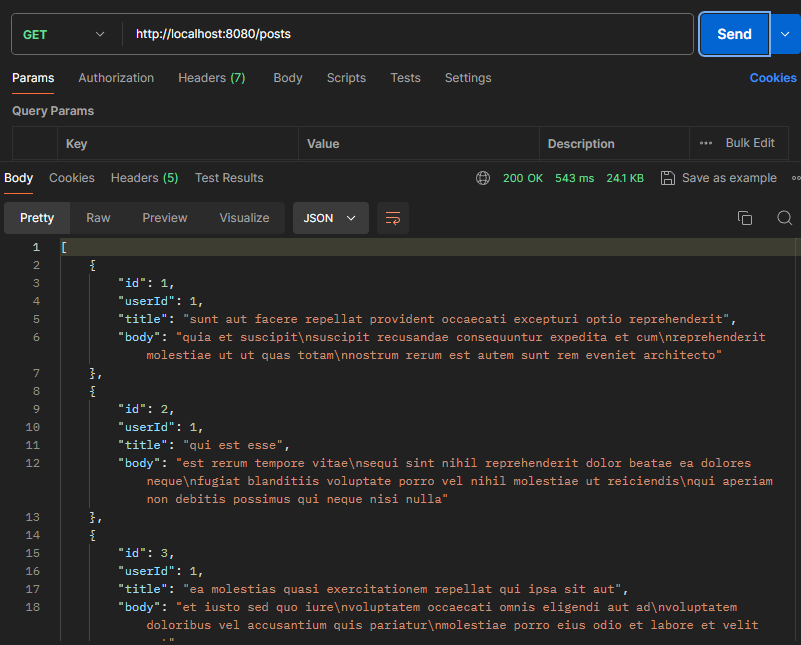
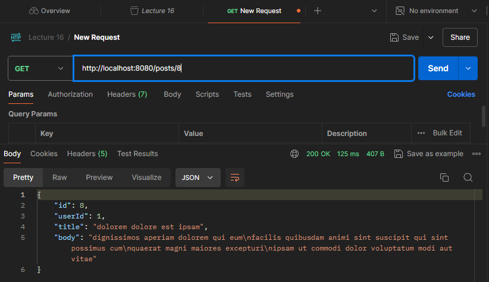

# Spring Cloud OpenFeign 

## 🎯 Project Objective
The objective of this project is to create a Spring Boot application that uses Spring Cloud OpenFeign to communicate with the JSONPlaceholder API. The application will provide endpoints to retrieve a list of posts and details of individual posts. 

### Key Features:
- Utilize OpenFeign for declarative REST client functionality.
- Implement a simple REST API to interact with the JSONPlaceholder API.
- Leverage Lombok to reduce boilerplate code.

## 🛠️ Project Setup Steps

### 1. Create a New Project
Go to [Spring Initializr](https://start.spring.io/) and create a new project with the following settings:
- **Group**: `jebi.hendardi.spring`
- **Dependencies**: 
  - Spring Web
  - Spring Cloud OpenFeign
  - Lombok

### 2. Update `pom.xml`
Add the necessary dependencies and configuration in your `pom.xml` file:

```xml
<properties>
    <java.version>17</java.version>
    <spring-cloud.version>2023.0.0</spring-cloud.version>
</properties>

<dependencies>
    <dependency>
        <groupId>org.projectlombok</groupId>
        <artifactId>lombok</artifactId>
        <optional>true</optional>
    </dependency>
    <dependency>
        <groupId>org.springframework.cloud</groupId>
        <artifactId>spring-cloud-starter-openfeign</artifactId>
    </dependency>
    <dependency>
        <groupId>io.github.openfeign</groupId>
        <artifactId>feign-okhttp</artifactId>
    </dependency>
    <dependency>
        <groupId>io.github.openfeign</groupId>
        <artifactId>feign-httpclient</artifactId>
    </dependency>
    <dependency>
        <groupId>org.springframework.boot</groupId>
        <artifactId>spring-boot-starter-test</artifactId>
        <scope>test</scope>
    </dependency>
</dependencies>

<dependencyManagement>
    <dependencies>
        <dependency>
            <groupId>org.springframework.cloud</groupId>
            <artifactId>spring-cloud-dependencies</artifactId>
            <version>${spring-cloud.version}</version>
            <type>pom</type>
            <scope>import</scope>
        </dependency>
    </dependencies>
</dependencyManagement>
```

### 3. Create Main Application Class
Create a main application class to bootstrap the Spring Boot application. Create a file named `Application.java` in the `src/main/java/jebi/hendardi/spring` directory:

```java
package jebi.hendardi.spring;

import org.springframework.boot.SpringApplication;
import org.springframework.boot.autoconfigure.SpringBootApplication;
import org.springframework.cloud.openfeign.EnableFeignClients;

/**
 * Main application class to bootstrap the Spring Boot application.
 * It enables Feign clients in the application.
 */
@SpringBootApplication
@EnableFeignClients
public class Application {
    public static void main(String[] args) {
        SpringApplication.run(Application.class, args);
    }
}
```

### 4. Create Feign Client Interface
Create a Feign client interface to define the API endpoints you want to interact with. Create a file named `JSONPlaceHolderClient.java` in the same package:

```java
package jebi.hendardi.spring;

import org.springframework.cloud.openfeign.FeignClient;
import org.springframework.web.bind.annotation.GetMapping;
import org.springframework.web.bind.annotation.PathVariable;

import java.util.List;

/**
 * Feign client interface to communicate with JSONPlaceholder API.
 */
@FeignClient(name = "jsonplaceholder", url = "https://jsonplaceholder.typicode.com/")
public interface JSONPlaceHolderClient {

    /**
     * Fetch all posts from the JSONPlaceholder API.
     * 
     * @return List of posts
     */
    @GetMapping("/posts")
    List<Post> getPosts();

    /**
     * Fetch a single post by its ID from the JSONPlaceholder API.
     * 
     * @param postId ID of the post to fetch
     * @return Post object
     */
    @GetMapping("/posts/{postId}")
    Post getPostById(@PathVariable("postId") Long postId);
}
```

### 5. Create Post Model
Create a model class to represent the data structure of a post. Create a file named `Post.java` in the same package:

```java
package jebi.hendardi.spring;

import lombok.Data;

/**
 * Model class representing a Post.
 */
@Data // Lombok annotation to generate getters, setters, and other methods
public class Post {
    private Long id;
    private String title;
    private String body;
}
```

### 6. Create a Controller
Create a controller to expose the API endpoints that will use the Feign client. Create a file named `PostController.java` in the same package:

```java
package jebi.hendardi.spring;

import org.springframework.web.bind.annotation.GetMapping;
import org.springframework.web.bind.annotation.PathVariable;
import org.springframework.web.bind.annotation.RestController;

import java.util.List;

/**
 * Controller class to handle incoming requests related to posts.
 */
@RestController
public class PostController {

    private final JSONPlaceHolderClient jsonPlaceHolderClient;

    public PostController(JSONPlaceHolderClient jsonPlaceHolderClient) {
        this.jsonPlaceHolderClient = jsonPlaceHolderClient;
    }

    /**
     * Endpoint to retrieve all posts.
     * 
     * @return List of posts
     */
    @GetMapping("/posts")
    public List<Post> getPosts() {
        return jsonPlaceHolderClient.getPosts();
    }

    /**
     * Endpoint to retrieve a single post by ID.
     * 
     * @param postId ID of the post to fetch
     * @return Post object
     */
    @GetMapping("/posts/{postId}")
    public Post getPostById(@PathVariable Long postId) {
        return jsonPlaceHolderClient.getPostById(postId);
    }
}
```

## 🔄 Program Flow
1. **Application Start**: The `Application` class is the entry point, which bootstraps the Spring Boot application.
2. **Feign Client Initialization**: The `JSONPlaceHolderClient` interface is recognized as a Feign client due to the `@FeignClient` annotation. It defines methods for retrieving posts.
3. **Controller Requests**: When a request hits the `/posts` or `/posts/{postId}` endpoint, the `PostController` methods are invoked.
4. **API Call**: The controller calls the corresponding method in the `JSONPlaceHolderClient`, which sends a request to the JSONPlaceholder API.
5. **Response Handling**: The API responds with the requested data, which is then returned to the client.

## 🧪 Testing with Postman

Open Postman and create requests to test the API. Below is a table summarizing the tests you can perform:

| 📄 Request Type | 🔗 URL                     | 🔍 Description                           | ✅ Expected Response                    |
|-----------------|---------------------------|-----------------------------------------|----------------------------------------|
| GET             | `http://localhost:8080/posts`         | Retrieve all posts from JSONPlaceholder | List of posts                          |
| GET             | `http://localhost:8080/posts/1`       | Retrieve a single post by ID (1)       | Post with ID 1                         |
| GET             | `http://localhost:8080/posts/999`     | Try to retrieve a non-existent post     | 404 Not Found                          |


#
#### Get all data



#
#### Get data by id




## 🔚 Conclusion
In this project we've outlined the steps to create a Spring Boot application using Spring Cloud OpenFeign to interact with a public API. We created a Feign client, defined a controller, and tested the endpoints using Postman.