## Unit Testing with Coverage Above 75%

### Dependencies

```xml
<dependencies>
    <dependency>
        <groupId>org.springframework.boot</groupId>
        <artifactId>spring-boot-starter-test</artifactId>
        <scope>test</scope>
    </dependency>
    <dependency>
        <groupId>org.mockito</groupId>
        <artifactId>mockito-core</artifactId>
        <scope>test</scope>
    </dependency>
</dependencies>
```

- **Spring Boot Starter Test**: This dependency provides a comprehensive testing framework that includes JUnit, Mockito, and other testing tools.
- **Mockito Core**: Mockito is a powerful mocking framework that allows you to create mock objects and define their behavior. It helps in isolating the unit of work by mocking dependencies.

#### Enity Test
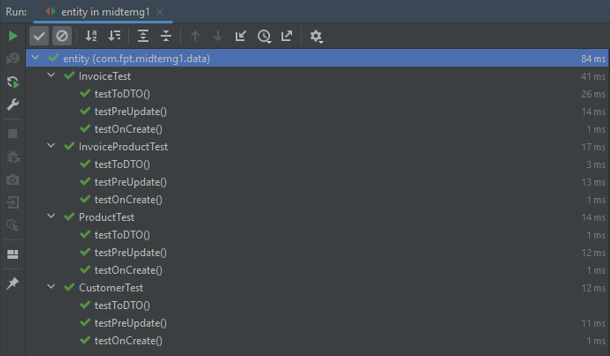
#
#### Controller Test
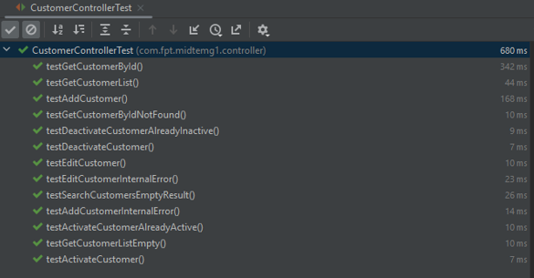

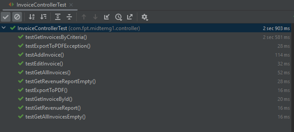

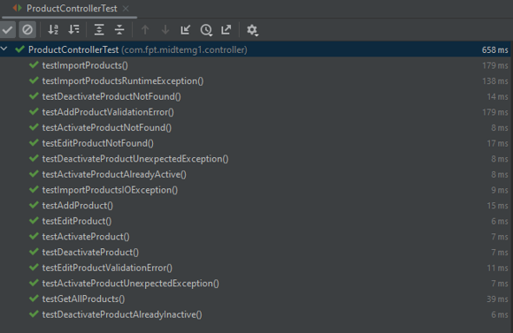
#
#### Service Test
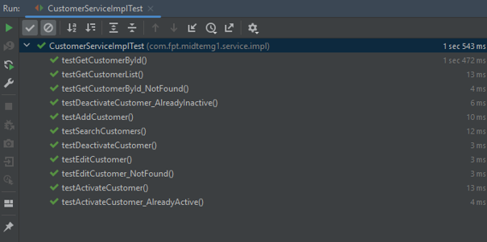

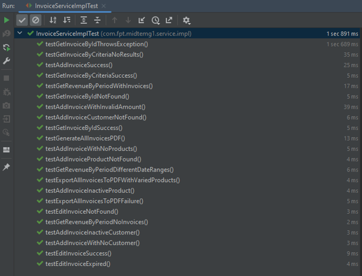

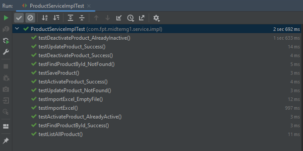
#
#### Specification Test
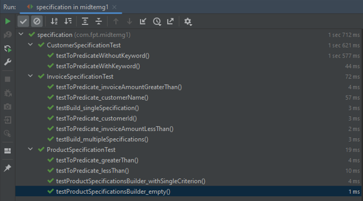


#
### SonarLint and SonarQube for Code Quality Testing

- **SonarLint**: SonarLint is an IDE extension that helps you detect and fix quality issues as you write code. It provides real-time feedback, highlighting potential bugs, vulnerabilities, and code smells directly in your IDE. SonarLint supports a wide range of languages and integrates seamlessly with popular IDEs like IntelliJ IDEA, Eclipse, and Visual Studio Code.

- **SonarQube**: SonarQube is a continuous inspection tool that analyzes code quality and provides detailed reports on bugs, vulnerabilities, code smells, and test coverage. It integrates with your CI/CD pipeline to enforce code quality standards across your entire codebase. SonarQube supports multiple languages and can be customized with quality profiles to meet your specific coding standards.


#### Create Project
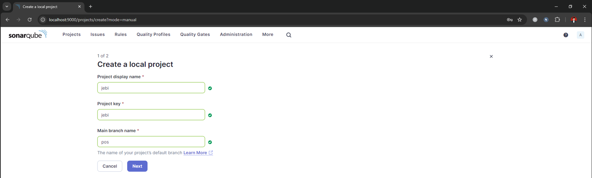

#### Provide Token
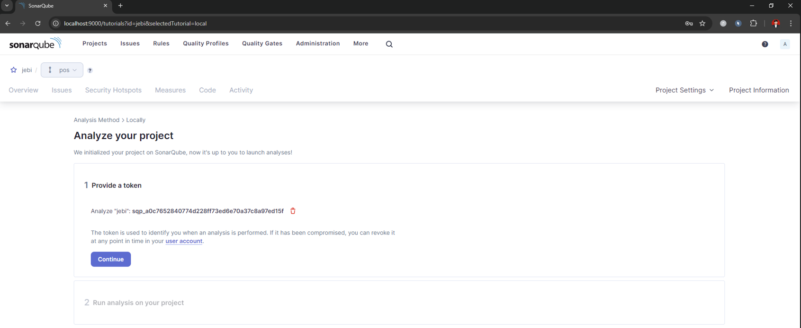


#### Analyze Project
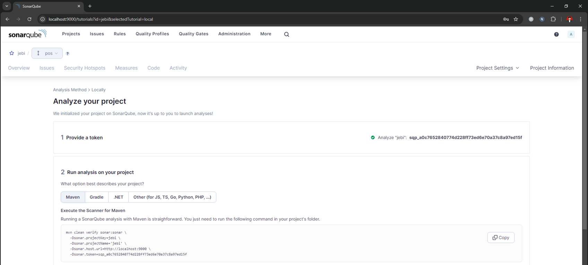

#### Result 
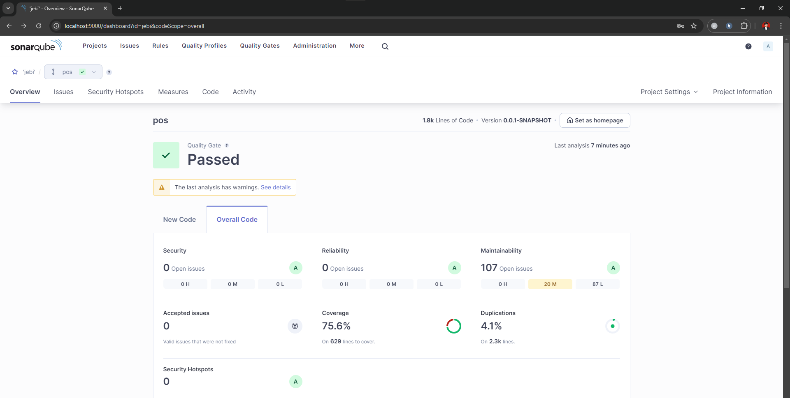


#
### JaCoCo for Determining Unit Test Coverage

To measure the unit test coverage, you can use JaCoCo (Java Code Coverage), a popular code coverage library for Java. To integrate JaCoCo with your Maven build, add the following plugin configuration to your `pom.xml`:

```xml
<build>
    <plugins>
        <plugin>
            <groupId>org.jacoco</groupId>
            <artifactId>jacoco-maven-plugin</artifactId>
            <version>0.8.7</version>
            <executions>
                <execution>
                    <goals>
                        <goal>prepare-agent</goal>
                    </goals>
                </execution>
                <execution>
                    <id>report</id>
                    <phase>prepare-package</phase>
                    <goals>
                        <goal>report</goal>
                    </goals>
                </execution>
            </executions>
        </plugin>
    </plugins>
</build>
```

- **JaCoCo Maven Plugin**: This plugin enables JaCoCo to instrument the classes in your project to measure code coverage. The `prepare-agent` goal attaches the JaCoCo agent to the JVM during test execution, while the `report` goal generates a coverage report during the `prepare-package` phase.

With this setup, you can ensure that your project maintains a high level of code quality, with comprehensive unit tests and automated analysis of code quality metrics.


#### Jacoco Report
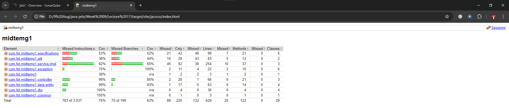