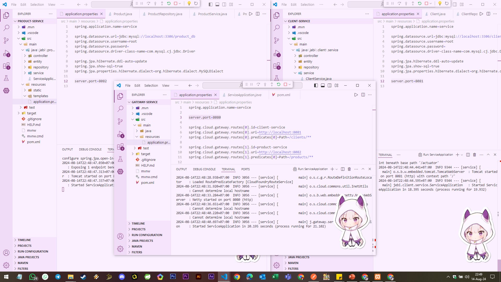
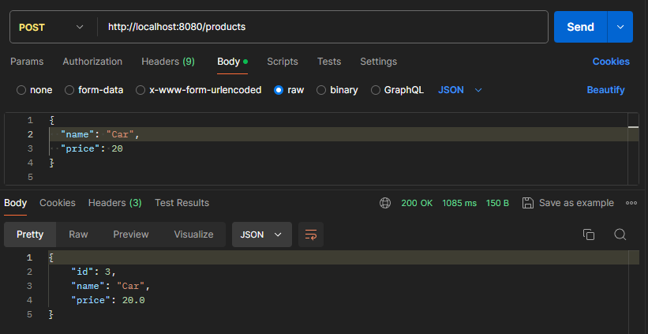
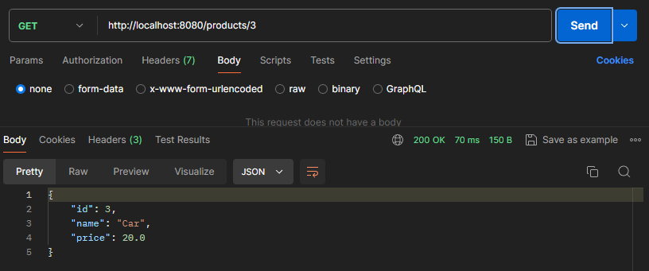
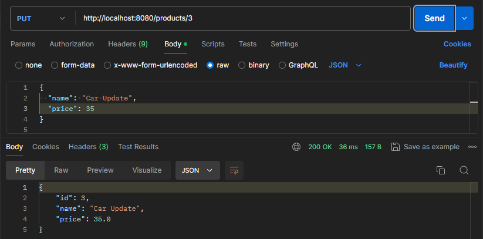
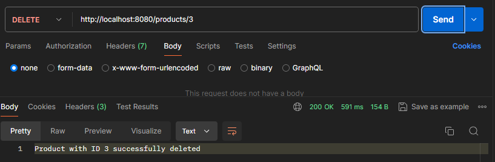
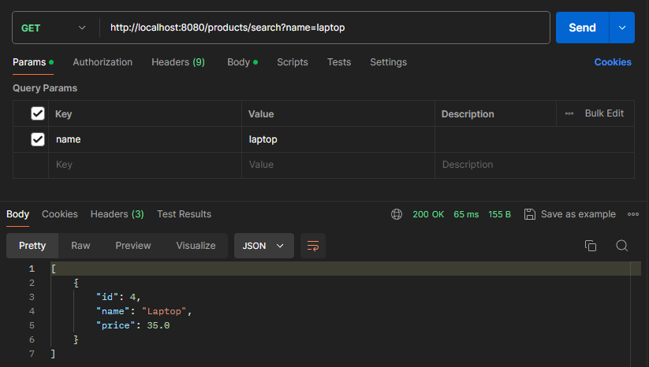
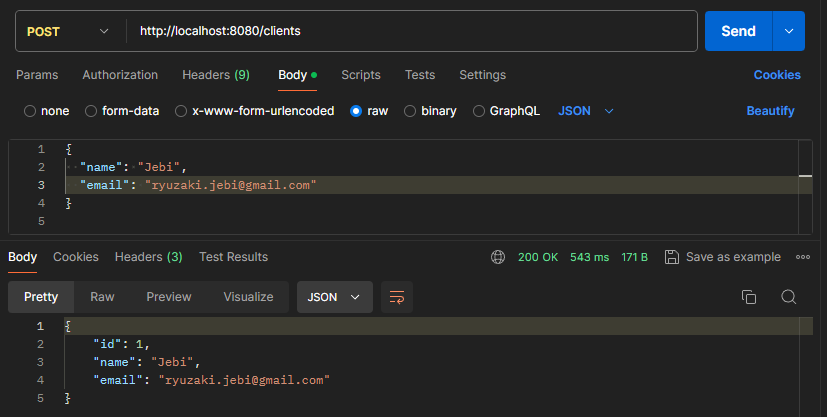
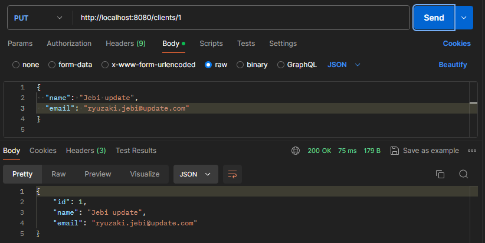
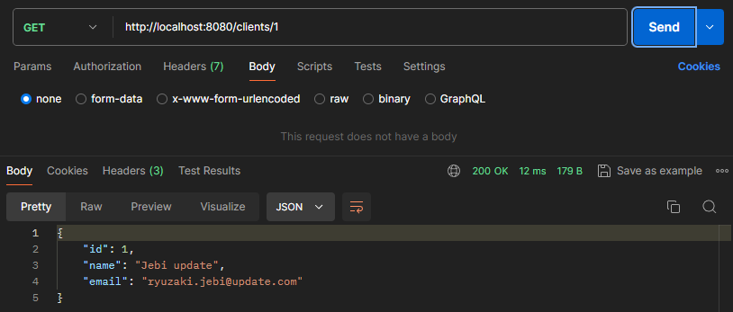
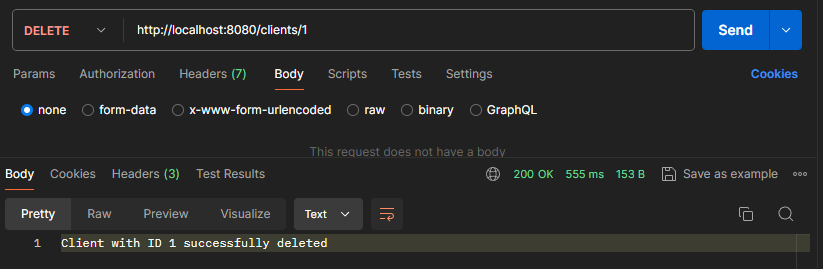

# 🛠️ Spring Cloud Gateway Project Documentation

### 📚 Overview
This document provides a detailed explanation of the Spring Cloud Gateway project that integrates three microservices: **Client Service**, **Product Service**, and **Gateway Service**. The project demonstrates how to route requests through the gateway to the appropriate service, ensuring a unified entry point for client and product management APIs.
#
### 🧱 Project Structure
The project consists of three main components:

1. **Client Service**: Manages client-related operations.
2. **Product Service**: Handles product-related operations.
3. **Gateway Service**: Routes requests to the appropriate service based on the URL path.
#
### 🌐 Server Ports List

The following are the ports configured for the various services:

- **Client Service**: `8081`
- **Product Service**: `8082`
- **Gateway Service**: `8080`

#
### 📦 Client Service
The **Client Service** is responsible for managing clients, including adding, updating, retrieving, and deleting client information.

#### 📋 Controller: `ClientController`
This controller provides REST endpoints for managing clients.

- **GET `/clients`**: Retrieve all clients.
- **GET `/clients/{id}`**: Retrieve a client by ID.
- **POST `/clients`**: Add a new client.
- **PUT `/clients/{id}`**: Update an existing client.
- **DELETE `/clients/{id}`**: Delete a client by ID.
- **GET `/clients/search`**: Search for clients by name.


#### 🗄️ Database Configuration
The `application.properties` file includes the following configurations:
- **Database URL**: `jdbc:mysql://localhost:3306/client_db`
- **Port**: `8081`


```properties
spring.application.name=client-service

server.port=8081

spring.datasource.url=jdbc:mysql://localhost:3306/client_db
spring.datasource.username=root
spring.datasource.password=
spring.datasource.driver-class-name=com.mysql.cj.jdbc.Driver

spring.jpa.hibernate.ddl-auto=update
spring.jpa.show-sql=true
spring.jpa.properties.hibernate.dialect=org.hibernate.dialect.MySQLDialect
```

#
### 📦 Product Service
The Product Service manages product-related operations, including adding, updating, retrieving, and deleting products.

#### 📋 Controller: ProductController
This controller provides REST endpoints for managing products.

- **GET /products**: Retrieve all products.
- **GET /products/{id}**: Retrieve a product by ID.
- **POST /products**: Add a new product.
- **PUT /products/{id}**: Update an existing product.
- **DELETE /products/{id}**: Delete a product by ID.
- **GET /products/search**: Search for products by name.


#### 🗄️ Database Configuration
The `application.properties` file includes the following configurations:

- **Database URL**: `jdbc:mysql://localhost:3306/product_db`
- **Port**: `8082`


```properties
spring.application.name=product-service

server.port=8082

spring.datasource.url=jdbc:mysql://localhost:3306/product_db
spring.datasource.username=root
spring.datasource.password=
spring.datasource.driver-class-name=com.mysql.cj.jdbc.Driver

spring.jpa.hibernate.ddl-auto=update
spring.jpa.show-sql=true
spring.jpa.properties.hibernate.dialect=org.hibernate.dialect.MySQLDialect
```
#
### 🌐 Gateway Service
The Gateway Service serves as the entry point to route client requests to the appropriate microservice based on the URL path.

##### 📋 Routing Configuration
The gateway service routes requests as follows:

- **Client Service**: Requests with the path `/clients/**` are routed to the client service at `http://localhost:8081`.
- **Product Service**: Requests with the path `/products/**` are routed to the product service at `http://localhost:8082`.

##### 🗄️ Gateway Configuration
The `application.properties` file for the gateway service includes the following configurations:

```properties
spring.application.name=gateway-service
server.port=8080

spring.cloud.gateway.routes[0].id=client-service
spring.cloud.gateway.routes[0].uri=http://localhost:8081
spring.cloud.gateway.routes[0].predicates[0]=Path=/clients/**

spring.cloud.gateway.routes[1].id=product-service
spring.cloud.gateway.routes[1].uri=http://localhost:8082
spring.cloud.gateway.routes[1].predicates[0]=Path=/products/**
```
### application.properties Explanation

- **spring.application.name**: Sets the application's name to `gateway-service`. This is mainly used for service identification and logging purposes.

- **server.port=8080**: Configures the gateway service to listen on port `8080`, where it will receive and process incoming requests.

- **spring.cloud.gateway.routes[0].id=client-service**: Assigns an ID (`client-service`) to the route that handles requests for the Client Service.

- **spring.cloud.gateway.routes[0].uri=http://localhost:8081**: Specifies that requests matching the `/clients/**` path should be forwarded to the Client Service located at `http://localhost:8081`.

- **spring.cloud.gateway.routes[0].predicates[0]=Path=/clients/**: Defines a path predicate that triggers this route when a request path starts with `/clients/`.

- **spring.cloud.gateway.routes[1].id=product-service**: Assigns an ID (`product-service`) to the route that handles requests for the Product Service.

- **spring.cloud.gateway.routes[1].uri=http://localhost:8082**: Specifies that requests matching the `/products/**` path should be forwarded to the Product Service located at `http://localhost:8082`.

- **spring.cloud.gateway.routes[1].predicates[0]=Path=/products/**: Defines a path predicate that triggers this route when a request path starts with `/products/`.

This configuration allows the gateway to route incoming requests to the appropriate microservice based on the URL path.

#
### Flow Explanation

1. **Client Request**: A client sends a request to the gateway service. The request could be intended for either the Client Service or the Product Service, depending on the URL path.

2. **Gateway Service**: The gateway service listens on port `8080` and examines the incoming request's path to determine which service it should be routed to.

3. **Routing Logic**:
   - If the path starts with `/clients/**`, the request is routed to the Client Service running at `http://localhost:8081`.
   - If the path starts with `/products/**`, the request is routed to the Product Service running at `http://localhost:8082`.

4. **Service Response**: The appropriate service (Client or Product) processes the request and sends a response back to the gateway.

5. **Gateway Response**: The gateway service then forwards the response from the selected service back to the client.

This flow ensures that all requests are handled through a single entry point (the gateway), which then intelligently routes them to the correct microservice based on the URL path.

#
🧪 Testing with Postman

### Testing Through Gateway

To test the Client and Product services, you can use the Gateway Service as the entry point. This approach ensures that all requests are routed correctly through the gateway. Here's a brief overview of how to perform the tests:

1. **Accessing Endpoints**: Send HTTP requests to the gateway service on port `8080` with the appropriate paths for Client and Product services.
   
2. **Client Service Testing**:
   - Use `/clients` paths to interact with the Client Service.
   - Example: Retrieve all clients with a `GET` request to `http://localhost:8080/clients`.

3. **Product Service Testing**:
   - Use `/products` paths to interact with the Product Service.
   - Example: Retrieve all products with a `GET` request to `http://localhost:8080/products`.

#
| **Client Service**             | **Method** | **Endpoint**                                         | **JSON Body/Parameter**          |
|--------------------------------|------------|------------------------------------------------------|----------------------------------|
| Retrieve all clients           | GET        | `http://localhost:8080/clients`                      | N/A                              |
| Retrieve client by ID          | GET        | `http://localhost:8080/clients/{id}`                 | Path Variable: `id`              |
| Add a new client               | POST       | `http://localhost:8080/clients`                      | JSON Body: `{ "name": "string", "email": "string" }` |
| Update a client by ID          | PUT        | `http://localhost:8080/clients/{id}`                 | Path Variable: `id` <br> JSON Body: `{ "name": "string", "email": "string" }` |
| Delete a client by ID          | DELETE     | `http://localhost:8080/clients/{id}`                 | Path Variable: `id`              |
| Search clients by name         | GET        | `http://localhost:8080/clients/search?name={name}`   | Query Parameter: `name`          |
#
| **Product Service**            | **Method** | **Endpoint**                                         | **JSON Body/Parameter**          |
|--------------------------------|------------|------------------------------------------------------|----------------------------------|
| Retrieve all products          | GET        | `http://localhost:8080/products`                     | N/A                              |
| Retrieve product by ID         | GET        | `http://localhost:8080/products/{id}`                | Path Variable: `id`              |
| Add a new product              | POST       | `http://localhost:8080/products`                     | JSON Body: `{ "name": "string", "price": "number" }` |
| Update a product by ID         | PUT        | `http://localhost:8080/products/{id}`                | Path Variable: `id` <br> JSON Body: `{ "name": "string", "price": "number" }` |
| Delete a product by ID         | DELETE     | `http://localhost:8080/products/{id}`                | Path Variable: `id`              |
| Search products by name        | GET        | `http://localhost:8080/products/search?name={name}`  | Query Parameter: `name`          |


#











