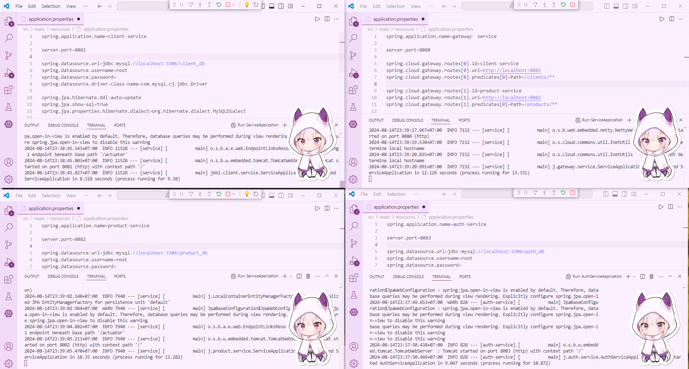
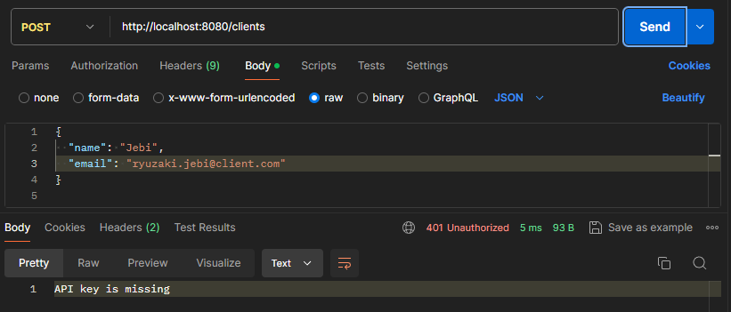
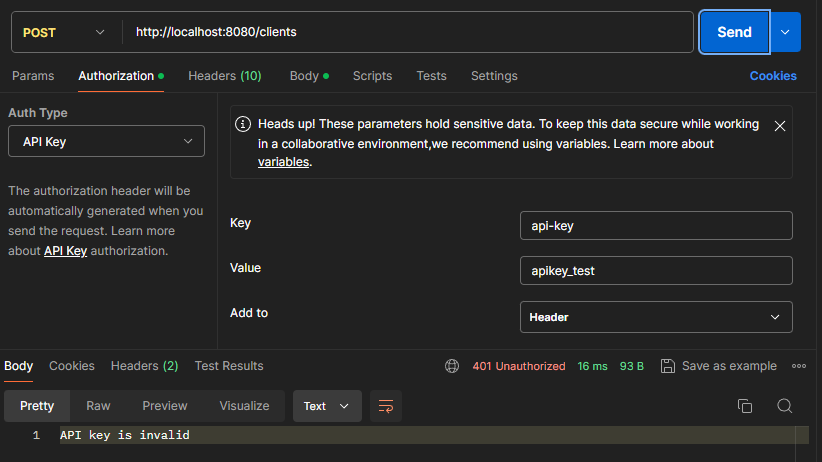
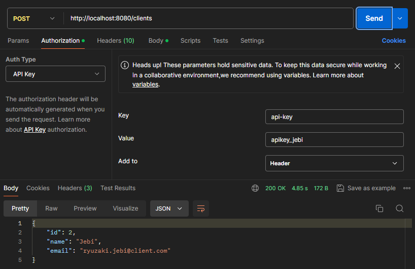
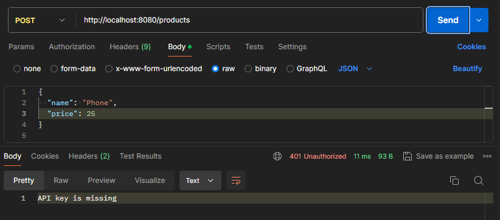
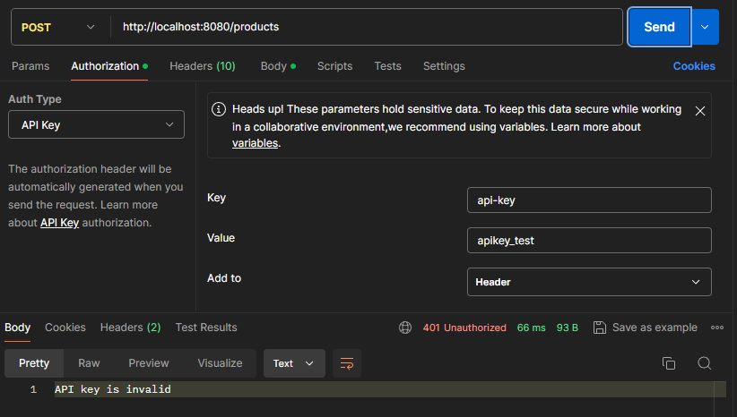
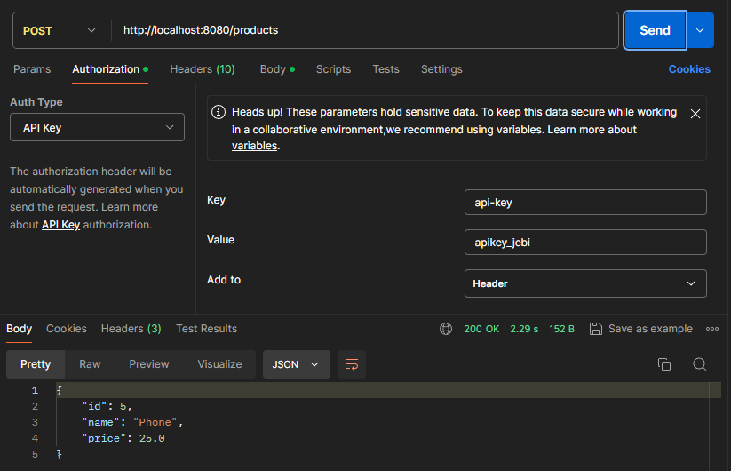

# Project Updates: Adding Authentication Service and Gateway Filter

## 📜 Overview

This document outlines the updates made to the project, including the addition of an authentication service and a filter in the gateway service. These updates ensure that API requests are validated using API keys.

## 🌐 Server Ports List

The following are the ports configured for the various services:

- **Client Service**: `8081`
- **Product Service**: `8082`
- **Authentication Service**: `8083`
- **Gateway Service**: `8080`

#
## 🔐 Authentication Service

### 🏷️ API Key Entity

The `ApiKey` entity class represents the API key in the database.

```java
package jebi.auth.service.entity;

@Entity
@Data
@NoArgsConstructor
public class ApiKey {
    @Id
    @GeneratedValue(strategy = GenerationType.IDENTITY)
    private Long id;
    private String XKEY;
}
```

### ⚙️ Service

The `AuthService` class handles the business logic for API key validation.

```java
package jebi.auth.service.service;

@Service
@RequiredArgsConstructor
public class AuthService {
    private final ApiKeyRepository apiKeyRepository;

    public boolean validateApiKey(String apiKey) {
        return apiKeyRepository.findByXKEY(apiKey).isPresent();
    }
}
```

### 🌐 Controller

The `ApiKeyController` class provides an endpoint to add new API keys.

```java
package jebi.auth.service.controller;

@RestController
@RequestMapping("/apikeys")
@RequiredArgsConstructor
public class ApiKeyController {
    private final ApiKeyRepository apiKeyRepository;

    @PostMapping
    public ApiKey createApiKey(@RequestBody ApiKey apiKey) {
        return apiKeyRepository.save(apiKey);
    }
}
```

## 🏛️ Update for Gateway Service

### 📜 WebClient Configuration


```java
package jebi.gateway.service.config;

@Configuration
public class WebClientConfig {

    @Bean
    public WebClient.Builder webClientBuilder() {
        return WebClient.builder();
    }
}
```
### **Explanation:**

- **`@Configuration`**: Marks the class as a configuration class for Spring.
- **`@Bean`**: Defines the `webClientBuilder` method as a Spring bean, making `WebClient.Builder` available for injection.

### **Flow:**

1. Spring initializes the `WebClientConfig` class.
2. The `webClientBuilder` method is called, returning a `WebClient.Builder` instance.
3. This `WebClient.Builder` bean is available for dependency injection wherever needed, allowing the creation of `WebClient` instances.

#
### 🔒 API Key Filter

```java
package jebi.gateway.service.filter;

@Component
@Order(1)
public class ApiKeyFilter implements GlobalFilter {
    private final WebClient.Builder webClientBuilder;

    public ApiKeyFilter(WebClient.Builder webClientBuilder) {
        this.webClientBuilder = webClientBuilder;
    }

    @Override
    public Mono<Void> filter(ServerWebExchange exchange, GatewayFilterChain chain) {
        String apiKey = exchange.getRequest().getHeaders().getFirst("api-key");

        if (apiKey == null || apiKey.isEmpty()) {
            return unauthorizedResponse(exchange, "API key is missing");
        }

        return webClientBuilder.build()
            .get()
            .uri("http://localhost:8083/auth/validate")
            .header("api-key", apiKey)
            .retrieve()
            .bodyToMono(Boolean.class)
            .flatMap(isValid -> {
                if (Boolean.TRUE.equals(isValid)) {
                    return chain.filter(exchange);
                } else {
                    return unauthorizedResponse(exchange, "API key is invalid");
                }
            });
    }

    private Mono<Void> unauthorizedResponse(ServerWebExchange exchange, String message) {
        ServerHttpResponse response = exchange.getResponse();
        response.setStatusCode(HttpStatus.UNAUTHORIZED);
        response.getHeaders().setContentType(MediaType.TEXT_PLAIN);
        byte[] bytes = message.getBytes(StandardCharsets.UTF_8);
        return response.writeWith(Mono.just(response.bufferFactory().wrap(bytes)));
    }
}
```
### **Explanation:**

- **`@Component`**: Registers the class as a Spring bean.
- **`@Order(1)`**: Sets the filter's order; lower values are processed first.
- **`ApiKeyFilter`**: Implements `GlobalFilter` to handle all incoming requests.
- **`WebClient.Builder`**: Injected to build a `WebClient` instance for making HTTP requests.
- **`filter` Method**:
  - Retrieves the `api-key` from request headers.
  - Returns an "API key is missing" response if the key is not present.
  - If the key is present, sends a request to the authentication service to validate the key.
  - Proceeds with the request if the key is valid; otherwise, returns "API key is invalid".
- **`unauthorizedResponse` Method**: Creates a `401 Unauthorized` response with a plain text message.

### **Flow:**

1. **Incoming Request**:
   - The `filter` method intercepts each request.

2. **API Key Extraction**:
   - Extracts the `api-key` from the request headers.

3. **Key Validation**:
   - If no key is found, it responds with "API key is missing".
   - If a key is present, it sends a GET request to the authentication service (`http://localhost:8083/auth/validate`) to validate the key.

4. **Validation Response**:
   - If the key is valid (authentication service returns `true`), the request proceeds by calling `chain.filter(exchange)`.
   - If invalid, it responds with "API key is invalid".

5. **Unauthorized Response**:
   - Sets the HTTP status to `401 Unauthorized` and returns the appropriate message if the API key is missing or invalid.

#

## 🔑 Add API Keys for Testing

To add API keys for testing purposes, execute the following SQL query:

```sql
INSERT INTO api_key (XKEY) VALUES 
    ('apikey_jebi'),
    ('apikey_light'),
```

## 🧪 Testing with Postman

- For valid API keys, program should receive the requested data from the service.
- For invalid or missing API keys, program should receive a `401 Unauthorized` response with the message `"API key is invalid"` or `"API key is missing"`.
#
## 🚀 Running All Services (Client, Product, Auth, Gateway)



## 🧪 Testing Requests to Client Service

### 1. ❌ Without API Key



### 2. 🚫 With Wrong API Key



### 3. ✅ With Correct API Key


#
## 🧪 Testing Requests to Product Service

### 1. ❌ Without API Key



### 2. 🚫 With Wrong API Key



### 3. ✅ With Correct API Key


