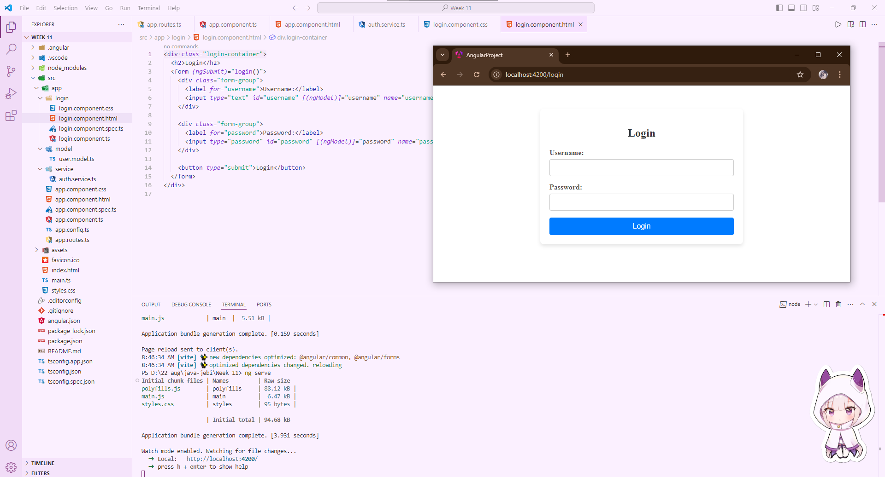

# Angular Training - Part 1 

Run and look into code structure : https://github.com/helenhash/angular-demo


## 🗂️ **1. Project Structure**

The project is organized following a typical Angular application structure:

### 📌 **`src/app/customer`**

- **Components**:
  - `customer.component.ts`: Handles displaying a list of customers and interacting with them.
  - `customer-detail.component.ts`: Manages displaying and editing details for a single customer.

### 📌 **`src/app/models`**

- **`customer.model.ts`**: Defines the `Customer` class, which represents the data structure used throughout the application.

### 📌 **`src/app/services`**

- **`customer.service.ts`**: Provides methods to interact with an external API, performing CRUD operations on customer data.

### 📌 **`src/app`**

- **`app.component.ts`**: The root component of the application, setting up the initial view with routing.
- **`app.config.ts`**: Configures the application’s providers, including routing and HTTP client services.
- **`app.routes.ts`**: Defines the routing paths for the application, linking URLs to components.

## 🔄 **2. Functions and Business Flow**

### 📌 **Main Components**

- **CustomerComponent**:
  - Displays a list of customers.
  - Allows the user to search for customers by their first name.
  - Handles the selection of a customer to display more details.
  - Provides the ability to delete all customers from the list.

- **CustomerDetailComponent**:
  - Displays details of a selected customer.
  - Provides an interface to update or delete a customer.
  - Supports toggling between view mode and edit mode.

### 📌 **Services**

- **CustomerService**:
  - Provides methods to interact with the backend API:
    - `getAll()`: Fetches all customers.
    - `get(id)`: Fetches a single customer by ID.
    - `create(data)`: Creates a new customer.
    - `update(id, data)`: Updates an existing customer.
    - `delete(id)`: Deletes a customer by ID.
    - `deleteAll()`: Deletes all customers.
    - `findByTitle(title)`: Searches for customers by their title (first name in this context).

### 📌 **Business Flow**

- **Initialization**: When the application starts, the `CustomerComponent` is loaded and initializes by calling `retrieveCustomers()`, which fetches and displays all customers.

- **Search**: The user can input a first name and click the search button. This triggers the `searchTitle()` method, which updates the list of customers based on the search term.

- **Select a Customer**: Clicking on a customer's name in the list sets it as the active customer, which displays more details in the `CustomerDetailComponent`.

- **Edit/Delete Customer**: The user can edit the customer's details and update them, or delete the customer entirely.

- **Remove All**: The user can remove all customers by clicking the "Remove All" button.

## 🚀 **3. Program Flow**

### 📌 **Component Initialization**

- **CustomerComponent**: Initializes by retrieving the list of customers.
- **CustomerDetailComponent**: Checks if it's in view mode or edit mode. If it's in edit mode, it fetches the customer data based on the route parameter.

### 📌 **Event Handling**

- User interactions, such as searching or clicking a customer, trigger corresponding methods in the components (`searchTitle()`, `setActiveCustomer()`, etc.).

### 📌 **Service Interaction**

- Each component interacts with the `CustomerService` to fetch or manipulate customer data, sending HTTP requests to the backend API.

### 📌 **Data Binding**

- Components use Angular's two-way data binding to synchronize the view with the model, allowing for dynamic updates to the UI.

---

# 🔍 **Investigation: Component Lifecycle in Angular**

Angular components have a well-defined lifecycle, which can be summarized as follows:

### 🟢 **`ngOnChanges`**

- Called whenever an input property of the component changes. It's triggered before `ngOnInit` and whenever input properties are updated.

### 🟢 **`ngOnInit`**

- Called once after the component's data-bound properties have been initialized. This is the ideal place to perform component initialization logic, such as fetching data.

### 🟢 **`ngDoCheck`**

- Called during every change detection run. It can be used to detect and act upon changes that Angular's default change detection might miss.

### 🟢 **`ngAfterContentInit`**

- Called after Angular projects external content into the component's view. It's triggered once after the first `ngDoCheck`.

### 🟢 **`ngAfterContentChecked`**

- Called after Angular checks the content projected into the component. It's called after `ngAfterContentInit` and every subsequent `ngDoCheck`.

### 🟢 **`ngAfterViewInit`**

- Called after Angular initializes the component's views and child views. It's triggered once after the first `ngAfterContentChecked`.

### 🟢 **`ngAfterViewChecked`**

- Called after the component's views have been checked by Angular. This method is called after `ngAfterViewInit` and every subsequent `ngAfterContentChecked`.

### 🟢 **`ngOnDestroy`**

- Called just before Angular destroys the component. It's used for cleanup, such as unsubscribing from observables or detaching event handlers.


#
## 🔄 Comparing Standalone and Non-Standalone Applications

### 🆓 Non-Standalone Application

In a non-standalone Angular application, components, directives, and pipes must be declared in an NgModule. This traditional approach requires a `declarations` array within the module, which can make the application more complex as it grows.

### 🆕 Standalone Application

Angular introduced the concept of standalone components, allowing components, directives, and pipes to work without being declared in an NgModule. This simplifies the structure by reducing the need for NgModules, enabling a more modular and straightforward codebase.

#### Example of a Standalone Component:

```typescript
import { Component } from '@angular/core';

@Component({
  selector: 'app-standalone-component',
  templateUrl: './standalone-component.component.html',
  styleUrls: ['./standalone-component.component.css'],
  standalone: true,
})
export class StandaloneComponent {}
```

### ❓ Why Use Standalone Components?

1. **Simplification**: Reduces the need for managing NgModules, leading to simpler, more readable code.
2. **Modularity**: Components can be more easily reused across different parts of the application without needing to import an entire module.
3. **Future-Proofing**: Angular's direction is moving towards more modular applications, making standalone components a future-proof approach.

## 📚 Conclusion

Using standalone components in Angular can simplify your application structure, improve modularity, and align with the future direction of Angular. However, it's essential to understand both approaches to choose the one that best fits your project needs.



