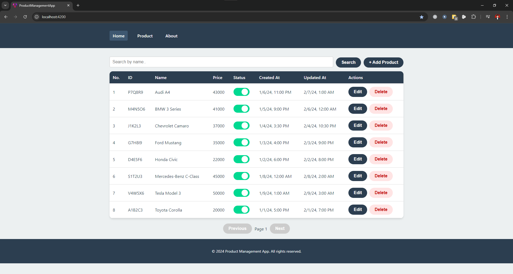
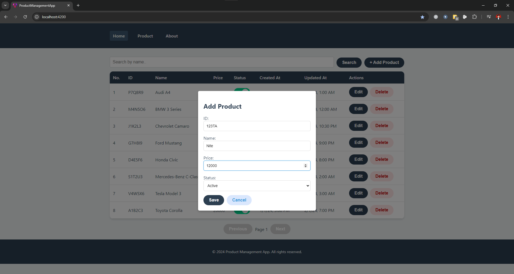
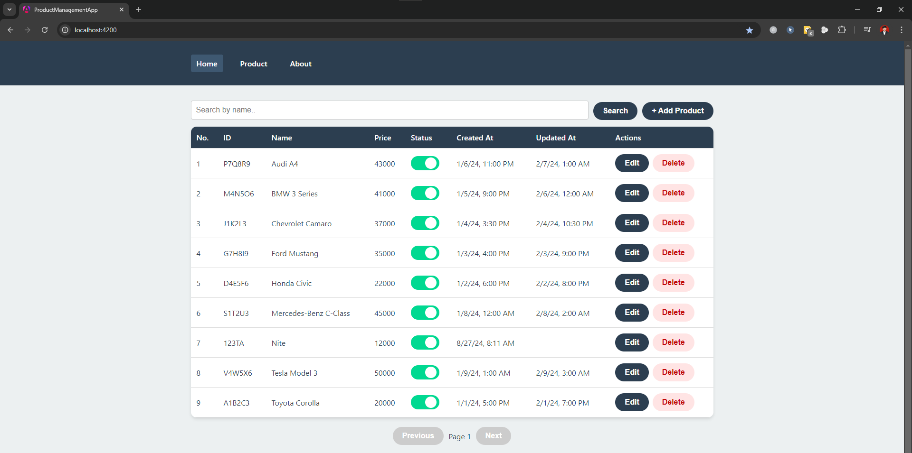
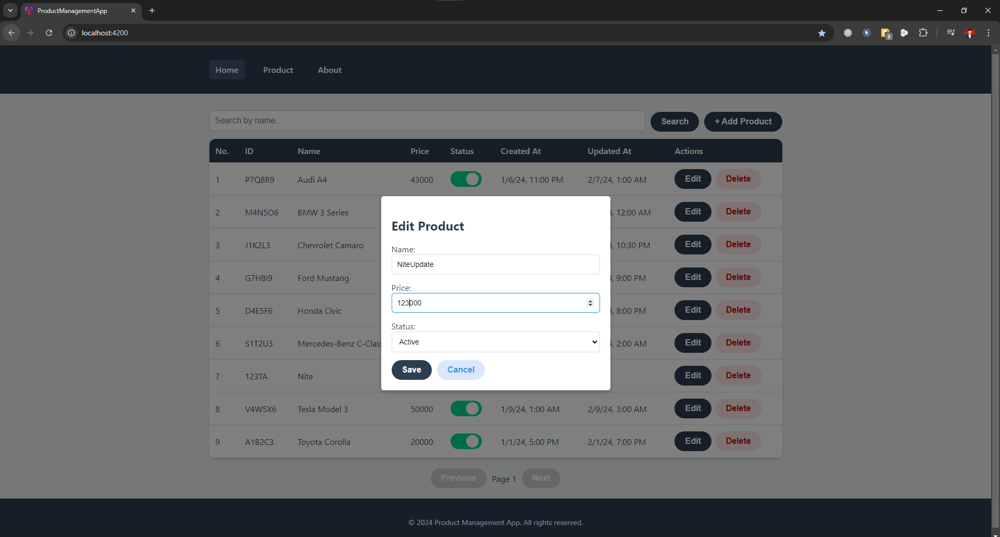
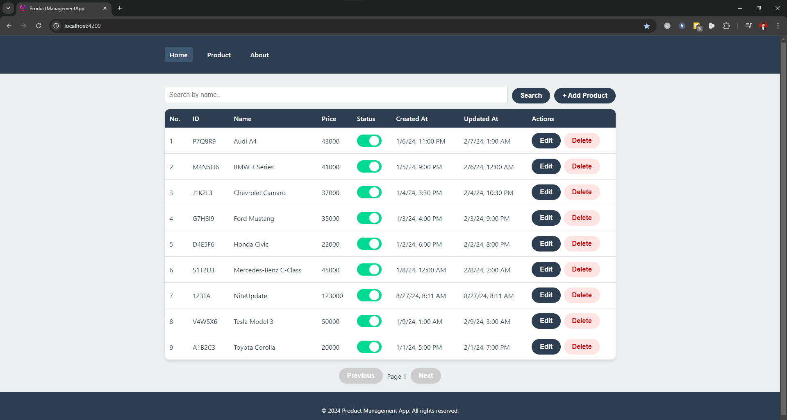
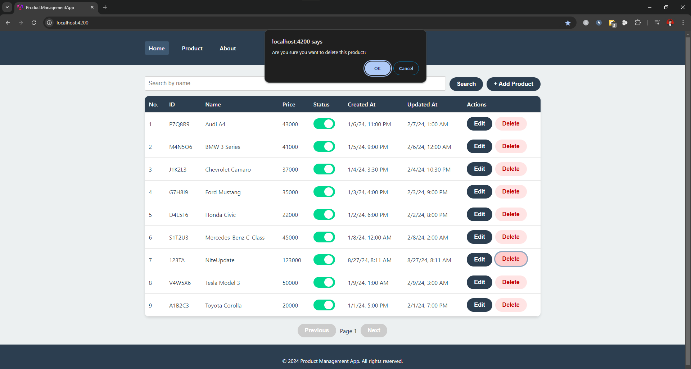
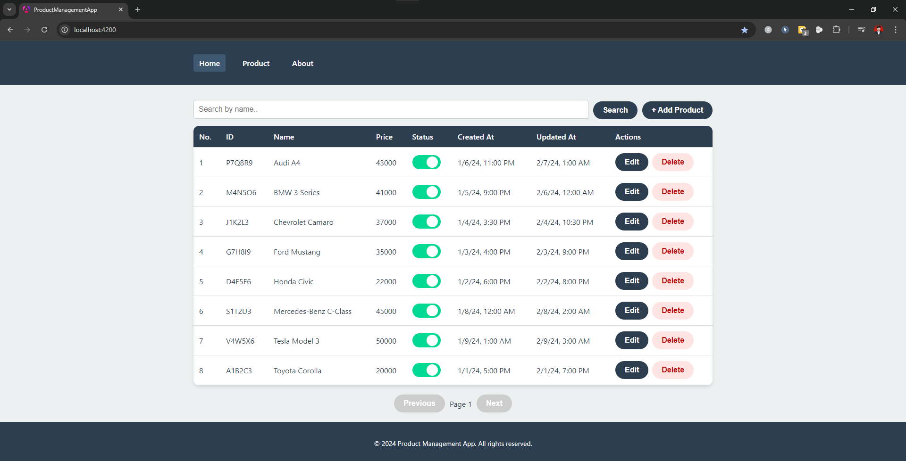

# Product Management

This application allows users to manage products, including creating, editing, deleting, and listing products. It also includes features for searching, sorting, and paginating the product list.

## Features

- **Add Product**: Allows adding a new product with details such as ID, name, price, and status.
- **Edit Product**: Enables editing the details of an existing product.
- **Delete Product**: Allows deletion of a product from the list.
- **Search and Filter**: Provides a search functionality for products by name.
- **Sorting**: Supports sorting of the product list by different columns such as name, price, etc.
- **Pagination**: Displays the product list in pages to enhance usability and performance.
#
## Setup and Installation

1. **Install dependencies**:
   ```bash
   npm install
   ```

2. **Start the JSON Server**:
   Before running the application, ensure that the JSON server is running to simulate an API backend.

   Run the following command to start the JSON server:
   ```bash
   npx json-server --watch db.json
   ```

   This command watches the `db.json` file for changes and provides RESTful API endpoints for the data.

3. **Run the Angular Application**:
   ```bash
   ng serve
   ```

   Open the browser and navigate to `http://localhost:4200/` to access the application.
#
## Project Structure

The project follows a modular structure, where each feature or component is encapsulated within its own module. Key directories and files include:

- **`src/app/config/`**: Contains configuration files for routing and application constants.
- **`src/app/main/components/`**: Contains shared components like the header and footer.
- **`src/app/pages/product/`**: Contains product-related components, such as the product form and product list.
- **`src/app/services/`**: Contains services for handling business logic and API calls.
- **`src/app/models/`**: Contains data models (interfaces) representing the application's data structures.
#
## Components

### 1. ProductFormComponent

This component provides a form for adding or editing a product. It includes input fields for product ID, name, price, and status, supporting both the addition of new products and updating existing ones.

### 2. ProductListComponent

This component displays a list of products with features such as searching, sorting, pagination, and actions for editing or deleting a product.
#
## Screenshots








