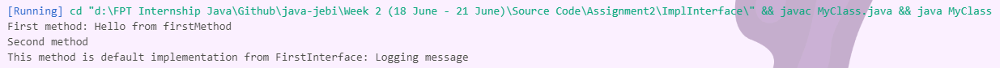

#### Week 2 (Assignment 1)
#
### 2.1 - What happen if implement 2 interface have same default method? How to solve? Demo in code.
When implementing multiple interfaces in Java, if both interfaces have a default method with the same name and signature, a conflict arises. This is because the implementing class cannot decide which default method to inherit. Java provides a way to resolve this conflict by explicitly specifying which default method to use or by overriding the default method in the implementing class

If MyClass implements both FirstInterface and SecondInterface, and both interfaces have a default method named log, Java cannot determine which log method to use. This ambiguity leads to a compilation error.

To resolve this, we must override the default method in the implementing class and explicitly specify which interface's default method we want to call using the `InterfaceName.super.methodName` syntax.

```java
public interface FirstInterface {
    void firstMethod(String string);

    default void log(String string) {
        System.out.println("This method is default implementation from FirstInterface: " + string);
    }
}
```
```java
public interface SecondInterface {
    void secondMethod();

    default void log(String string) {
        System.out.println("This method is default implementation from SecondInterface: " + string);
    }
}
```
```java
public class MyClass implements FirstInterface, SecondInterface {
    @Override
    public void firstMethod(String string) {
        System.out.println("First method: " + string);
    }

    @Override
    public void secondMethod() {
        System.out.println("Second method");
    }

    // Fix conflict
    @Override
    public void log(String string) {
        FirstInterface.super.log(string);
    }

    public static void main(String[] args) {
        MyClass myClass = new MyClass();
        
        myClass.firstMethod("Hello from firstMethod");
        myClass.secondMethod();
        
        myClass.log("Logging message");
    }
}
```

MyClass implements both FirstInterface and SecondInterface. Since both interfaces have a log method, we must resolve the conflict by overriding the log method in MyClass. Inside the overridden log method, we use `FirstInterface.super.log(string)` to explicitly call the log method from FirstInterface. This way, we decide which default method to use when there is a name conflict. We can also choose to call `SecondInterface.super.log(string)` if we want to use the default method from SecondInterface.



#
### 2.2 - Explain the difference between abstract class and interface (Syntax and Purpose)

### Abstract Class

`Syntax`
- An abstract class is declared using the abstract keyword.
- It can have abstract methods as well as concrete methods (methods with a body).
- Abstract methods are declared without implementation using the abstract keyword and are intended to be overridden by subclasses.
- Concrete methods in an abstract class can provide default behavior which subclasses can optionally override.

`Purpose`
- An abstract class allows you to define a template for other classes to extend and inherit from.
- It can contain member variables, constructors, and methods (both abstract and concrete).
- Abstract classes are useful when you have a base class that defines some methods but needs subclasses to provide specific implementations for certain methods.


#
### Interface
`Syntax`
- An interface is declared using the interface keyword.
- It can only contain constants, method signatures (methods without a body), and default methods (methods with a default implementation introduced in Java 8).
- All methods in an interface are implicitly public and abstract (even if not explicitly specified).
- Interfaces cannot have instance fields (variables) other than constants.

`Purpose`
- Interfaces provide a way to achieve abstraction and multiple inheritance in Java.
- They define a contract that classes must follow; any class that implements an interface must provide concrete implementations for all methods defined in the interface.
- Interfaces are useful when you want to specify a set of methods that a class must implement, regardless of the class's inheritance hierarchy.

#
### Key Differences
- Abstract classes can have abstract methods as well as concrete methods. Interfaces can only have method signatures (abstract methods) or default methods (with a default implementation).

- Java does not support multiple inheritance of classes, but a class can implement multiple interfaces. This allows interfaces to provide a form of multiple inheritance.

- Abstract classes are used to define a common behavior among several subclasses, while interfaces are used to define a contract that classes can adhere to, regardless of their inheritance.

- Abstract classes are used to define common behavior and provide some default functionality, while interfaces define a contract that classes must follow, allowing for multiple inheritance of type. Both are important tools in Java for achieving abstraction and defining relationships between classes.


#
### 2.3 - Research @FunctionalInterface
`@FunctionalInterface` is an annotation used to denote that an interface is intended to be a functional interface. A functional interface is one that contains exactly one abstract method. This concept is closely related to functional programming paradigms, where functions are treated as first-class citizens.

### Purpose and Usage
- **Lambda Expressions**: Functional interfaces enable the use of lambda expressions, which provide a concise syntax for defining anonymous functions directly within Java code.
- **Single Abstract Method (SAM)**: Any interface with exactly one abstract method can be marked as a functional interface using @FunctionalInterface.

#
### Key Functional Interfaces
- **Function**: Represents a function that accepts one argument and produces a result. It has methods like apply for computation and compose for function chaining.
- **Supplier**: Represents a supplier of results, used to generate or supply values without taking any input.
- **Consumer**: Represents an operation that accepts a single input argument and returns no result. Useful for operations with side effects.
- **Predicate**: Represents a boolean-valued function of one argument. Commonly used for filtering elements in collections.
- **UnaryOperator and BinaryOperator**: Specializations of Function for cases where the input and output types are the same (UnaryOperator for single argument and BinaryOperator for two arguments).