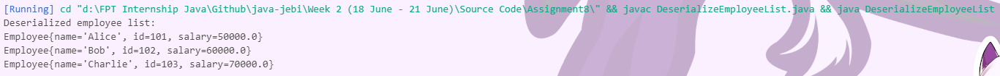
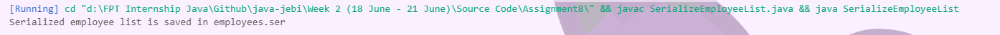

### 8.1 - What Is the serialVersionUID?
The serialVersionUID in Java is a unique identifier for each class that implements the Serializable interface. It is used during the deserialization process to ensure that a loaded class corresponds exactly to a serialized object.

serialVersionUID is a long value that is used to ensure the consistency of a class during the serialization and deserialization processes.
It acts as a version control identifier for a serialized class.


#
`Purpose of serialVersionUID`
- It helps in verifying that the sender and receiver of a serialized object have loaded classes for that object that are compatible with respect to serialization.
- If a class undergoes changes (like adding or removing fields), the serialVersionUID helps in identifying compatibility between the versions.

#

`How it works`
- When an object is serialized, the serialVersionUID is embedded within the serialized form.
- Upon deserialization, the JVM checks if the serialVersionUID of the serialized object matches that of the loaded class.
- If the IDs do not match, a InvalidClassException is thrown, indicating that the classes are not compatible for deserialization.
#
`Key Points of serialVersionUID`
#### Default Value:

- If a serialVersionUID is not explicitly declared, the JVM will generate one based on the class details like its name, fields, methods, etc.
- The automatically generated serialVersionUID is dependent on the structure of the class, meaning even small changes in the class can lead to a different ID, making deserialization fail.
#### Explicit Declaration:
- It is a good practice to declare serialVersionUID explicitly in the class to avoid unexpected InvalidClassException.
- Example :
    ```java
    private static final long serialVersionUID = 1L;
    ```
- Declaring it explicitly ensures that even if the class changes, the serialized form remains compatible as long as the changes are backward-compatible.

#### Backward Compatibility
- Explicitly declaring a serialVersionUID allows you to maintain backward compatibility for serialized objects when making changes to the class.
- If fields are added or removed, but you still want to be able to deserialize old versions of the class, keeping the serialVersionUID unchanged can help.

#### Best Practices
- Always declare a serialVersionUID in any Serializable class.
- Increment the serialVersionUID when making changes that are not backward-compatible.

#### Serialization Mechanism:
- Serialization is the process of converting an object's state into a byte stream.
- Deserialization is the process of converting the byte stream back into a copy of the original object.
- serialVersionUID plays a critical role in these processes by ensuring that the serialized form of an object can be read into an instance of a compatible class.

#
### Example Scenario
1. Without `serialVersionUI`:
   - Suppose you have a class Person which is Serializable.
   - You serialize an instance of Person and later modify the Person class by adding a new field.
   - During deserialization of the old object, the JVM-generated serialVersionUID for the modified class may not match the ID of the serialized form, leading to an exception.
2. With `serialVersionUID`:
   - If you explicitly set a serialVersionUID, you can modify the class (add/remove fields) and still deserialize the old object without issues, as long as you handle the new fields appropriately (e.g., default values for new fields).


#
### Common Issues and Solutions
1. InvalidClassException during deserialization.
   
   **Solution**: Ensure that the serialVersionUID is consistent between the serialized object and the class trying to deserialize it. Explicitly declare serialVersionUID in your class.

2. Changes to the class break serialization compatibility.
   
   **Solution**: Plan for changes carefully. Maintain backward compatibility by managing serialVersionUID and handling new fields gracefully.

#
### Summary
serialVersionUID is an essential part of Java’s serialization mechanism, ensuring version compatibility between serialized objects and their corresponding classes. By explicitly managing serialVersionUID, developers can avoid serialization issues and maintain backward compatibility for serialized data across different versions of a class.

This understanding is crucial for developing robust Java applications that rely on object serialization for tasks like object persistence, remote method invocation (RMI), and data exchange over networks.


#
### 8.2 - Illustrate Serialization and Deserialization in write list of object (employee) to  file and read file to convert to object and using serialVersionUID
Serialization and deserialization are fundamental techniques in Java used to save the state of an object to a storage medium and restore it later. This process is particularly useful for tasks like saving application state, data transfer, and object persistence.

#### Step 1: Define the Employee Class
First, we need to define an Employee class that implements the Serializable interface. This class will include a serialVersionUID to maintain serialization compatibility.
```java
import java.io.Serializable;

public class Employee implements Serializable {
    private static final long serialVersionUID = 1L; // Unique identifier for version control

    private String name;
    private int id;
    private double salary;

    public Employee(String name, int id, double salary) {
        this.name = name;
        this.id = id;
        this.salary = salary;
    }

    @Override
    public String toString() {
        return "Employee{name='" + name + "', id=" + id + ", salary=" + salary + "}";
    }
}
```
`serialVersionUID`: It is a unique identifier that ensures compatibility during deserialization. If the class structure changes, this ID helps maintain consistency between the serialized and current versions of the class.
#
#### Step 2: Create a List of Employee Objects
Next, we create and populate a list with several Employee objects.
```java
import java.util.ArrayList;
import java.util.List;

public class EmployeeListCreator {
    public static List<Employee> createEmployeeList() {
        List<Employee> employees = new ArrayList<>();
        employees.add(new Employee("Alice", 101, 50000));
        employees.add(new Employee("Bob", 102, 60000));
        employees.add(new Employee("Charlie", 103, 70000));
        return employees;
    }
}
```
`List Creation`: We use ArrayList to store the Employee objects. This list will be serialized to a file.

#
#### Step 3: Serialize the List to a File
We serialize the list of Employee objects to a file using ObjectOutputStream.
```java
import java.io.FileOutputStream;
import java.io.IOException;
import java.io.ObjectOutputStream;
import java.util.List;

public class SerializeEmployeeList {
    public static void main(String[] args) {
        List<Employee> employeeList = EmployeeListCreator.createEmployeeList();

        try (FileOutputStream fileOut = new FileOutputStream("employees.ser");
             ObjectOutputStream out = new ObjectOutputStream(fileOut)) {
            out.writeObject(employeeList);
            System.out.println("Serialized employee list is saved in employees.ser");
        } catch (IOException i) {
            i.printStackTrace();
        }
    }
}
```
`ObjectOutputStream`: This class writes primitive data types and graphs of Java objects to an OutputStream. Here, it writes the employeeList to employees.ser.

#
#### Step 4: Deserialize the List from the File
We deserialize the list from the file back into a list of Employee objects using ObjectInputStream.
```java
import java.io.FileInputStream;
import java.io.IOException;
import java.io.ObjectInputStream;
import java.util.List;

public class DeserializeEmployeeList {
    public static void main(String[] args) {
        List<Employee> employeeList = null;

        try (FileInputStream fileIn = new FileInputStream("employees.ser");
             ObjectInputStream in = new ObjectInputStream(fileIn)) {
            employeeList = (List<Employee>) in.readObject();
            System.out.println("Deserialized employee list:");
            for (Employee employee : employeeList) {
                System.out.println(employee);
            }
        } catch (IOException | ClassNotFoundException e) {
            e.printStackTrace();
        }
    }
}
```
`ObjectInputStream`: This class reads primitive data types and graphs of Java objects from an InputStream. It reads the serialized employeeList from employees.ser.

#
#### Step 5: Understanding serialVersionUID
- `Purpose`: The serialVersionUID is used to ensure that a deserialized object matches the version of the class in the current environment. If changes occur in the class (e.g., adding/removing fields), the serialVersionUID helps to check compatibility between the serialized object and the class.

- `Automatic Generation`: If not explicitly declared, the JVM generates a serialVersionUID based on various attributes of the class. However, it's best practice to explicitly declare it to maintain control over serialization compatibility.

#### Compile the class
```
javac Employee.java EmployeeListCreator.java SerializeEmployeeList.java DeserializeEmployeeList.java
```
#
#### Serialize the Employee List:
```
java SerializeEmployeeList
```


- The output message "Serialized employee list is saved in employees.ser" indicates that the list of Employee objects has been successfully converted to a byte stream and written to the file employees.ser.
- This file now contains the serialized form of the Employee objects, which can be read back later to recreate the list of Employee objects.
#
#### Deserialize the Employee List:

- The output lists the details of each Employee object that was deserialized from the file
- This means the Employee objects were successfully read back from the file, and their original state (name, id, salary) has been restored.

#
#### Summary
- `Serialization:` The process of converting an object into a byte stream for storage or transmission.
- `Deserialization`: The process of reconstructing an object from a byte stream.
- `serialVersionUID`: A unique identifier for classes that implement Serializable, ensuring that the serialized and deserialized objects are compatible, especially when the class structure changes.
  
This approach is essential for applications that require object persistence, data exchange, and maintaining application state across different sessions or platforms. By properly managing serialVersionUID, you ensure that serialized objects remain compatible with their respective class definitions, even as those definitions evolve.