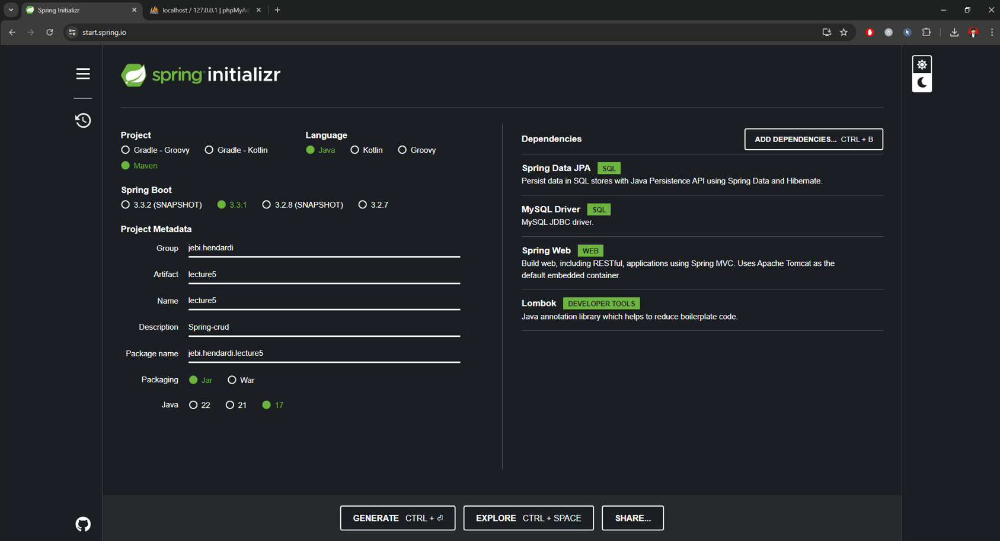
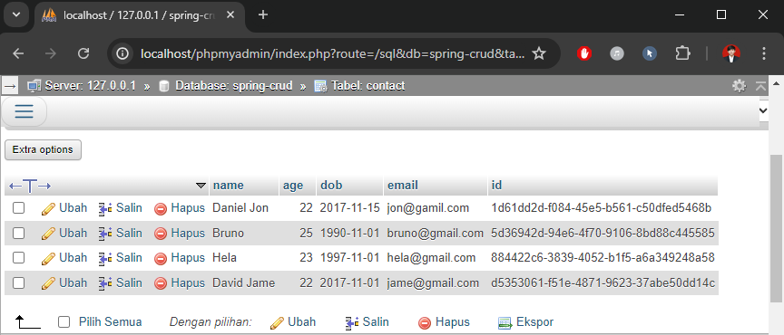
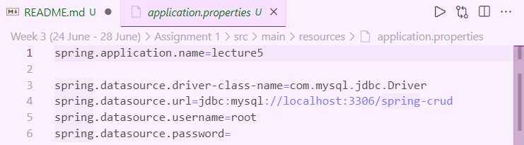
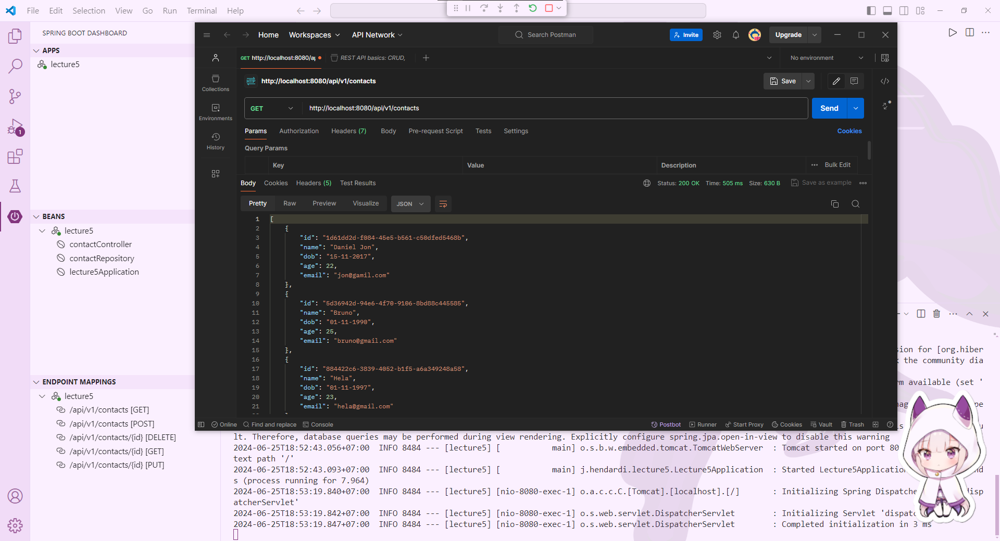
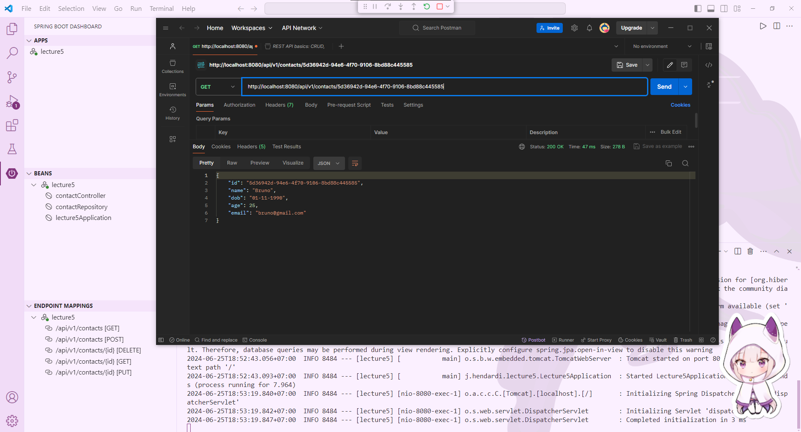
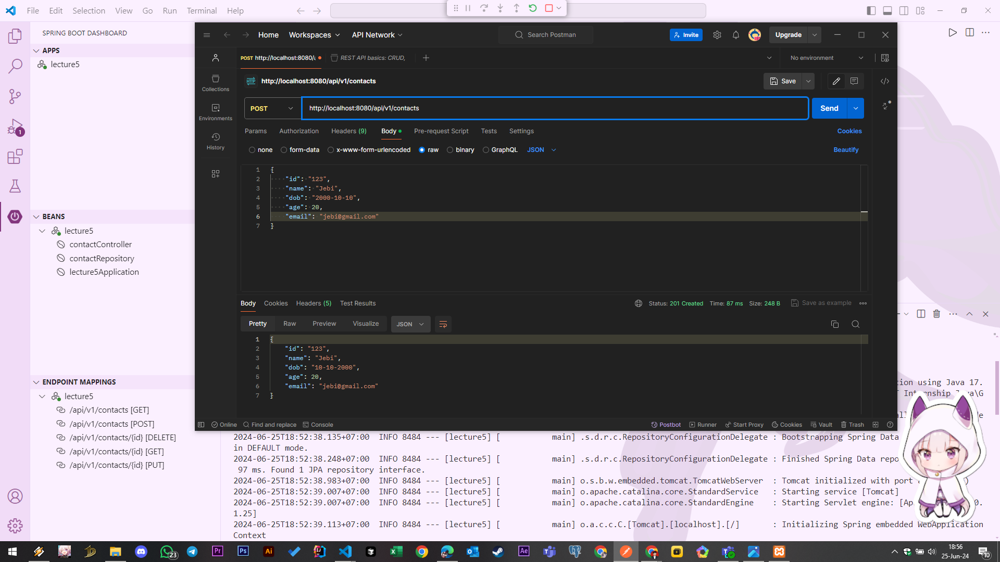
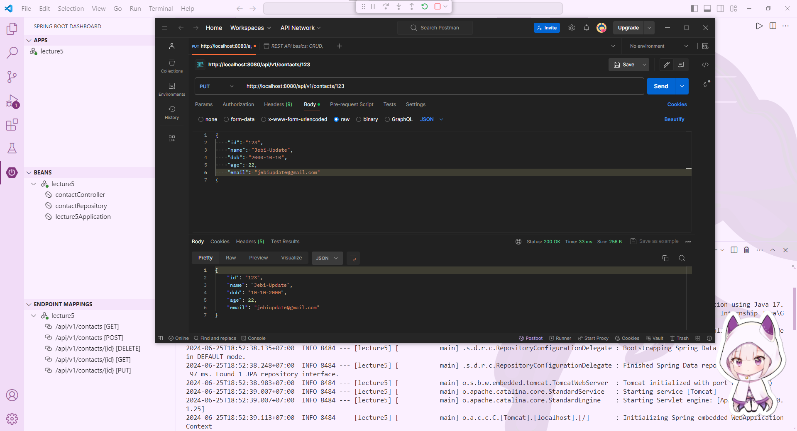
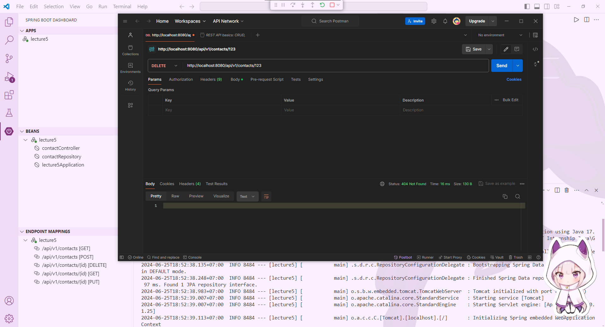

### Assignment 1 : Spring CRUD

#
#### Getting Started




Visit https://start.spring.io/ and create a new Spring project by selecting the following dependencies:
- `Spring Data JPA` : This dependency provides robust support for database interaction using Java Persistence API (JPA). It facilitates the creation of data access layers and repositories, enabling seamless integration with relational databases.
- `MySQL Driver` : This is the JDBC driver for MySQL databases, enabling your application to connect to and interact with MySQL databases.
- `Spring Web` : This dependency equips your application with capabilities for developing web applications, including RESTful services. It includes essential tools for building and deploying web-based services and applications.
- `Lombok` : Library that simplifies Java code by automating the creation of boilerplate code such as getters, setters, and constructors. 

#
### Init Database
```sql
CREATE TABLE `contact` (
           `name` varchar(100) COLLATE utf8mb4_unicode_ci NOT NULL,
           `age` int(3) NOT NULL,
           `dob` date NOT NULL,
           `email` varchar(100) COLLATE utf8mb4_unicode_ci NOT NULL,
           `id` varchar(50) NOT NULL
) ENGINE=InnoDB DEFAULT CHARSET=utf8mb4 COLLATE=utf8mb4_unicode_ci;


ALTER TABLE `contact`
    ADD PRIMARY KEY (`id`);


INSERT INTO `contact` (`name`, `age`, `dob`, `email`, `id`) VALUES
('Daniel Jon', 22, '2017-11-15', 'jon@gamil.com', "1d61dd2d-f084-45e5-b561-c50dfed5468b"),
('David Jame', 22, '2017-11-01', 'jame@gmail.com', "d5353061-f51e-4871-9623-37abe50dd14c"),
('Hela', 23, '1997-11-01', 'hela@gmail.com', "884422c6-3839-4052-b1f5-a6a349248a58"),
('Bruno', 25, '1990-11-01', 'bruno@gmail.com', "5d36942d-94e6-4f70-9106-8bd88c445585");

```
This step for initializing the contact table in a MySQL database. This initialization process creates a structured and ready-to-use contact table in your MySQL database, complete with sample data for testing and development. 




#
### Configure properties



These steps configure a Spring application to connect to a MySQL database by setting the application name and specifying the necessary details for the database connection, including the JDBC driver, database URL, username, and password.

#
### Create Model
Source Code : [Contact.java](https://github.com/affandyfandy/java-jebi/blob/week_03/Week%203%20(24%20June%20-%2028%20June)/Assignment%201/src/main/java/jebi/hendardi/lecture5/model/Contact.java)

- This Java class Contact models contact information within an application. 
- It is annotated with @Entity from the Jakarta Persistence API, indicating it is a database entity. 
- The class includes fields for id (annotated with @Id as the primary key), name, dob (date of birth), age, and email. 
- Lombok annotations (@Getter and @Setter) automate the generation of getter and setter methods for these fields. 
- Implementing Serializable enables instances of this class to be serialized, facilitating tasks such as network transmission or object persistence.

#
### Create JPA repository
Source Code : [ContactRepository.java](https://github.com/affandyfandy/java-jebi/blob/week_03/Week%203%20(24%20June%20-%2028%20June)/Assignment%201/src/main/java/jebi/hendardi/lecture5/repository/ContactRepository.java)

- The ContactRepository interface is a Spring Data repository that manages Contact entities. 
- It extends JpaRepository<Contact, String>, allowing it to inherit built-in methods for CRUD operations on Contact objects, where String represents the type of the entity's primary key. 
- Annotated with @Repository, it is automatically recognized as a repository component by Spring, facilitating seamless integration with the application's data layer. 
- This interface provides methods to save, update, delete, and query Contact entities, streamlining data access and persistence operations within the application.

#
### Create controller
Source Code : [ContactController.java](https://github.com/affandyfandy/java-jebi/blob/week_03/Week%203%20(24%20June%20-%2028%20June)/Assignment%201/src/main/java/jebi/hendardi/lecture5/controller/ContactController.java)

The ContactController class, annotated with @RestController and mapped to /api/v1/contacts, serves as the endpoint controller for managing Contact entities within the application. It handles CRUD (Create, Read, Update, Delete) operations through various HTTP methods:


| HTTP Method | Endpoint | Description |
|---|---|---|
| GET | /api/v1/contacts | Retrieves all contacts from the database as ContactDTO objects. |
| GET | /api/v1/contacts/{id} | Retrieves a specific contact by ID from the database. |
| POST | /api/v1/contacts | Creates a new contact in the database. |
| PUT | /api/v1/contacts/{id} | Updates an existing contact by ID in the database. |
| DELETE | /api/v1/contacts/{id} | Deletes a contact by ID from the database. |
#
**Dependencies**:

- Utilizes ContactRepository for database operations and ContactMapper for mapping between Contact entities and ContactDTO data transfer objects.
- Injects ContactRepository via constructor injection using Lombok's @AllArgsConstructor.


#
### Call api by postman
To call the API using Postman, open the application, select the HTTP method (e.g., GET, POST, PUT, DELETE), enter the API endpoint URL, add necessary headers (like Content-Type for POST and PUT), configure the JSON request body if required, and send the request. Review the response in Postman to confirm the operation's status and returned data

**Get all data**
- **Endpoint** : `GET` /api/v1/contacts
- **Description** : Retrieves all contact data from the database.
- **JSON Request Body** : Not applicable for GET requests.

#
**Get data by ID**
- **Endpoint** : `GET` /api/v1/contacts/{id}
- **Description** : Retrieves a specific contact by its id from the database.
- **JSON Request Body** : Not applicable for GET requests.

#
**Add new data**
- **Endpoint**: `POST` /api/v1/contacts
- **Description**: Adds a new contact to the database
- **JSON Request Body**: 
    ```json
    {
    "id": "123",
    "name": "jebi",
    "age": 20,
    "dob": "2000-10-10",
    "email": "jebi@example.com"
    }
    ```
    

#
**Update data by ID**
- **Endpoint**: `PUT` /api/v1/contacts/{id}
- **Description**: Updates an existing contact identified by its id in the database.
- **JSON Request Body**:
    ```json
    {
    "id": "123",
    "name": "jebiupdate",
    "age": 20,
    "dob": "2000-10-10",
    "email": "jebiupdate@example.com"
    }
    ```
    
#
 **Delete data**
- **Endpoint**: `DELETE` /api/v1/contacts/{id}
- **Description**: Deletes a specific contact by its id from the database.
- **JSON Request Body**: Not applicable for DELETE requests.
