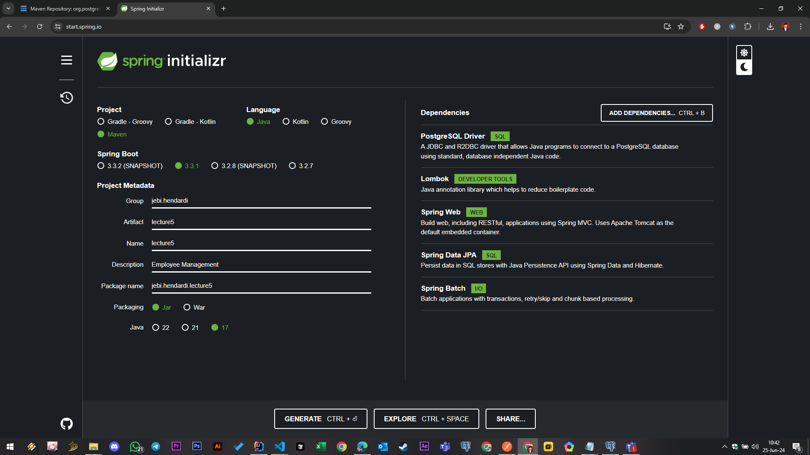
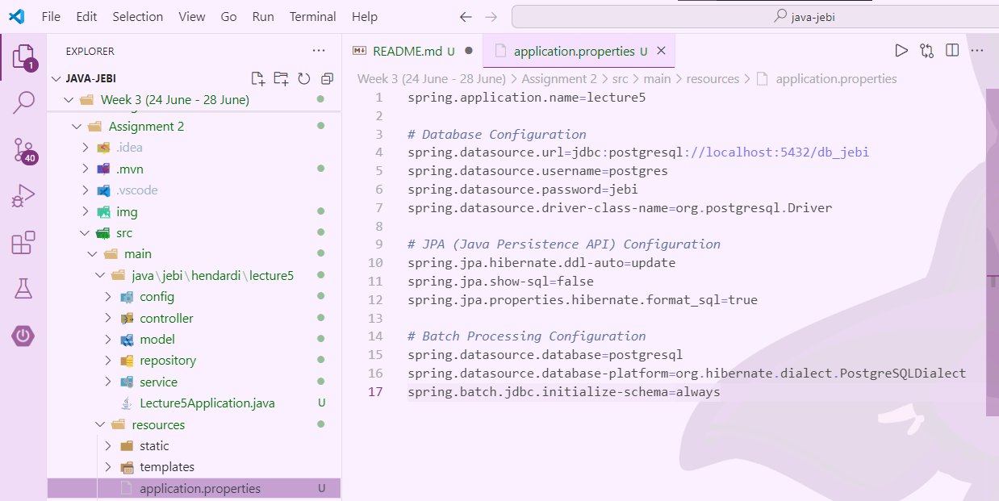
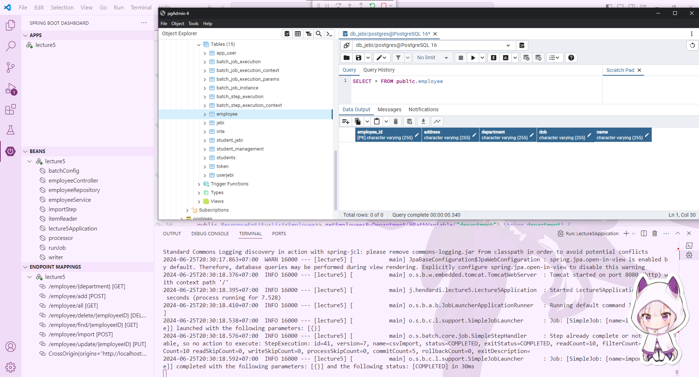
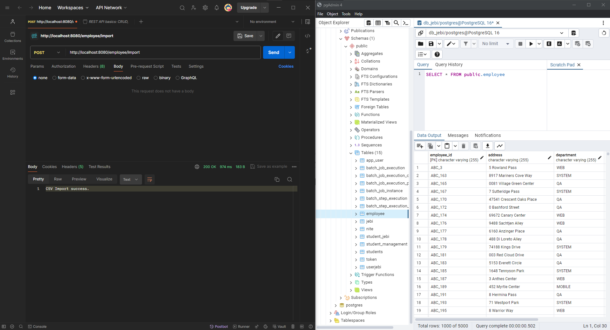
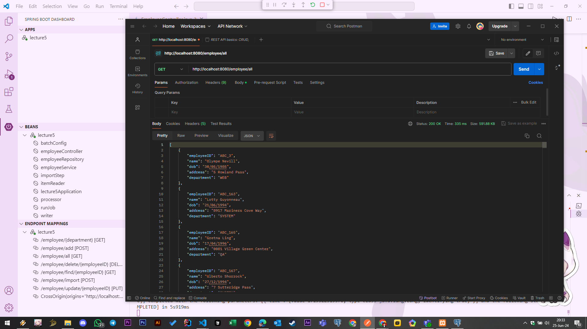
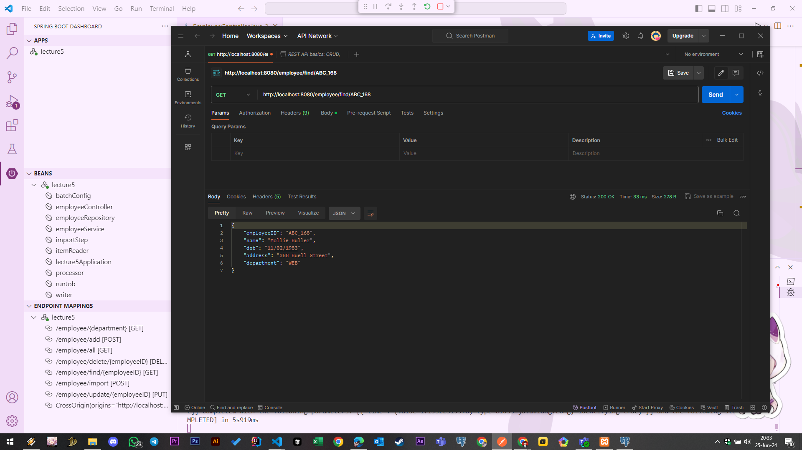
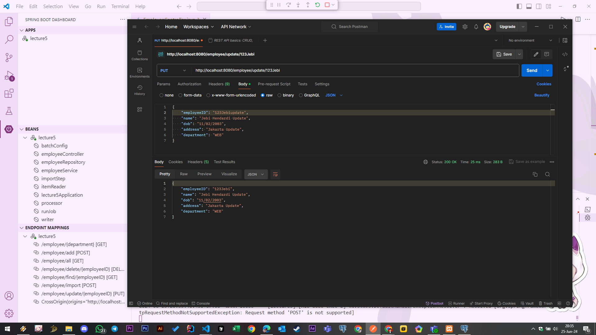
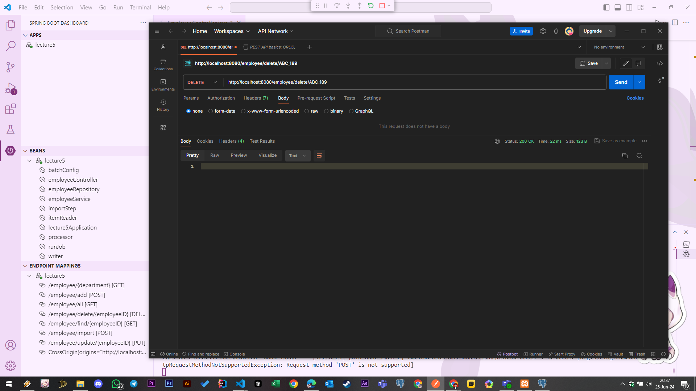
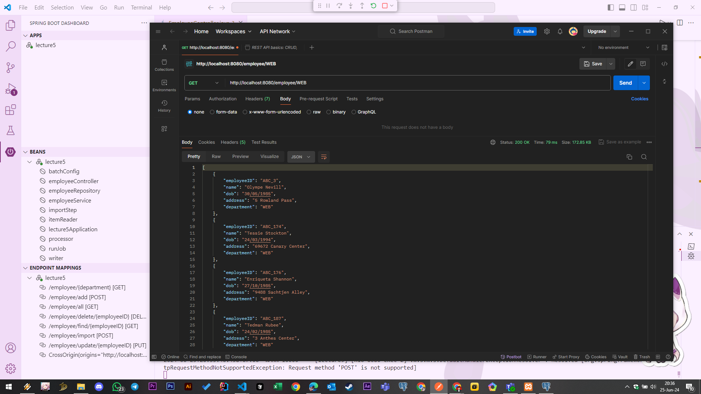
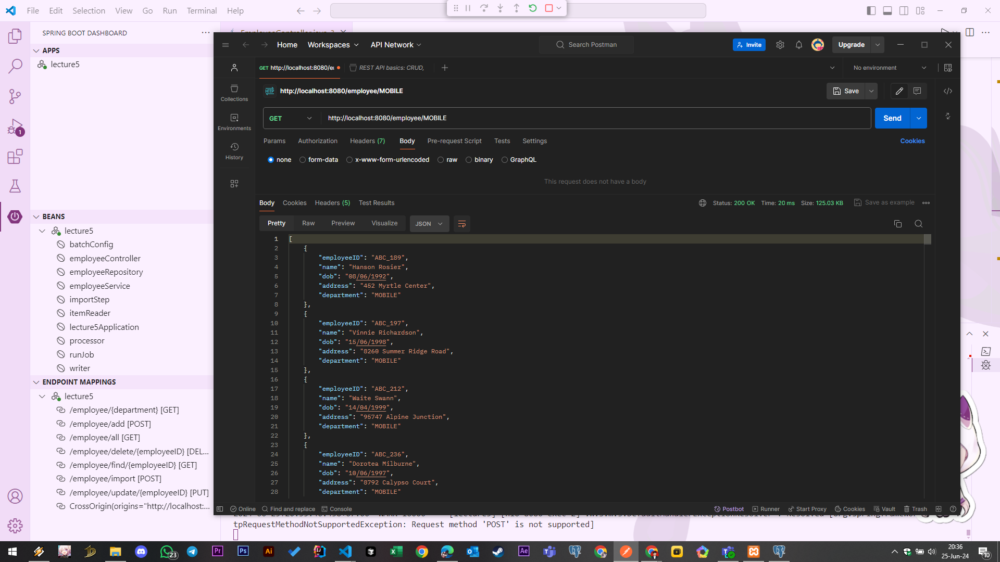

#
### Assignment 2 - Spring CRUD with CSV Import to database

#
## 1. Initialize Project
Visit https://start.spring.io/ and create a new Spring project by selecting the following dependencies:
- `Spring Data JPA` : This dependency provides robust support for database interaction using Java Persistence API (JPA). It facilitates the creation of data access layers and repositories, enabling seamless integration with relational databases.
- `PostgreSQL Driver` : The PostgreSQL Driver is a JDBC driver for PostgreSQL databases, enabling your Spring application to connect to and interact with PostgreSQL databases
- `Spring Web` : This dependency equips your application with capabilities for developing web applications, including RESTful services. It includes essential tools for building and deploying web-based services and applications.
- `Lombok` : Library that simplifies Java code by automating the creation of boilerplate code such as getters, setters, and constructors. 
- `Spring Batch` : Spring Batch is a framework within the Spring ecosystem focused on processing large volumes of batch data. It provides reusable functions for tasks like reading large datasets, processing them, and writing back to databases. Spring Batch handles transactions, chunk-based processing, and job restartability, making it suitable for complex and reliable batch processing tasks.
  
    

#
### Create Configuration

**Database Configuration**:

- `spring.datasource.url=jdbc:postgresql://localhost:5432/db_jebi`: Specifies the JDBC URL to connect to the PostgreSQL database named db_jebi running on localhost and listening on port 5432.
- `spring.datasource.username=postgres`: Specifies the username (postgres) used to authenticate against the PostgreSQL database.
- `spring.datasource.password=jebi`: Specifies the password (jebi) used for authenticating the username against the PostgreSQL database.
- `spring.datasource.driver-class-name=org.postgresql.Driver`: Specifies the JDBC driver class (org.postgresql.Driver) used by Spring Boot to connect to PostgreSQL.

**JPA Configuration**:

- `spring.jpa.hibernate.ddl-auto=update`: Specifies the Hibernate DDL (Data Definition Language) auto-generation strategy. update mode tells Hibernate to update the database schema automatically based on the entity mappings when the application starts.
- `spring.jpa.show-sql=false`: Configures whether to show SQL statements generated by Hibernate. It's set to false, so SQL statements won't be logged.
- `spring.jpa.properties.hibernate.format_sql=true`: Enables pretty-printing of SQL queries generated by Hibernate for better readability when show-sql is enabled.

**Batch Processing Configuration**:

- `spring.batch.jdbc.initialize-schema=always`: Tells Spring Batch to initialize its database schema (BATCH_ tables) always when the application starts up. This is useful for ensuring that the necessary batch processing tables are created or updated as needed.

#
### Create Model

`Source Code` : [Employee.java](https://github.com/affandyfandy/java-jebi/blob/week_03/Week%203%20(24%20June%20-%2028%20June)/Assignment%202/src/main/java/jebi/hendardi/lecture5/model/Employee.java)

The Employee model class serves as a blueprint for representing employee data in project.

**Annotation**
- `@Entity`: Marks the class as an entity, representing a table in the relational database.
- `@Table(name = "employee")`: Specifies the name of the database table (employee) to which this entity (Employee) is mapped.
- `@Getter`: Automatically generates getter methods for all fields.
- `@Setter`: Automatically generates setter methods for all fields.
- `@NoArgsConstructor`: Generates a no-argument constructor.
- `@AllArgsConstructor`: Generates a constructor with all fields as arguments.

**Purpose of the Employee Model Class**
- **Data Representation**: Defines the structure (employeeID, name, dob, address, department) and attributes of an Employee object within the application.
- **Database Mapping**: Specifies how the attributes of the Employee entity correspond to columns in the database table (@Column annotations).
- **Integration with JPA**: Allows the Employee entity to be managed by the Java Persistence API (JPA), facilitating data persistence and retrieval operations.

#
## 2. Create Repository
`Source Code` : [EmployeeRepository.java](https://github.com/affandyfandy/java-jebi/blob/week_03/Week%203%20(24%20June%20-%2028%20June)/Assignment%202/src/main/java/jebi/hendardi/lecture5/repository/EmployeeRepository.java)

- The EmployeeRepository interface acts as an intermediary between your application and the database, leveraging Spring Data JPA to provide CRUD operations for the Employee entity. 

- EmployeeRepository extends the Spring Data JPA interface JpaRepository. This interface provides methods for performing CRUD operations (save, findById, findAll, delete, etc.) on the Employee entity.

**Purpose of EmployeeRepository Interface**
- **Data Access**: Provides an interface for interacting with the Employee entity in the database using Spring Data JPA's built-in methods (save, findById, findAll, delete, etc.).

- **Can Custom Query Methods**: Allows defining custom query methods (deleteEmployeeByEmployeeID, findEmployeesByDepartmentIgnoreCase) to perform specific database operations that are not covered by the default methods provided by JpaRepository.

- **Integration with Spring Data JPA**: Integrates seamlessly with Spring Data JPA to leverage its features such as automatic query generation based on method names (deleteBy..., findBy...) and repository abstraction, simplifying database operations within the application.

#
## 3. Create Service
`Source Code` : [EmployeeService.java](https://github.com/affandyfandy/java-jebi/blob/week_03/Week%203%20(24%20June%20-%2028%20June)/Assignment%202/src/main/java/jebi/hendardi/lecture5/service/EmployeeService.java)

EmployeeService class serves as a pivotal component in application's service layer, encapsulating business logic related to employees. Annotations (@Service, @Transactional) denote its role and transactional behavior. It leverages EmployeeRepository for data access operations, promoting separation of concerns and enhancing maintainability. 

**Annotations:**

- `@Service`: Marks the class as a service component in Spring, indicating it holds business logic. It is typically used in the service layer of a Spring application.

- `@Transactional`: Declares the transactional behavior for methods in the service. It ensures that each method is executed within a transaction context, allowing for ACID properties (Atomicity, Consistency, Isolation, Durability) in database operations.

**Constructor and Dependency Injection:**

- `EmployeeRepository employeeRepository`: Private field to hold an instance of EmployeeRepository.
- `public EmployeeService(EmployeeRepository employeeRepository)`: Constructor that injects EmployeeRepository dependency into the service.

**Service Methods:**

1. `findEmployeesByDepartment(String department)`:
    
    **Purpose** : Retrieves a list of employees based on the specified department, ignoring case sensitivity.

    **Implementation** : Delegates the call to EmployeeRepository's method findEmployeesByDepartmentIgnoreCase.

2. `addEmployee(Employee employee)`:

    **Purpose** : Saves a new employee to the database.

    **Implementation** : Calls EmployeeRepository's save method to persist the provided Employee object.

3. `findAllEmployees()`:
   
    **Purpose** : Retrieves all employees from the database.

    **Implementation** : Delegates the call to EmployeeRepository's findAll method.

4. `updateEmployee(Employee employee)`:

    **Purpose** : Updates an existing employee record in the database.

    **Implementation** : Calls EmployeeRepository's save method, which updates the provided Employee object if it already exists.

5. `findEmployeeByEmployeeID(String employeeID)`:
   
    **Purpose** : Retrieves an employee by their unique employeeID.

    **Implementation** : Calls EmployeeRepository's findById method to retrieve the employee by employeeID.

6. `deleteEmployee(String employeeID)`:

    **Purpose** : Deletes an employee from the database based on their employeeID.

    **Implementation** : Invokes EmployeeRepository's deleteEmployeeByEmployeeID method to remove the employee record.

#
**Purpose of EmployeeService Class:**
- **Business Logic** : Contains methods that encapsulate business logic related to employees, such as retrieving, adding, updating, and deleting employees from the database.

- **Transaction Management**: Utilizes @Transactional to ensure that operations within each service method are executed atomically and consistently, maintaining data integrity.

- **Integration with Repository**: Acts as an intermediary between the controller (or other components) and the EmployeeRepository, facilitating data access operations and abstracting away the underlying data access mechanism.
#
## 4. Create Batch Configuration

`Source Code` : [BatchConfig.java](https://github.com/affandyfandy/java-jebi/blob/week_03/Week%203%20(24%20June%20-%2028%20June)/Assignment%202/src/main/java/jebi/hendardi/lecture5/config/BatchConfig.java)

The BatchConfig class serves as the configuration hub for Spring Batch operations within your application. It orchestrates the reading, processing, and writing of Employee data from a CSV file to a database.

**Annotations:**

- `@Configuration`: Indicates that the class defines Spring configuration. Beans (@Bean methods) declared here will be managed by the Spring container.
- `@RequiredArgsConstructor`: Lombok annotation that generates a constructor with required arguments. Injects dependencies (EmployeeRepository, JobRepository, PlatformTransactionManager) into the class via constructor injection.

**Dependencies:**

- `EmployeeRepository repository`: Instance of EmployeeRepository for data access operations.
- `JobRepository jobRepository`: Interface for interacting with Spring Batch's job repository.
- `PlatformTransactionManager platformTransactionManager`: Manages transactions for Spring Batch steps.

**Bean Definitions:**

- **itemReader()**: Creates and configures a FlatFileItemReader bean to read data from a CSV file (ImportData.csv). Skips the header line (setLinesToSkip(1)) and maps each line using a custom LineMapper.

- **processor()**: Defines a bean of type EmployeeProcessor, which presumably processes each Employee read from the CSV file.

- **writer()**: Configures a RepositoryItemWriter bean that uses EmployeeRepository to save (methodName("save")) processed Employee objects into the database.

- **importStep()**: Defines a batch Step named "csvImport". It reads from itemReader(), processes using processor(), writes using writer(), and is executed asynchronously (taskExecutor(new SimpleAsyncTaskExecutor())). It handles chunks of 100 Employee objects per transaction (chunk(100, platformTransactionManager)).

- **runJob()**: Configures a Spring Batch Job named "importEmployee" that starts with importStep().

**LineMapper Configuration:**

- **lineMapper()**: Defines a custom LineMapper (DefaultLineMapper<Employee>) for mapping lines from the CSV file to Employee objects.
- **DelimitedLineTokenizer**: Specifies the delimiter (,), allowing parsing of CSV lines into fields (employeeID, name, dob, address, department).
- **BeanWrapperFieldSetMapper**: Maps fields from the CSV file to properties of Employee using JavaBeans conventions.

**Purpose of BatchConfig Class:**
- **Batch Configuration**: Configures Spring Batch jobs and steps (importStep(), runJob()) to handle bulk data processing (e.g., importing CSV data into a database).

- **Integration with Spring Batch**: Integrates Spring Batch components (JobBuilder, StepBuilder, FlatFileItemReader, RepositoryItemWriter) for batch processing tasks.

- **Transaction Management**: Manages transactions (platformTransactionManager) to ensure data integrity during batch processing operations.

- **Data Mapping**: Maps data from CSV (FlatFileItemReader, lineMapper()) to domain objects (Employee) for insertion into the database (writer()).
#
### 5. Create Processor
`Source Code` : [EmployeeProcessor.java](https://github.com/affandyfandy/java-jebi/blob/week_03/Week%203%20(24%20June%20-%2028%20June)/Assignment%202/src/main/java/jebi/hendardi/lecture5/config/EmployeeProcessor.java)

The EmployeeProcessor class in this Spring Batch application implements the ItemProcessor interface to handle Employee objects during batch processing. It currently serves as an identity processor, returning each input Employee without modification.

**Usage in Batch Job:**
- The EmployeeProcessor class implements Spring Batch's ItemProcessor interface, which allows processing of items before they are written.
- This processor (EmployeeProcessor) is used in the BatchConfig class as part of the Spring Batch job configuration (importStep() method).

**Annotations and Interfaces: `ItemProcessor<Employee, Employee>`**
- <Employee, Employee>: Specifies that this processor accepts an Employee object as input and outputs another Employee object.

**Process Method : `public Employee process(Employee employee)`**
- **Input Parameter**: Employee employee - Represents an Employee object read from the input source (e.g., CSV file).
- **Return Type**: Employee - Returns the processed Employee object, which can be modified or filtered based on business logic.
#
## 6. Create Controller
`Source Code` : [EmployeeController.java](https://github.com/affandyfandy/java-jebi/blob/week_03/Week%203%20(24%20June%20-%2028%20June)/Assignment%202/src/main/java/jebi/hendardi/lecture5/controller/EmployeeController.java)

The EmployeeController class acts as the REST controller for managing Employee resources. It handles HTTP requests, delegates operations to EmployeeService for data manipulation, and launches batch jobs (importEmployee) for bulk data import operations.

**REST Endpoints**
| HTTP Method | Endpoint                          | Description                                                                                           |
|-------------|-----------------------------------|-------------------------------------------------------------------------------------------------------|
| GET         | `/employee/all`                   | Retrieves all employees from the database using `employeeService.findAllEmployees()`.                  |
| GET         | `/employee/find/{employeeID}`     | Retrieves an employee by their `employeeID` using `employeeService.findEmployeeByEmployeeID(employeeID)`. |
| POST        | `/employee/add`                   | Adds a new employee to the database using `employeeService.addEmployee(employee)`.                     |
| GET         | `/employee/{department}`           | Retrieves employees by their `department` using `employeeService.findEmployeesByDepartment(department)`. |
| PUT         | `/employee/update/{employeeID}`   | Updates an employee identified by `employeeID` with new details using `employeeService.updateEmployee(updatedEmployee)`. |
| DELETE      | `/employee/delete/{employeeID}`   | Deletes an employee from the database by `employeeID` using `employeeService.deleteEmployee(employeeID)`. |
| POST        | `/employee/import`                | Initiates a batch job (`importEmployee`) to import data from a CSV file (`ImportData.csv`) into the database using `jobLauncher.run(job, jobParameters)`. |

**Annotations:**

- `@RestController`: Indicates that this class defines a REST controller. It handles incoming HTTP requests and sends HTTP responses back to the client.
- `@RequestMapping("/employee")`: Maps all HTTP operations (GET, POST, PUT, DELETE) on paths starting with /employee to this controller class.

**Dependencies:**

- `EmployeeService employeeService`: Handles business logic related to Employee entities.
- `JobLauncher jobLauncher`: Launches Spring Batch jobs.
- `Job job`: Represents the Spring Batch job (importEmployee) configured in BatchConfig.

**Response Entities:**

- `ResponseEntity<List<Employee>>`: Wraps the list of employees and HTTP status for GET requests.
- `ResponseEntity<Employee>`: Wraps a single employee and HTTP status for GET requests.
- `ResponseEntity<String>`: Wraps a message string and HTTP status for POST requests (import job success/failure).

**Job Parameterization:**

- `JobParametersBuilder`: Builds job parameters (jobParameters) with a timestamp (addLong("time", System.currentTimeMillis())) for each job execution.

**Purpose of EmployeeController Class:**
- **REST API Endpoint Definition**: Defines endpoints (/employee) for CRUD operations on Employee entities.

- **Integration with Service Layer**: Injects EmployeeService to perform business logic operations on Employee data.

- **Batch Job Launching**: Uses JobLauncher to initiate the importEmployee batch job (job) for importing CSV data into the database.

#
## 7. Demo Run Project
### Start Project
When the project is successfully started, the employee table is automatically created in the database.

**Entity Annotations:**
- The Employee class is annotated with `@Entity`, `@Table`, `@Column` from the jakarta.persistence package.
- These annotations provide metadata to Hibernate and Spring Data JPA about how to map the Java class Employee to corresponding database tables and columns.

#
### Import data to DB
Since the database is initially empty, data needs to be imported from the ImportData.csv file using a HTTP `POST` request to `/employee/import`

**Note**: Ensure that the CSV file is located in `src\main\resources\ImportData.csv`, as specified in `BatchConfig.java`.

After the HTTP `POST` request to `/employee/import` is successful, the data from the CSV file is imported into the employee table in the database.

#
### Retrieve All Employees
Retrieve all employees from the database using a HTTP `GET` request to `/employee/all`.

#
### Retrieve Employee by EmployeeID
Retrieve a specific employee by their employeeID using a HTTP `GET` request to `/employee/find/{employeeID}`.

#
### Add New Employee
Add a new employee to the database using a HTTP `POST` request to `/employee/add`.

- Prepare a JSON payload containing details of a new employee.
- Send a `POST` request to `/employee/add` with the JSON payload in the request body.

#
### Update Employee by EmployeeID
Update an existing employee's information identified by their employeeID using a HTTP `PUT` request to `/employee/update/{employeeID}`

- Replace {employeeID} with the ID of an existing employee.
- Prepare a JSON payload containing updated information for the employee.
- Send a `PUT` request to `/employee/update/{employeeID}` with the JSON payload.
  

#
### Delete Employee by EmployeeID
Delete an employee from the database by their employeeID using a HTTP `DELETE` request to `/employee/delete/{employeeID}`

#
### Filter Employees by Department
Filter employees by their department using HTTP `GET` requests to `/employee/{department}` for different departments.

Send a `GET` request to `/employee/{department}` where {department} is replaced with specific department names like **WEB** or **MOBILE**.

